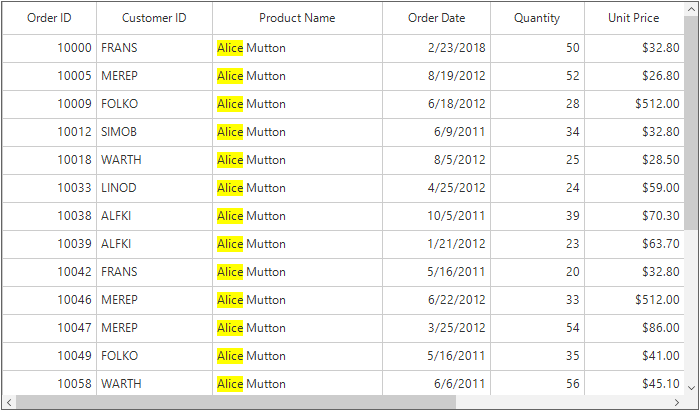
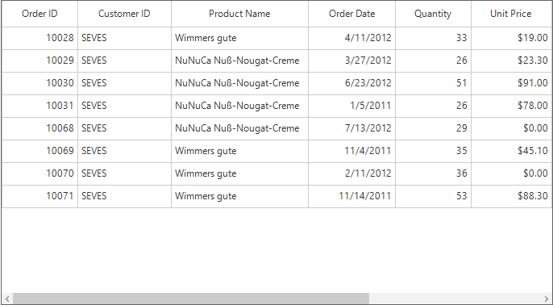
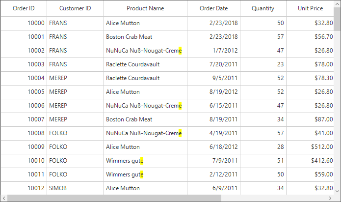
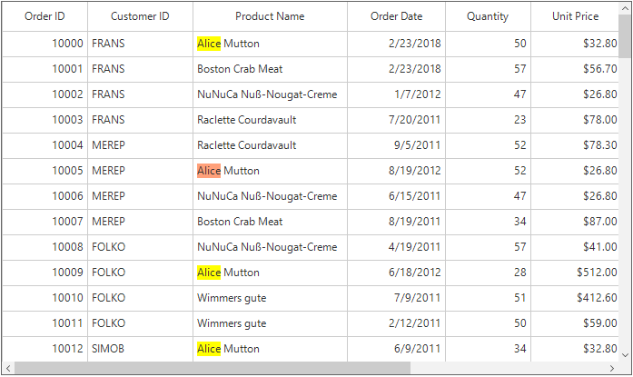

# Search
SfDataGrid provides the support for search the specific string in the SfDataGrid. This can be achieved by using the [SearchController.Search](https://help.syncfusion.com/cr/cref_files/windowsforms/sfdatagrid/Syncfusion.SfDataGrid.WinForms~Syncfusion.WinForms.DataGrid.SearchController~Search.html) method. The founded matches will be highlighted in the SfDataGrid.



//Search and highlight the text in SfDataGrid.
this.sfDataGrid.SearchController.Search("a");



### Filtering
The filtering based on the search text can be enabled by setting the [AllowFiltering](https://help.syncfusion.com/cr/cref_files/windowsforms/sfdatagrid/Syncfusion.SfDataGrid.WinForms~Syncfusion.WinForms.DataGrid.SearchController~AllowFiltering.html) property to `true`.



// Enable the filtering using the search text
this.sfDataGrid.SearchController.AllowFiltering = true;

//Search and highlight the text in SfDataGrid.
this.sfDataGrid.SearchController.Search("Alice");



### Case Sensitive Search
The data can be searched with the case-sensitivity by setting the [SearchController.AllowCaseSensitiveSearch](https://help.syncfusion.com/cr/cref_files/windowsforms/sfdatagrid/Syncfusion.SfDataGrid.WinForms~Syncfusion.WinForms.DataGrid.SearchController~AllowCaseSensitiveSearch.html) property to `true`.

### Changing Search Highlight Color
The highlighting color of the search text can be changed by using the [SearchColor](https://help.syncfusion.com/cr/cref_files/windowsforms/sfdatagrid/Syncfusion.SfDataGrid.WinForms~Syncfusion.WinForms.DataGrid.SearchController~SearchColor.html) property.


//Set the color for highlighting the search text
this.sfDataGrid.SearchController.SearchColor = Color.LightGreen;



### Disable Highlighting Search Text
The highlighting of the search text can be disabled by setting the [AllowHighlightSearchText](https://help.syncfusion.com/cr/cref_files/windowsforms/sfdatagrid/Syncfusion.SfDataGrid.WinForms~Syncfusion.WinForms.DataGrid.SearchController~AllowHighlightSearchText.html) property to `false`.



//Disable the highlighting of the search text
this.sfDataGrid.SearchController.AllowHighlightSearchText = false;

//Search and filter without highlighting the search text.
this.sfDataGrid.SearchController.AllowFiltering = true;
this.sfDataGrid.SearchController.Search("SEVES");



## Search only In Selected Columns
By default the searching is applied for all the columns in the SfDataGrid. This can be changed to search only in the specified columns by using the [SeachColumns](https://help.syncfusion.com/cr/cref_files/windowsforms/sfdatagrid/Syncfusion.SfDataGrid.WinForms~Syncfusion.WinForms.DataGrid.SearchController~SearchColumns.html) collection. The column names added to the SearchColumns list is only consider for the search operations.



// Search only in Quantity column
this.sfDataGrid.SearchController.SearchColumns.Add("Quantity");
this.sfDataGrid.SearchController.Search("2");



## Search Condition
By default the searching will be performed based on the `Contains` condition. This can be changed by using the [SearchType](https://help.syncfusion.com/cr/cref_files/windowsforms/sfdatagrid/Syncfusion.SfDataGrid.WinForms~Syncfusion.WinForms.DataGrid.SearchController~SearchType.html) property. The `SearchType` enumeration has the following conditions,
* StartsWith – Used to find the text which starts with the SearchText.
* EndsWith – Used to find the text which ends with the SearchText.
* Contains – Used to find the text which contains the SearchText.

## Navigating based on search text
The cells which contains the SearchText can be navigated by using the [SearchController.FindNext](https://help.syncfusion.com/cr/cref_files/windowsforms/sfdatagrid/Syncfusion.SfDataGrid.WinForms~Syncfusion.WinForms.DataGrid.SearchController~FindNext.html) and [SearchController.FindPrevious](https://help.syncfusion.com/cr/cref_files/windowsforms/sfdatagrid/Syncfusion.SfDataGrid.WinForms~Syncfusion.WinForms.DataGrid.SearchController~FindPrevious.html) methods.



// Find the next match and highlight using the HighlightSearchColor.
this.sfDataGrid.SearchController.FindNext("Alice");

// Find the previous match and highlight using the HighlightSearchColor.
this.sfDataGrid.SearchController.FindPrevious("Alice");



By default the currently navigated search text will be highlighted with the default color. This can be changed by using the [SearchHighlightColor](https://help.syncfusion.com/cr/cref_files/windowsforms/sfdatagrid/Syncfusion.SfDataGrid.WinForms~Syncfusion.WinForms.DataGrid.SearchController~SearchHighlightColor.html) property.



this.sfDataGrid.SearchController.SearchHighlightColor = Color.Red;
// Find the next match and highlight using the HighlightSearchColor.
this.sfDataGrid.SearchController.FindNext("MEREP");



### Move current cell to the next match
The current cell can be moved to the next possible match by using the [SearchController.CurrentRowColumnIndex](https://help.syncfusion.com/cr/cref_files/windowsforms/sfdatagrid/Syncfusion.SfDataGrid.WinForms~Syncfusion.WinForms.DataGrid.SearchController~CurrentRowColumnIndex.html) property.



// Find the next match and highlight using the HighlightSearchColor.
this.sfDataGrid.SearchController.FindNext("MEREP");

// Moves the current cell to the next possible match.
this.sfDataGrid.MoveToCurrentCell(this.sfDataGrid.SearchController.CurrentRowColumnIndex);



## Clear Search
The search can be cleared by using the [ClearSearch](https://help.syncfusion.com/cr/cref_files/windowsforms/sfdatagrid/Syncfusion.SfDataGrid.WinForms~Syncfusion.WinForms.DataGrid.SearchController~ClearSearch.html) method.



// Clears the search applied by using the search controller.
this.sfDataGrid.SearchController.ClearSearch();



## Search Customization 
SfDataGrid process the search operations in [SearchController](https://help.syncfusion.com/cr/cref_files/windowsforms/sfdatagrid/Syncfusion.SfDataGrid.WinForms~Syncfusion.WinForms.DataGrid.SearchController.html) class. The default search behaviors can be customized by overriding the `SearchController` class and set to `SfDataGrid.SearchController` property.



public class SearchControllerExt : SearchController
{
    public SearchControllerExt(SfDataGrid grid) :
        base(grid)
    { }

    protected override void HighlightSearchText(Graphics paint, DataColumnBase column, CellStyleInfo style, Rectangle bounds, string cellValue, RowColumnIndex rowColumnIndex)
    {
        //Does not highlight the search text the specific column
        if (column.GridColumn.MappingName == "ProductName")
            return;

        base.HighlightSearchText(paint, column, style, bounds, cellValue, rowColumnIndex);
    }
}



