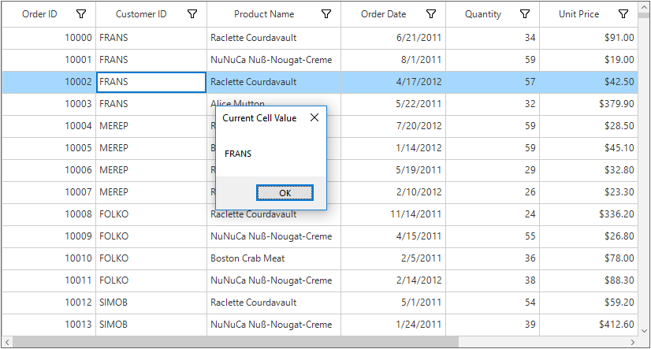
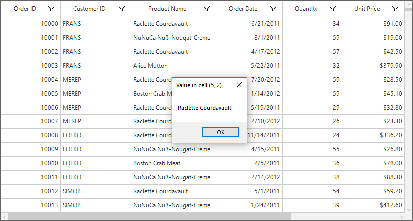
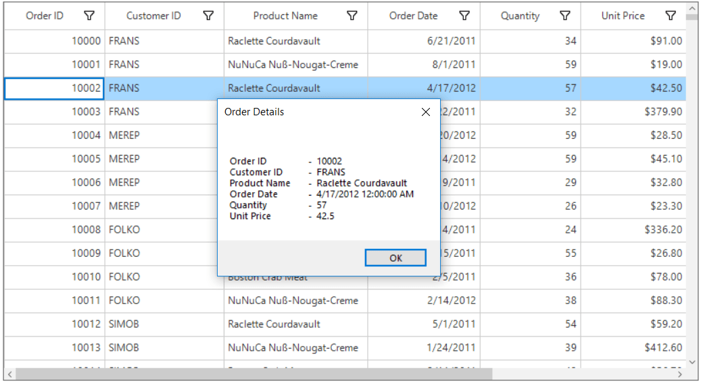
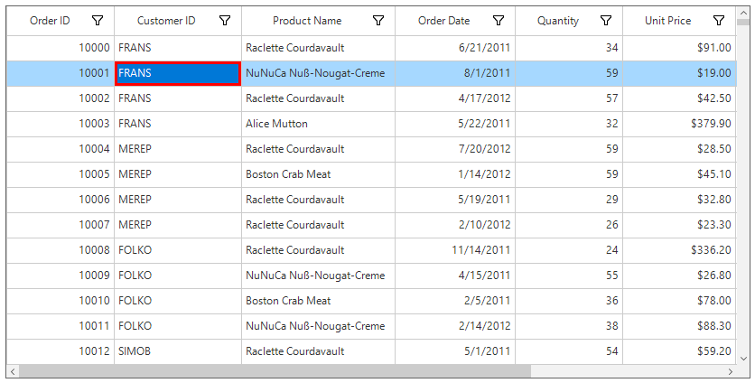

# Selection
SfDataGrid provides a selection functionality that allows the user to select one or more rows. 

## Selection Modes

The [SelectionMode](https://help.syncfusion.com/cr/cref_files/windowsforms/Syncfusion.SfDataGrid.WinForms~Syncfusion.WinForms.DataGrid.SfDataGrid~SelectionMode.html) property defines the behavior of selection in SfDataGrid. 

### Single Row Selection

If the [SelectionMode](https://help.syncfusion.com/cr/cref_files/windowsforms/Syncfusion.SfDataGrid.WinForms~Syncfusion.WinForms.DataGrid.SfDataGrid~SelectionMode.html) is `Single`, only a single row can be selected. SfDataGrid allows to select or deselect a single row, when the `SelectionMode` is `SingleDeselect`.



this.sfDataGrid1.SelectionMode = GridSelectionMode.Single;


Me.sfDataGrid1.SelectionMode = GridSelectionMode.Single



N> When the[SelectionMode](https://help.syncfusion.com/cr/cref_files/windowsforms/Syncfusion.SfDataGrid.WinForms~Syncfusion.WinForms.DataGrid.SfDataGrid~SelectionMode.html) is `SingleDeselect`, single row can be selected or deselected by clicking the respective row or  by pressing space key.

### Multiple Row Selection

The SfDataGrid allows to select multiple rows by setting [SelectionMode](https://help.syncfusion.com/cr/cref_files/windowsforms/Syncfusion.SfDataGrid.WinForms~Syncfusion.WinForms.DataGrid.SfDataGrid~SelectionMode.html) property as `Extended` or `Multiple`, where multiple rows can be selected by dragging the mouse on SfDataGrid and also using the key modifiers.
While using Extended, multiple rows can be selected by pressing the key modifiers Ctrl and Shift.



this.sfDataGrid1.SelectionMode = GridSelectionMode.Extended;


Me.sfDataGrid1.SelectionMode = GridSelectionMode.Extended



N>  When the[SelectionMode](https://help.syncfusion.com/cr/cref_files/windowsforms/Syncfusion.SfDataGrid.WinForms~Syncfusion.WinForms.DataGrid.SfDataGrid~SelectionMode.html) is `Multiple`, multiple rows can be selected or deselected by clicking the respective row. Also in multiple selection pressing navigation keys will move only the current cell and the rows can be selected or deselected by pressing space key.



this.sfDataGrid1.SelectionMode = GridSelectionMode.Multiple;


Me.sfDataGrid1.SelectionMode = GridSelectionMode.Multiple



### Disable the Selection
The selection can be disabled by setting `SelectionMode` property as `None`.


this.sfDataGrid1.SelectionMode = GridSelectionMode.None;


Me.sfDataGrid1.SelectionMode = GridSelectionMode.None



Selection on particular row can be disabled by handling [CurrentCellActivating](https://help.syncfusion.com/cr/cref_files/windowsforms/Syncfusion.SfDataGrid.WinForms~Syncfusion.WinForms.DataGrid.SfDataGrid~CurrentCellActivating_EV.html) event.

N> It is not possible to select header rows, table summary rows, unbound rows which are above the table summary row when it’s placed in top and the unbound rows which are below table summary rows when it’s placed in bottom of SfDataGrid.

## Get Selected Rows

The [SelectedItem](https://help.syncfusion.com/cr/cref_files/windowsforms/Syncfusion.SfDataGrid.WinForms~Syncfusion.WinForms.DataGrid.SfDataGrid~SelectedItem.html) property returns the data object of the selected row and the [SelectedIndex](https://help.syncfusion.com/cr/cref_files/windowsforms/Syncfusion.SfDataGrid.WinForms~Syncfusion.WinForms.DataGrid.SfDataGrid~SelectedIndex.html) property returns the index of the `SelectedItem` in SfDataGrid. `SelectedItem` denotes the first selected row in multiple selection.

All the selected records can be retrieved through [SelectedItems](https://help.syncfusion.com/cr/cref_files/windowsforms/Syncfusion.SfDataGrid.WinForms~Syncfusion.WinForms.DataGrid.SfDataGrid~SelectedItems.html) property.

### CurrentItem vs SelectedItem

Both [SelectedItem](https://help.syncfusion.com/cr/cref_files/windowsforms/Syncfusion.SfDataGrid.WinForms~Syncfusion.WinForms.DataGrid.SfDataGrid~SelectedItem.html) and [CurrentItem](https://help.syncfusion.com/cr/cref_files/windowsforms/Syncfusion.SfDataGrid.WinForms~Syncfusion.WinForms.DataGrid.SfDataGrid~CurrentItem.html) returns the same data object when there is single row is selected in SfDataGrid. When more than one rows are selected, the record that had been selected initially is maintained in `SelectedItem` and the record that currently have focus is maintained in `CurrentItem`.

## Programmatic Selection

### Process Selection using Properties

A single row can be selected by setting [SelectedItem](https://help.syncfusion.com/cr/cref_files/windowsforms/Syncfusion.SfDataGrid.WinForms~Syncfusion.WinForms.DataGrid.SfDataGrid~SelectedItem.html) property or [SelectedIndex](https://help.syncfusion.com/cr/cref_files/windowsforms/Syncfusion.SfDataGrid.WinForms~Syncfusion.WinForms.DataGrid.SfDataGrid~SelectedIndex.html) property.



var record = SelectionHelper.GetRecordAtRowIndex(this.sfDataGrid, 3);
this.sfDataGrid1.SelectedItem = record;


Dim record = SelectionHelper.GetRecordAtRowIndex(Me.sfDataGrid, 3)
Me.sfDataGrid1.SelectedItem = record





var recordIndex = this.sfDataGrid.TableControl.ResolveToRecordIndex(5);
this.sfDataGrid1.SelectedIndex = recordIndex;


Dim recordIndex = Me.sfDataGrid.TableControl.ResolveToRecordIndex(5)
Me.sfDataGrid1.SelectedIndex = recordIndex



Multiple rows can be selected by adding data objects to [SelectedItems](https://help.syncfusion.com/cr/cref_files/windowsforms/Syncfusion.SfDataGrid.WinForms~Syncfusion.WinForms.DataGrid.SfDataGrid~SelectedItems.html) property.



var records = this.sfDataGrid.View.Records;

foreach(var record in records)
{
    var obj = record.Data as OrderInfo;
    if (obj.ProductName == "Raclette Courdavault")
      this.sfDataGrid1.SelectedItems.Add(obj);
}


Dim records = Me.sfDataGrid.View.Records

For Each record In records
	Dim obj = TryCast(record.Data, OrderInfo)
	If obj.ProductName = "Raclette Courdavault" Then
	  Me.sfDataGrid1.SelectedItems.Add(obj)
	End If
Next record



### Process Selection using Methods

SfDataGrid Allows to select a range of rows through [SelectRows](https://help.syncfusion.com/cr/cref_files/windowsforms/Syncfusion.SfDataGrid.WinForms~Syncfusion.WinForms.DataGrid.SfDataGrid~SelectRows.html) method.


this.sfDataGrid1.SelectRows(3, 6);


Me.sfDataGrid1.SelectRows(3, 6)



All the rows can be selected by using [SelectAll](https://help.syncfusion.com/cr/cref_files/windowsforms/Syncfusion.SfDataGrid.WinForms~Syncfusion.WinForms.DataGrid.SfDataGrid~SelectAll.html) method in SfDataGrid.



this.sfDataGrid1.SelectAll();


Me.sfDataGrid1.SelectAll()



### Process Current Cell

When a particular record is assigned to the [CurrentItem](https://help.syncfusion.com/cr/cref_files/windowsforms/Syncfusion.SfDataGrid.WinForms~Syncfusion.WinForms.DataGrid.SfDataGrid~CurrentItem.html) property, the [CurrentCell](https://help.syncfusion.com/cr/cref_files/windowsforms/Syncfusion.SfDataGrid.WinForms~Syncfusion.WinForms.DataGrid.SfDataGrid~CurrentCell.html) will be moved to corresponding record when the [SelectionMode](https://help.syncfusion.com/cr/cref_files/windowsforms/Syncfusion.SfDataGrid.WinForms~Syncfusion.WinForms.DataGrid.SfDataGrid~SelectionMode.html) is `Multiple` or `Extended` and the selection will added to the particular record item when the SelectionMode is `Single`.



this.sfDataGrid1.CurrentItem = SelectionHelper.GetRecordAtRowIndex(this.sfDataGrid, 2);


Me.sfDataGrid1.CurrentItem = SelectionHelper.GetRecordAtRowIndex(Me.sfDataGrid, 2)



The `CurrentCell` can be moved to a particular RowColumnIndex by using the  [MoveToCurrentCell](https://help.syncfusion.com/cr/cref_files/windowsforms/Syncfusion.SfDataGrid.WinForms~Syncfusion.WinForms.DataGrid.SfDataGrid~MoveToCurrentCell.html) method.



this.sfDataGrid1.MoveToCurrentCell(new RowColumnIndex(3, 3));


Me.sfDataGrid1.MoveToCurrentCell(New RowColumnIndex(3, 3))



### Clear Selection
The Selection can be cleared by using the [ClearSelection](https://help.syncfusion.com/cr/cref_files/windowsforms/Syncfusion.SfDataGrid.WinForms~Syncfusion.WinForms.DataGrid.SfDataGrid~ClearSelection.html) Method. Selection can also be removed by setting null to[SelectionItem](https://help.syncfusion.com/cr/cref_files/windowsforms/Syncfusion.SfDataGrid.WinForms~Syncfusion.WinForms.DataGrid.SfDataGrid~SelectedItem.html) or by clearing the [SelectedItems](https://help.syncfusion.com/cr/cref_files/windowsforms/Syncfusion.SfDataGrid.WinForms~Syncfusion.WinForms.DataGrid.SfDataGrid~SelectedItems.html) property.



this.sfDataGrid1.ClearSelection();


Me.sfDataGrid1.ClearSelection()



## Get the  Cell Value

### Get the current cell value

The current cell value can be retrieved by using the [GridCellRendererBase.GetControlValue](https://help.syncfusion.com/cr/cref_files/windowsforms/Syncfusion.SfDataGrid.WinForms~Syncfusion.WinForms.DataGrid.Renderers.GridCellRendererBase~GetControlValue.html) method when the `CurrentCell` value is not null.



if (sfDataGrid1.CurrentCell != null)
{
    // Get the CurrentCellValue
    var currentCellValue = sfDataGrid1.CurrentCell.CellRenderer.GetControlValue();
    MessageBox.Show(currentCellValue.ToString(), "Current Cell Value");
}


If sfDataGrid1.CurrentCell IsNot Nothing Then
	' Get the CurrentCellValue
	Dim currentCellValue = sfDataGrid1.CurrentCell.CellRenderer.GetControlValue()
	MessageBox.Show(currentCellValue.ToString(), "Current Cell Value")
End If



### Get the value of a cell

A particular cell value can be retrieved from records in the [SfDataGrid.View](https://help.syncfusion.com/cr/cref_files/windowsforms/Syncfusion.SfDataGrid.WinForms~Syncfusion.WinForms.DataGrid.SfDataGrid~View.html) by using the row column index of the cell.



// Get the cell value for RowIndex = 5 and ColumnIndex = 2
string cellValue;
int rowIndex = 5;
int columnIndex = sfDataGrid1.TableControl.ResolveToGridVisibleColumnIndex(2);
if (columnIndex < 0)
    return;
var mappingName = sfDataGrid1.Columns[columnIndex].MappingName;
var recordIndex = sfDataGrid1.TableControl.ResolveToRecordIndex(rowIndex);
if (recordIndex < 0)
    return;
if (sfDataGrid1.View.TopLevelGroup != null)
{
    var record = sfDataGrid1.View.TopLevelGroup.DisplayElements[recordIndex];
    if (!record.IsRecords)
        return;
    var data = (record as RecordEntry).Data;
    cellValue = (data.GetType().GetProperty(mappingName).GetValue(data, null).ToString());
}
else
{
    var record1 = sfDataGrid1.View.Records.GetItemAt(recordIndex);
    cellValue = (record1.GetType().GetProperty(mappingName).GetValue(record1, null).ToString());
}

MessageBox.Show(cellValue, "Value in cell (" + rowIndex + ", " + columnIndex + ")");


Dim cellValue As String
Dim rowIndex As Integer = 5
Dim columnIndex As Integer = sfDataGrid1.TableControl.ResolveToGridVisibleColumnIndex(2)
If columnIndex < 0 Then
	Return
End If
Dim mappingName = sfDataGrid1.Columns(columnIndex).MappingName
Dim recordIndex = sfDataGrid1.TableControl.ResolveToRecordIndex(rowIndex)
If recordIndex < 0 Then
	Return
End If
If sfDataGrid1.View.TopLevelGroup IsNot Nothing Then
	Dim record = sfDataGrid1.View.TopLevelGroup.DisplayElements(recordIndex)
	If Not record.IsRecords Then
		Return
	End If
	Dim data = (TryCast(record, RecordEntry)).Data
	cellValue = (data.GetType().GetProperty(mappingName).GetValue(data, Nothing).ToString())
Else
	Dim record1 = sfDataGrid1.View.Records.GetItemAt(recordIndex)
	cellValue = (record1.GetType().GetProperty(mappingName).GetValue(record1, Nothing).ToString())
End If

MessageBox.Show(cellValue, "Value in cell (" & rowIndex & ", " & columnIndex & ")")
& ")")



## Scrolling Rows

### Automatic Scrolling on Drag Selection

SfDataGrid will scrolls rows and columns automatically while performing the drag selection like excel. 

## Mouse and Keyboard Behaviors

### Keyboard Behavior

<table>
<tr>
<td>
{{'**Key or KeyCombinations**        '| markdownify }}
</td>
<td>
{{'**Description**'| markdownify }}
</td>
</tr>
<tr>
<td>
<kbd>DownArrow</kbd>
</td>
<td>
Moves CurrentCell directly below the active current cell. If the CurrentCell is in last row, pressing Down arrow does nothing.
</td>
</tr>
<tr>
<td>
<kbd>UpArrow</kbd>        
</td>
<td>
Moves the CurrentCell directly above the active current cell. If the CurrentCell is in first row, pressing Up arrow does nothing.
</td>
</tr>
<tr>
<td>
<kbd>LeftArrow</kbd>        
</td>
<td>
Moves the current cell previous to the active current cell. If the CurrentCell is in first cell, pressing Left arrow does nothing. If the focused row is group header, the group will be collapsed when it is in expanded state.
</td>
</tr>
<tr>
<td>
<kbd>RightArrow</kbd>
</td>
<td>
Moves the current cell to next to the active current cell. If the CurrentCell is in last cell, pressing Right arrow does nothing. If the focused row is group header, the group will be expanded when it is in collapsed state.
</td>
</tr>
<tr>
<td>
<kbd>Home</kbd> / <kbd>Ctrl</kbd> + <kbd>LeftArrow</kbd>        
</td>
<td>
Moves the current cell to the first cell of the current row.
</td>
</tr>
<tr>
<td>
<kbd>End</kbd> / <kbd>Ctrl</kbd> + <kbd>RightArrow</kbd>
</td>
<td>
Moves the current cell to the last cell of the current row.
</td>
</tr>
<tr>
<td>
<kbd>PageDown</kbd>        
</td>
<td>
The SfDataGrid will be scrolled to next set of rows that are not displayed in view, including the row that are partially displayed and the current cell is set to last row.
</td>
</tr>
<tr>
<td>
<kbd>PageUp</kbd>        
</td>
<td>
The SfDataGrid will be scrolled to previous set of rows that are not displayed in view, including the row that are partially displayed and the current cell is set to the first row.
</td>
</tr>
<tr>
<td>
<kbd>Tab</kbd>
</td>
<td>
Moves the current cell to next to the active current cell. If the active current cell is the last cell of the current row, the focus will moved to first cell of the row next to the current row.If the active current cell is the last cell of the last row, the focus will be moved to next control in the tab order of the parent container.
</td>
</tr>
<tr>
<td>
<kbd>Shift</kbd> + <kbd>Tab</kbd>
</td>
<td>
Moves the current cell previous to the active current cell. If the active current cell is the first cell of the current row, the current cell will moved to last cell of the row previous to the current row.If the active current cell is the first cell of the first row, the focus will be moved to previous control in the tab order of the parent container.
</td>
</tr>
<tr>
<td>
<kbd>Ctrl</kbd> + <kbd>DownArrow</kbd>
</td>
<td>
Moves the current cell to the current column of the last row.
</td>
</tr>
<tr>
<td>
<kbd>Ctrl</kbd> + <kbd>UpArrow</kbd>
</td>
<td>
Moves the current cell to the current column of the first row.
</td>
</tr>
<tr>
<td>
<kbd>Ctrl</kbd> + <kbd>Home</kbd>
</td>
<td>
Moves the current cell to the first cell of the first row.
</td>
</tr>
<tr>
<td>
<kbd>Ctrl</kbd> + <kbd>End</kbd>
</td>
<td>
Moves the current cell to the last cell of the last row.
</td>
</tr>
<tr>
<td>
<kbd>Enter</kbd>
</td>
<td>
If the active current cell is in edit mode, the changes will committed and moves the current cell to below the active current cell. If the active current cell is in last row, commits changes only and retains in the same cell.
</td>
</tr>
<tr>
<td>
<kbd>Ctrl</kbd> + <kbd>Enter</kbd>
</td>
<td>
Commits only the changes when the current cell in edit mode and retains the focus in same cell.
</td>
</tr>
<tr>
<td>
<kbd>F2</kbd>
</td>
<td>
If the DataGrid.AllowEditing property is true and the GridColumn.AllowEditing property is true for the current column, the current cell enters into edit mode.
</td>
</tr>
<tr>
<td>
<kbd>Esc</kbd>
</td>
<td>
If the current cell is in edit mode, reverts the changes that had been done in the current cell. If the underlying source implements the IEditableObject.
</td>
</tr>
<tr>
<td>
<kbd>Delete</kbd>        
</td>
<td>
If the current cell is not in edit mode, the current row will be deleted.
</td>
</tr>
<tr>
<td>
<kbd>Ctrl</kbd> + <kbd>A</kbd>        
</td>
<td>
All rows or cells will be selected.
</td>
</tr>
</table>

### Shift Key Combinations

When the [SelectionMode](https://help.syncfusion.com/cr/cref_files/windowsforms/Syncfusion.SfDataGrid.WinForms~Syncfusion.WinForms.DataGrid.SfDataGrid~SelectionMode.html) is set to Extended, multiple rows can be selected by using the navigation keys along with the Shift key. Before navigation starts, the current cell will be marked as a pressed cell and the selection will be done in all rows between the pressed cell and current cell.

<table>
<tr>
<td>
{{'**Key Combinations**'| markdownify }}
</td>
</tr>
<tr>
<td>
<kbd>Shift</kbd> + <kbd>DownArrow</kbd>
</td>
</tr>
<tr>
<td>
<kbd>Shift</kbd> + <kbd>UpArrow</kbd>
</td>
</tr>
<tr>
<td>
<kbd>Shift</kbd> + <kbd>RightArrow</kbd>
</td>
</tr>
<tr>
<td>
<kbd>Shift</kbd> + <kbd>LeftArrow</kbd>
</td>
</tr>
<tr>
<td>
<kbd>Shift</kbd> + <kbd>Home</kbd>
</td>
</tr>
<tr>
<td>
<kbd>Shift</kbd> + <kbd>End</kbd>
</td>
</tr>
<tr>
<td>
<kbd>Shift</kbd> + <kbd>PageDown</kbd>
</td>
</tr>
<tr>
<td>
<kbd>Shift</kbd> + <kbd>PageUp</kbd>
</td>
</tr>
<tr>
<td>
<kbd>Shift</kbd> + <kbd>Ctrl</kbd> + <kbd>DownArrow</kbd>
</td>
</tr>
<tr>
<td>
<kbd>Shift</kbd> + <kbd>Ctrl</kbd> + <kbd>UpArrow</kbd>
</td>
</tr>
<tr>
<td>
<kbd>Shift</kbd> + <kbd>Ctrl</kbd> + <kbd>RightArrow</kbd>
</td>
</tr>
<tr>
<td>
<kbd>Shift</kbd> + <kbd>Ctrl</kbd> + <kbd>LeftArrow</kbd>
</td>
</tr>
<tr>
<td>
<kbd>Shift</kbd> + <kbd>Ctrl</kbd> + <kbd>Home</kbd>
</td>
</tr>
<tr>
<td>
<kbd>Shift</kbd> + <kbd>Ctrl</kbd> + <kbd>End</kbd>
</td>
</tr>
<tr>
<td>
<kbd>Shift</kbd> + <kbd>Ctrl</kbd> + <kbd>PageDown</kbd>
</td>
</tr>
<tr>
<td>
<kbd>Shift</kbd> + <kbd>Ctrl</kbd> + <kbd>PageUp</kbd>
</td>
</tr>
</table>

### Mouse Behavior

The selection can be enabled/disabled when the mouse button is in pressed state by setting the [AllowSelectionOnMouseDown](https://help.syncfusion.com/cr/cref_files/windowsforms/Syncfusion.SfDataGrid.WinForms~Syncfusion.WinForms.DataGrid.SfDataGrid~AllowSelectionOnMouseDown.html) property.
When a row is clicked along with Shift key, all the rows between the pressed cell to the current cell will be selected, if the [SelectionMode](https://help.syncfusion.com/cr/cref_files/windowsforms/Syncfusion.SfDataGrid.WinForms~Syncfusion.WinForms.DataGrid.SfDataGrid~SelectionMode.html) is set to `Extended`.

## Customization Using Events

### Cancel CurrentCell Moving 

The current cell moving process can be canceled within [CurrentCellActivating](https://help.syncfusion.com/cr/cref_files/windowsforms/Syncfusion.SfDataGrid.WinForms~Syncfusion.WinForms.DataGrid.SfDataGrid~CurrentCellActivating_EV.html#) event by setting [CurrentCellActivatingEventArgs.Cancel](https://help.syncfusion.com/cr/cref_files/windowsforms/Syncfusion.SfDataGrid.WinForms~Syncfusion.WinForms.DataGrid.Events.CurrentCellActivatingEventArgs_members.html) as true. 


void SfDataGrid1_CurrentCellActivating(object sender, CurrentCellActivatingEventArgs e)
{
  if((e.DataRow.RowData as OrderInfo).CustomerID == "FRANS")
  {
     e.Cancel = true;
  }
}


Private Sub SfDataGrid1_CurrentCellActivating(ByVal sender As Object, ByVal e As CurrentCellActivatingEventArgs)
  If (TryCast(e.DataRow.RowData, OrderInfo)).CustomerID = "FRANS" Then
	 e.Cancel = True
  End If
End Sub



### Displaying Message Box on Current Cell Activated

The [CurrentCellActivated](https://help.syncfusion.com/cr/cref_files/windowsforms/Syncfusion.SfDataGrid.WinForms~Syncfusion.WinForms.DataGrid.SfDataGrid~CurrentCellActivated_EV.html) event provides notification when the current cell is moved from one cell to another.



this.sfDataGrid1.CurrentCellActivated += SfDataGrid1_CurrentCellActivated;

void SfDataGrid1_CurrentCellActivated(object sender, CurrentCellActivatedEventArgs e)
{
    MessageBox.Show("The current cell is moved to the (" + e.DataRow.RowIndex + "," + e.DataColumn.ColumnIndex + ")");
}


AddHandler sfDataGrid1.CurrentCellActivated, AddressOf SfDataGrid1_CurrentCellActivated

Private Sub SfDataGrid1_CurrentCellActivated(ByVal sender As Object, ByVal e As CurrentCellActivatedEventArgs)
	MessageBox.Show("The current cell is moved to the (" & e.DataRow.RowIndex & "," & e.DataColumn.ColumnIndex & ")")
End Sub



### Cancel Selection 

The selection process can be canceled within [SelectionChanging](https://help.syncfusion.com/cr/cref_files/windowsforms/Syncfusion.SfDataGrid.WinForms~Syncfusion.WinForms.DataGrid.SfDataGrid~SelectionChanging_EV.html) event by setting the [SelectionChangingEventArgs.Cancel](https://help.syncfusion.com/cr/cref_files/windowsforms/Syncfusion.SfDataGrid.WinForms~Syncfusion.WinForms.DataGrid.Events.SelectionChangingEventArgs_members.html) property as true.



void SfDataGrid1_SelectionChanging(object sender, SelectionChangingEventArgs e)
{
   if (e.RemovedItems.Count != 0)
       e.Cancel = true;
}


Private Sub SfDataGrid1_SelectionChanging(ByVal sender As Object, ByVal e As SelectionChangingEventArgs)
   If e.RemovedItems.Count <> 0 Then
	   e.Cancel = True
   End If
End Sub



### Displaying Message Box on Selection Changed

The [SelectionChanged](https://help.syncfusion.com/cr/cref_files/windowsforms/Syncfusion.SfDataGrid.WinForms~Syncfusion.WinForms.DataGrid.SfDataGrid~SelectionChanged_EV.html) event provides notification when the selection is changed from one row to another.


this.sfDataGrid1.SelectionChanged += SfDataGrid1_SelectionChanged;
void SfDataGrid1_SelectionChanged(object sender, SelectionChangedEventArgs e)
{
    MessageBox.Show("Selection has been changed");
}


AddHandler sfDataGrid1.SelectionChanged, AddressOf SfDataGrid1_SelectionChanged
Private Sub SfDataGrid1_SelectionChanged(ByVal sender As Object, ByVal e As SelectionChangedEventArgs)
	MessageBox.Show("Selection has been changed")
End Sub



### Retrieving the Current Item and Display in Message Box

The current item can be displayed in a message box by using the [CurrentItem](https://help.syncfusion.com/cr/cref_files/windowsforms/Syncfusion.SfDataGrid.WinForms~Syncfusion.WinForms.DataGrid.SfDataGrid~CurrentItem.html) property in the [SfDataGrid.SelectionChanged](https://help.syncfusion.com/cr/cref_files/windowsforms/Syncfusion.SfDataGrid.WinForms~Syncfusion.WinForms.DataGrid.SfDataGrid~SelectionChanged_EV.html) event.



this.sfDataGrid1.SelectionChanged += sfDataGrid1_SelectionChanged;

void sfDataGrid1_SelectionChanged(object sender, Syncfusion.WinForms.DataGrid.Events.SelectionChangedEventArgs e)
{
    var orderInfo = this.sfDataGrid.CurrentItem as OrderInfo;
    MessageBox.Show("\n Order ID \t-  " + orderInfo.OrderID.ToString() +
                    "\n Customer ID \t-  " + orderInfo.CustomerID +
                    "\n Product Name \t-  " + orderInfo.ProductName +
                    "\n Order Date \t-  " + orderInfo.OrderDate +
                    "\n Quantity \t-  " + orderInfo.Quantity +
                    "\n Unit Price \t-  " + orderInfo.UnitPrice, "Order Details");
}


AddHandler sfDataGrid1.SelectionChanged, AddressOf SfDataGrid1_SelectionChanged

Private Sub sfDataGrid1_SelectionChanged(ByVal sender As Object, ByVal e As Syncfusion.WinForms.DataGrid.Events.SelectionChangedEventArgs)
	Dim orderInfo = TryCast(Me.sfDataGrid.CurrentItem, OrderInfo)
    MessageBox.Show(Constants.vbLf & " Order ID " & Constants.vbTab & "-  " & orderInfo.OrderID.ToString() &
                    Constants.vbLf & " Customer ID " & Constants.vbTab & "-  " & orderInfo.CustomerID +
                    Constants.vbLf & " Product Name " & Constants.vbTab & "-  " & orderInfo.ProductName +
                    Constants.vbLf & " Order Date " & Constants.vbTab & "-  " & orderInfo.OrderDate.ToString() &
                    Constants.vbLf & " Quantity " & Constants.vbTab & "-  " & orderInfo.Quantity.ToString() &
                    Constants.vbLf & " Unit Price " & Constants.vbTab & "-  " & orderInfo.UnitPrice.ToString(), "Order Details")
End Sub



## Appearance

SfDataGrid allows to customize the appearance of the selected rows and current cell through [SfDatagrid.Style](https://help.syncfusion.com/cr/cref_files/windowsforms/Syncfusion.SfDataGrid.WinForms~Syncfusion.WinForms.DataGrid.SfDataGrid~Style.html) property.

### Selection

#### Change the Background and Foreground Color for Selection

The selection background and foreground color can be changed  of by [SfDataGrid.Style.SelectionStyle](https://help.syncfusion.com/cr/cref_files/windowsforms/Syncfusion.SfDataGrid.WinForms~Syncfusion.WinForms.DataGrid.Styles.DataGridStyle~SelectionStyle.html) property.



this.sfDataGrid1.Style.SelectionStyle.BackColor = Color.LightSeaGreen;
this.sfDataGrid1.Style.SelectionStyle.TextColor = Color.DarkBlue;


Me.sfDataGrid1.Style.SelectionStyle.BackColor = Color.LightSeaGreen
Me.sfDataGrid1.Style.SelectionStyle.TextColor = Color.DarkBlue



### CurrentCell

#### Change the Background, Foreground, BorderColor, and BorderThickness of CurrentCell

The Background, Foreground, BorderColor, and BorderThickness of the current cell can be changed by [SfDataGrid.Style.CurrentCellStyle](https://help.syncfusion.com/cr/cref_files/windowsforms/Syncfusion.SfDataGrid.WinForms~Syncfusion.WinForms.DataGrid.Styles.DataGridStyle~CurrentCellStyle.html) property.



this.sfDataGrid1.Style.CurrentCellStyle.BackColor = SystemColors.Highlight;
this.sfDataGrid1.Style.CurrentCellStyle.TextColor = Color.White;
this.sfDataGrid1.Style.CurrentCellStyle.BorderColor = Color.Red;
this.sfDataGrid1.Style.CurrentCellStyle.BorderThickness = GridBorderWeight.Thick;


Me.sfDataGrid1.Style.CurrentCellStyle.BackColor = SystemColors.Highlight
Me.sfDataGrid1.Style.CurrentCellStyle.TextColor = Color.White
Me.sfDataGrid1.Style.CurrentCellStyle.BorderColor = Color.Red
Me.sfDataGrid1.Style.CurrentCellStyle.BorderThickness = GridBorderWeight.Thick



