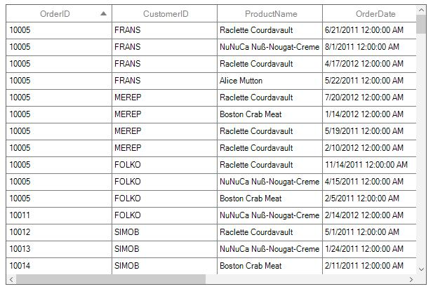
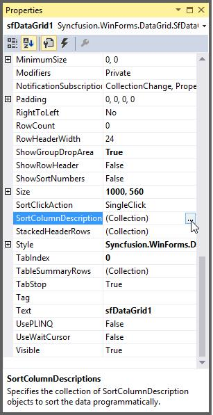
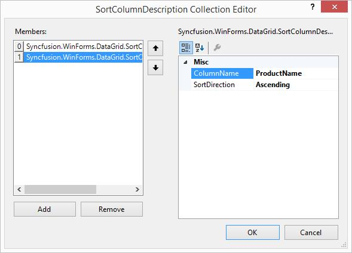
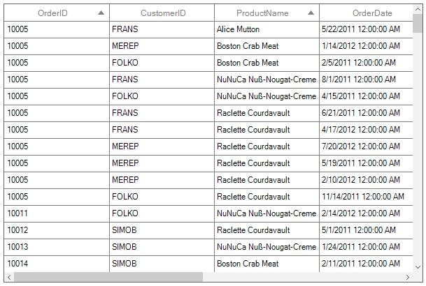
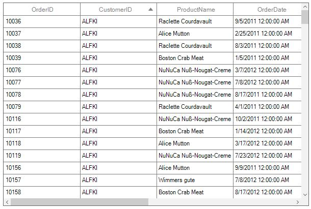
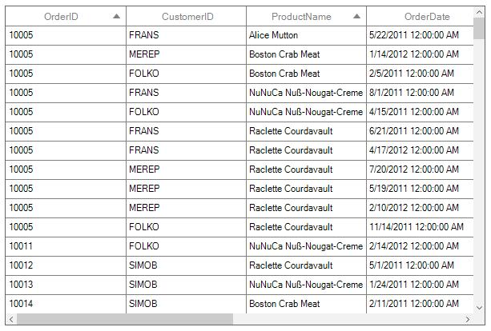
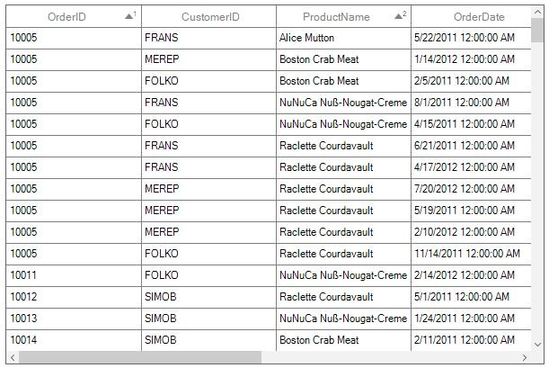
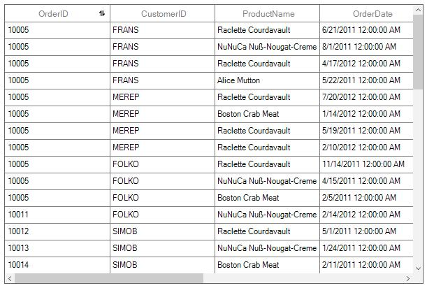
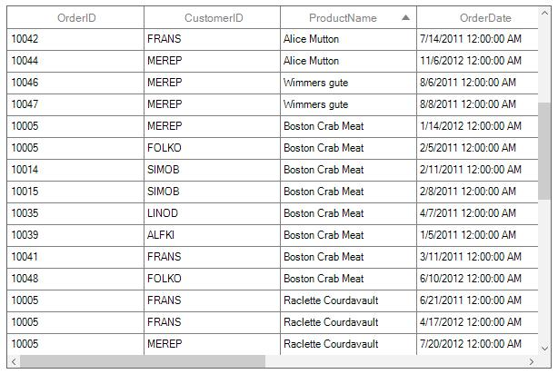

# Sorting
[SfDataGrid](http://172.16.0.145:8093/Syncfusion.DataGrid.WinForms/api/Syncfusion.WinForms.DataGrid.SfDataGrid.html) allows you to sort the data against one or more columns either in ascending or descending order. When sorting is applied, the rows are rearranged based on sort criteria.
The data can be sorted by clicking on the column headers that needs to be sorted or it can be performed programmatically. Once sorting is applied, the grid will display a sort icon in the respected column headers showing the sort direction.
You can allow users to sort the data by touching or clicking the column header using [SfDataGrid.AllowSorting](http://172.16.0.145:8093/Syncfusion.DataGrid.WinForms/api/Syncfusion.WinForms.DataGrid.SfDataGrid.html#Syncfusion_WinForms_DataGrid_SfDataGrid_AllowSorting) property to `true`.



this.sfDataGrid1.AllowSorting = true;



In another way, you can enable or disable the sorting for particular column by setting the [GridColumnBase.AllowSorting](http://172.16.0.145:8093/Syncfusion.DataGrid.WinForms/api/Syncfusion.WinForms.DataGrid.GridColumnBase.html#Syncfusion_WinForms_DataGrid_GridColumnBase_AllowSorting) property.



this.sfDataGrid1.Columns["OrderID"].AllowSorting = true;
this.sfDataGrid1.Columns["CustomerID"].AllowSorting = false;



N> The `GridColumn.AllowSorting` takes higher priority than `SfDataGrid.AllowSorting` property.

End users can sort the column by clicking column header cell. Once the columns get sorted, the sort indicator will be displayed on the right side of the column header.

### Adding sort columns

#### Through designer
At design time, data can be sorted by accessing [SortColumnDescriptions](http://172.16.0.145:8093/Syncfusion.DataGrid.WinForms/api/Syncfusion.WinForms.DataGrid.SortColumnDescriptions.html) property of `SfDataGrid`. This will open [SortColumnDescription](http://172.16.0.145:8093/Syncfusion.DataGrid.WinForms/api/Syncfusion.WinForms.DataGrid.SortColumnDescription.html) collection editor. 
In that editor, clicking the Add button will add new `SortColumnDescription` into the collection. The [ColumnName](http://172.16.0.145:8093/Syncfusion.DataGrid.WinForms/api/Syncfusion.WinForms.DataGrid.SortColumnDescription.html#Syncfusion_WinForms_DataGrid_SortColumnDescription_ColumnName) and [SortDirection](http://172.16.0.145:8093/Syncfusion.DataGrid.WinForms/api/Syncfusion.WinForms.DataGrid.SortColumnDescription.html#Syncfusion_WinForms_DataGrid_SortColumnDescription_SortDirection) properties will allow user to specify their desired field name to sort and the sort order.	

**Designer generated code**



SortColumnDescription sortColumnDescription1 = new SortColumnDescription();
SortColumnDescription sortColumnDescription2 = new SortColumnDescription();

sortColumnDescription1.ColumnName = "OrderID";
sortColumnDescription1.SortDirection = ListSortDirection.Ascending;
sortColumnDescription2.ColumnName = "ProductName";
sortColumnDescription2.SortDirection = ListSortDirection.Ascending;
this.sfDataGrid1.SortColumnDescriptions.Add(sortColumnDescription1);
this.sfDataGrid1.SortColumnDescriptions.Add(sortColumnDescription2);



N> [SfDataGrid.SortColumnsChanging](http://172.16.0.145:8093/Syncfusion.DataGrid.WinForms/api/Syncfusion.WinForms.DataGrid.SfDataGrid.html#Syncfusion_WinForms_DataGrid_SfDataGrid_SortColumnsChanging) and [SfDataGrid.SortColumnsChanged](http://172.16.0.145:8093/Syncfusion.DataGrid.WinForms/api/Syncfusion.WinForms.DataGrid.SfDataGrid.html#Syncfusion_WinForms_DataGrid_SfDataGrid_SortColumnsChanged) events are not raised when the data sorted programmatically through `SfDataGrid.SortColumnDescriptions`.

#### Through code
You can sort the data programmatically by adding or removing the `SortColumnDescription` in `SfDataGrid.SortColumnDescriptions` property.
Sorting can be applied to the grid data by creating a `SortColumnDescription` of the desired field name to the `SortColumnDescriptions.Add()`.


SortColumnDescription scd = new SortColumnDescription();
scd.ColumnName = "CustomerID";
scd.SortDirection = ListSortDirection.Ascending;

this.sfDataGrid1.SortColumnDescriptions.Add(scd);



### Removing sort columns
You can unsort the data by removing the corresponding `SortColumnDescription` from the `SfDataGrid.SortColumnDescriptions` property.


var sortColumnDescription = this.sfDataGrid1.SortColumnDescriptions.FirstOrDefault(col => col.ColumnName == "OrderID");
if (sortColumnDescription != null)
{
    this.sfDataGrid1.SortColumnDescriptions.Remove(sortColumnDescription);
}



### Clear sorting
You can clear sorting, by clearing the `SfDataGrid.SortColumnDescriptions`.



this. sfDataGrid1.SortColumnDescriptions.Clear();



### Disable sorting
The sorting functionality of the `SfDataGrid` can be disabled by using the [AllowSorting](http://172.16.0.145:8093/Syncfusion.DataGrid.WinForms/api/Syncfusion.WinForms.DataGrid.SfDataGrid.html#Syncfusion_WinForms_DataGrid_SfDataGrid_AllowSorting) property.



this.sfDataGrid1.AllowSorting = false;



## Sorting column in double click
By default, column gets sorted when column header clicked. You can change this behavior to sort the column in double click action by setting [SfDataGrid.SortClickAction](http://172.16.0.145:8093/Syncfusion.DataGrid.WinForms/api/Syncfusion.WinForms.DataGrid.SfDataGrid.html#Syncfusion_WinForms_DataGrid_SfDataGrid_SortClickAction) property to `DoubleClick`.



this.sfDataGrid1.SortClickAction = SortClickAction.DoubleClick;



## Sorting order
By default, the data is sorted in ascending or descending order when clicking column header. You can rearrange the data to its initial order from descending, when clicking column header by setting [SfDataGrid.AllowTriStateSorting](http://172.16.0.145:8093/Syncfusion.DataGrid.WinForms/api/Syncfusion.WinForms.DataGrid.SfDataGrid.html#Syncfusion_WinForms_DataGrid_SfDataGrid_AllowTriStateSorting) property.
Following are the sequence of sorting orders when clicking column header,

* Sorts the data in ascending order
* Sorts the data in descending order
* Clears the sorting and records displayed in its initial order

## Multi column sorting
`SfDataGrid` control allows you sort more than one column, where sorting is applied one column against other columns. To apply sorting on multiple columns, user have to click the column header by pressing the `Ctrl` key.
In the below screen shot, the OrderID column sorted. Then the ProductName column is sorted against the OrderID data by clicking column header by pressing `Ctrl` key. The sorting state of OrderID column is preserved and ProductName column sorted against OrderID column.

### Display sort order
It is also possible to display sorted order of columns in header by setting [SfDataGrid.ShowSortNumbers](http://172.16.0.145:8093/Syncfusion.DataGrid.WinForms/api/Syncfusion.WinForms.DataGrid.SfDataGrid.html#Syncfusion_WinForms_DataGrid_SfDataGrid_ShowSortNumbers) property to `true`.



this.sfDataGrid1.ShowSortNumbers = true;



### Custom sort icon
The sort icon can be changed using the [GridHeaderStyleInfo.SortIcon](http://172.16.0.145:8093/Syncfusion.DataGrid.WinForms/api/Syncfusion.WinForms.DataGrid.Styles.GridHeaderStyleInfo.html#Syncfusion_WinForms_DataGrid_Styles_GridHeaderStyleInfo_SortIcon) property.



this.sfDataGrid1.Columns[0].HeaderStyle.SortIcon = global::GettingStarted.Properties.Resources.SortIcon;



## Custom sorting
`SfDataGrid` allows you to sort the columns based on the custom logic. The custom sorting can be applied by adding the `SortComparer` instance to [SfDataGrid.SortComparers](http://172.16.0.145:8093/Syncfusion.DataGrid.WinForms/api/Syncfusion.WinForms.DataGrid.SfDataGrid.html#Syncfusion_WinForms_DataGrid_SfDataGrid_SortComparers).
You can implement `ISortDirection` interface in comparer to get the sort direction. So you can apply different custom logics for ascending and descending.
Follow the below steps to add custom comparer to sort using custom logic,

### Defining custom comparer
In the below code snippet, ProductName property is compared based on its string length, instead of default string comparison.



Public class CustomComparer:IComparer<object>,ISortDirection
{
    public int Compare(object x, object y)
    {
        int nameX;
        int nameY;

        //While data object passed to comparer
        if (x.GetType() == typeof(OrderInfo))
        {
            nameX = ((OrderInfo)x).ProductName.Length;
            nameY = ((OrderInfo)y).ProductName.Length;
        }
        
        //While sorting groups
        else if (x.GetType() == typeof(Group))
        {
            //Calculating the group key length
            nameX = ((Group)x).Key.ToString().Length;
            nameY = ((Group)y).Key.ToString().Length;
        }

        else
        {
            nameX = x.ToString().Length;
            nameY = y.ToString().Length;
        }

        //returns the comparison result based in SortDirection.
        if (nameX.CompareTo(nameY) > 0)
            return SortDirection == ListSortDirection.Ascending ? 1 : -1;
            
        else if (nameX.CompareTo(nameY) == -1)
            return SortDirection == ListSortDirection.Ascending ? -1 : 1;
            
        else
            return 0;
    }

    
    private ListSortDirection _SortDirection;
    
    /// 

    /// Gets or sets the property that denotes the sort direction.
    /// 

    /// <remarks>
    /// SortDirection gets updated only when sorting the groups. For other cases, SortDirection is always ascending.
    /// </remarks>
    public ListSortDirection SortDirection
    {
        get { return _SortDirection; }
        set { _SortDirection = value; }
    }
}



### Adding custom comparer
Custom comparer can be added to `SfDataGrid.SortComparers` property. `SortComparers` maintains custom comparers and the custom comparer gets called when corresponding column gets sorted by clicking column header or programmatically.



this.sfDataGrid1.SortComparers.Add(new Syncfusion.Data.SortComparer() { Comparer = new CustomComparer(), PropertyName = "ProductName" });


Sorting ProductName column sorts the data using custom comparer available in `SfDataGrid.SortComparers`.

### Canceling sorting for a specific column
The sorting for a particular column can be canceled by using the `SortColumnsChanging` event through `Cancel` property.



this.sfDataGrid1.SortColumnsChanging += SfDataGrid1_SortColumnsChanging;

private void SfDataGrid1_SortColumnsChanging(object sender, GridSortColumnsChangingEventArgs e)
{
    if (e.AddedItems[0].ColumnName == "OrderID")
    {
        e.Cancel = true;
    }
}



### Canceling scrolling after sorting
The scrolling after the sorting to bring SelectedItem in view can be cancelled by using the `SortColumnsChanging` event through [CancelScroll](http://172.16.0.145:8093/Syncfusion.DataGrid.WinForms/api/Syncfusion.WinForms.DataGrid.GridSortColumnsChangingEventArgs.html#Syncfusion_WinForms_DataGrid_GridSortColumnsChangingEventArgs_CancelScroll) property.


this.sfDataGrid1.SortColumnsChanging += SfDataGrid1_SortColumnsChanging;

private void SfDataGrid1_SortColumnsChanging(object sender, GridSortColumnsChangingEventArgs e)
{
    e.CancelScroll = true;
}



## Sorting the underlying collection
`SfDataGrid` sorts the records in UI and maintains in its internal CollectionView and it will not change the order of data in underlying collection.
You can get sorted data from [SfDataGrid.View.Records](http://172.16.0.145:8099/Syncfusion.Data.WinForms_2015/api/Syncfusion.Data.CollectionViewAdv.html#Syncfusion_Data_CollectionViewAdv_Records) when groups is not in place and [SfDataGrid.View.TopLevelGroup.DisplayElements](http://172.16.0.145:8099/Syncfusion.Data.WinForms_2015/api/Syncfusion.Data.TopLevelGroup.html#Syncfusion_Data_TopLevelGroup_DisplayElements) when grouping in place.
If you want to sort the underlying collection when sorting takes place, this can be achieved by handling `SfDataGrid.SortColumnsChanged` event.



this.dataGrid.SortColumnsChanged += dataGrid_SortColumnsChanged;

void dataGrid_SortColumnsChanged(object sender, GridSortColumnsChangedEventArgs e)
{
    var viewModel = this.DataContext as ViewModel;
    
    IEnumerable<OrderInfo> OrderedSource = viewModel.Orders;
    
    foreach (var sortColumn in this.dataGrid.View.SortDescriptions)
    {
        var columnName = sortColumn.PropertyName;
        
        if (sortColumn.Direction == ListSortDirection.Ascending)
            OrderedSource = OrderedSource.OrderBy(source => GetOrderSource(source, columnName));

        else
            OrderedSource = OrderedSource.OrderByDescending(source => GetOrderSource(source, columnName));
    }            
}

private object GetOrderSource(OrderInfo source, string name)
{
    var propInfo = source.GetType().GetRuntimeProperty(name);
    
    if (propInfo != null)
    
        // get the current sort column value
        return propInfo.GetValue(source);
        
    return null;
}


