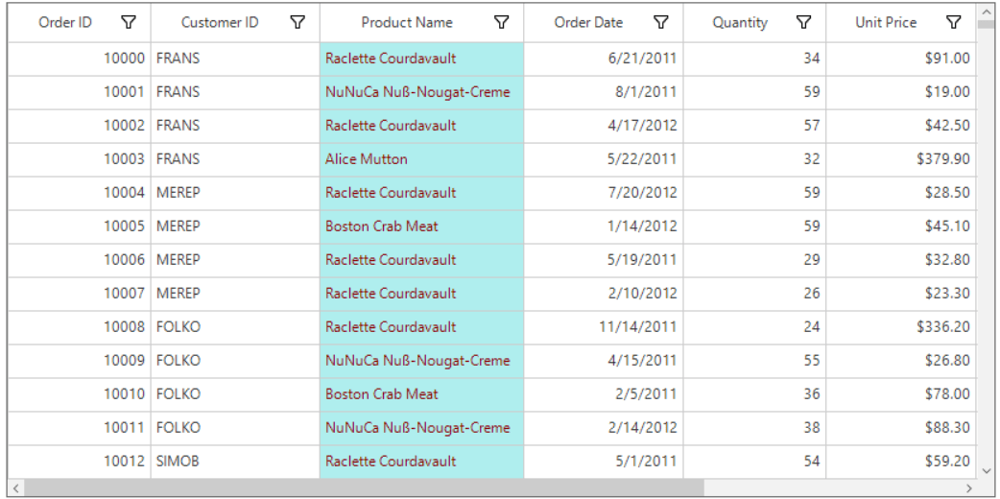
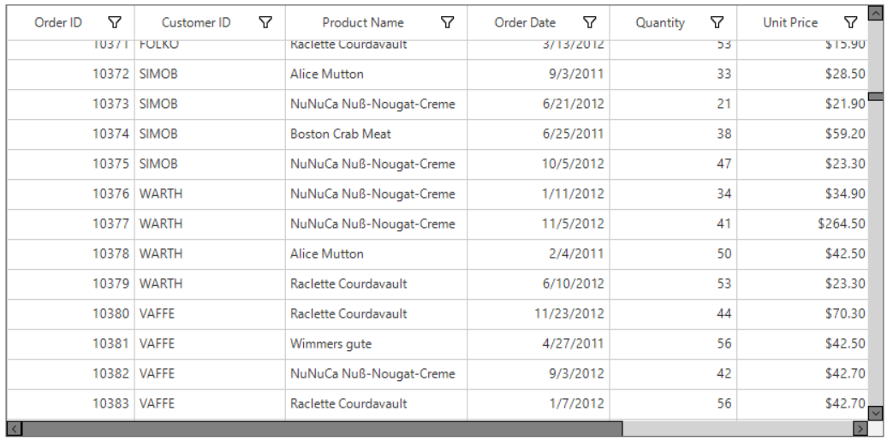
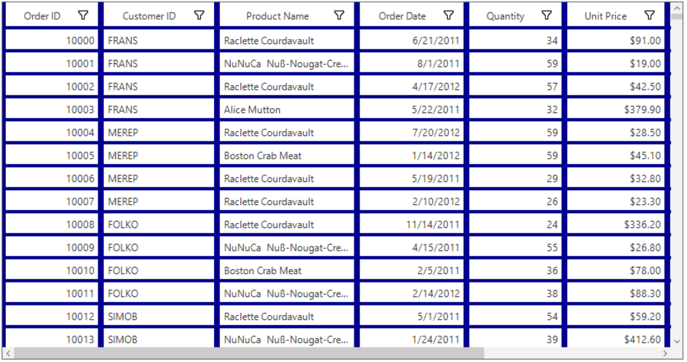
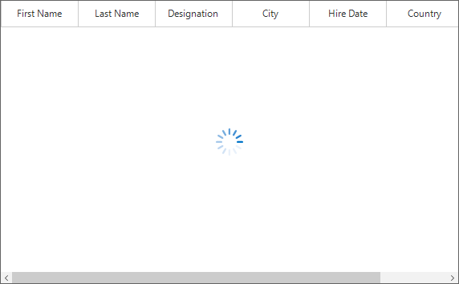

## Styling Record Cell

Appearance of the record cells can be customized by using the [CellStyle](https://help.syncfusion.com/cr/cref_files/windowsforms/sfdatagrid/Syncfusion.SfDataGrid.WinForms~Syncfusion.WinForms.DataGrid.Styles.DataGridStyle~CellStyle.html) property.



this.sfDataGrid1.Style.CellStyle.BackColor = Color.AliceBlue;
this.sfDataGrid1.Style.CellStyle.TextColor = Color.DarkBlue;


Me.sfDataGrid1.Style.CellStyle.BackColor = Color.AliceBlue
Me.sfDataGrid1.Style.CellStyle.TextColor = Color.DarkBlue



Appearance of the record cells of a particular column can be customized by using the [GridColumnBase.CellStyle](https://help.syncfusion.com/cr/cref_files/windowsforms/sfdatagrid/Syncfusion.SfDataGrid.WinForms~Syncfusion.WinForms.DataGrid.GridColumnBase~CellStyle.html) property.



this.sfDataGrid1.Columns["ProductName"].CellStyle.BackColor = Color.PaleTurquoise;
this.sfDataGrid1.Columns["ProductName"].CellStyle.TextColor = Color.DarkRed;


Me.sfDataGrid1.Columns("ProductName").CellStyle.BackColor = Color.PaleTurquoise
Me.sfDataGrid1.Columns("ProductName").CellStyle.TextColor = Color.DarkRed



Font orientation of the record cells can be set by using the [CellStyle.Font.Orientation](https://help.syncfusion.com/cr/cref_files/windowsforms/sfdatagrid/Syncfusion.SfDataGrid.WinForms~Syncfusion.WinForms.DataGrid.Styles.DataGridStyle~CellStyle.html) property.



this.sfDataGrid1.RowHeight = 80;
this.sfDataGrid1.Style.CellStyle.Font.Orientation = 45;


Me.sfDataGrid1.RowHeight = 80
Me.sfDataGrid1.Style.CellStyle.Font.Orientation = 45



N>[GridColumnBase.CellStyle](https://help.syncfusion.com/cr/cref_files/windowsforms/sfdatagrid/Syncfusion.SfDataGrid.WinForms~Syncfusion.WinForms.DataGrid.GridColumnBase~CellStyle.html) has higher priority than [SfDataGrid.Style.CellStyle](https://help.syncfusion.com/cr/cref_files/windowsforms/sfdatagrid/Syncfusion.SfDataGrid.WinForms~Syncfusion.WinForms.DataGrid.Styles.DataGridStyle~CellStyle.html).

## Styling Column Header
Appearance of the column headers can be customized by using the [HeaderStyle](https://help.syncfusion.com/cr/cref_files/windowsforms/sfdatagrid/Syncfusion.SfDataGrid.WinForms~Syncfusion.WinForms.DataGrid.Styles.DataGridStyle~HeaderStyle.html) property.
For more details, refer to `Appearance` in [Header Row](https://help.syncfusion.com/windowsforms/sfdatagrid/rows#header-row ) section.

## Styling Stacked Header
Appearance of the stacked headers can be customized by the [StackedHeaderStyle](https://help.syncfusion.com/cr/cref_files/windowsforms/sfdatagrid/Syncfusion.SfDataGrid.WinForms~Syncfusion.WinForms.DataGrid.Styles.DataGridStyle~StackedHeaderStyle.html) property.
For more details, refer to `Appearance` in [Stacked Headers](https://help.syncfusion.com/windowsforms/sfdatagrid/columns#stacked-headers ) section.

## Styling CaptionSummary
Appearance of the caption summary can be customized by using the [CaptionSummaryRowStyle](https://help.syncfusion.com/cr/cref_files/windowsforms/sfdatagrid/Syncfusion.SfDataGrid.WinForms~Syncfusion.WinForms.DataGrid.Styles.DataGridStyle~CaptionSummaryRowStyle.html) property.
For more details, refer to `Appearance` in [Caption Summary](https://help.syncfusion.com/windowsforms/sfdatagrid/summaries#caption-summary ) section.

## Styling GroupSummary
Appearance of the group summary can be customized by using the [GroupSummaryRowStyle](https://help.syncfusion.com/cr/cref_files/windowsforms/sfdatagrid/Syncfusion.SfDataGrid.WinForms~Syncfusion.WinForms.DataGrid.Styles.DataGridStyle~GroupSummaryRowStyle.html) property.
For more details, refer to `Appearance` in [Group Summary](https://help.syncfusion.com/windowsforms/sfdatagrid/summaries#group-summary ) section.

## Styling TableSummary
Appearance of the table summary can be customized by using the [TableSummaryRowStyle](https://help.syncfusion.com/cr/cref_files/windowsforms/sfdatagrid/Syncfusion.SfDataGrid.WinForms~Syncfusion.WinForms.DataGrid.Styles.DataGridStyle~TableSummaryRowStyle.html) property.
For more details, refer to `Appearance` in [Table Summary](https://help.syncfusion.com/windowsforms/sfdatagrid/summaries#table-summary ) section.

## Styling UnboundRows
Appearance of the unbound rows can be customized by using the [UnboundRowStyle](https://help.syncfusion.com/cr/cref_files/windowsforms/sfdatagrid/Syncfusion.SfDataGrid.WinForms~Syncfusion.WinForms.DataGrid.Styles.DataGridStyle~UnboundRowStyle.html) property.
For more details, refer to `Appearance` in [Unbound Rows](https://help.syncfusion.com/windowsforms/sfdatagrid/unboundrow) section.

## Styling AddNewRow
Appearance of the AddNewRow can be customized by using the [AddNewRowStyle](https://help.syncfusion.com/cr/cref_files/windowsforms/sfdatagrid/Syncfusion.SfDataGrid.WinForms~Syncfusion.WinForms.DataGrid.Styles.DataGridStyle~AddNewRowStyle.html) property.
For more details, refer to `Appearance` in [AddNewRow](https://help.syncfusion.com/windowsforms/sfdatagrid/datamanipulation#addnewrow ) section.

## Styling RowHeader
Appearance of a row header can be customized by using the [RowHeaderStyle](https://help.syncfusion.com/cr/cref_files/windowsforms/sfdatagrid/Syncfusion.SfDataGrid.WinForms~Syncfusion.WinForms.DataGrid.Styles.DataGridStyle~RowHeaderStyle.html) property.
For more details, refer to `Appearance` in [Row Header](https://help.syncfusion.com/windowsforms/sfdatagrid/rows#row-header ) section.

## Styling FilterRow
Appearance of a filter row can be customized by using the [FilterRowStyle](https://help.syncfusion.com/cr/cref_files/windowsforms/sfdatagrid/Syncfusion.SfDataGrid.WinForms~Syncfusion.WinForms.DataGrid.Styles.DataGridStyle~FilterRowStyle.html) property.
For more details, refer to `Appearance` in [Filter Row](https://help.syncfusion.com/windowsforms/sfdatagrid/filterrow#appearance ) section.

## Styling Scrollbars
Appearance of the vertical scrollbar can be customized by using the [VerticalScrollBar](https://help.syncfusion.com/cr/cref_files/windowsforms/sfdatagrid/Syncfusion.SfDataGrid.WinForms~Syncfusion.WinForms.DataGrid.Styles.DataGridStyle~VerticalScrollBar.html) property.



//Sets the back color of the vertical scrollbar arrow button.
this.sfDataGrid1.Style.VerticalScrollBar.ArrowButtonBackColor = Color.Gray;
this.sfDataGrid1.Style.VerticalScrollBar.ArrowButtonHoverBackColor = Color.White;
this.sfDataGrid1.Style.VerticalScrollBar.ArrowButtonPressedBackColor = Color.Blue;

//Sets the fore color of the vertical scrollbar arrow button.
this.sfDataGrid1.Style.VerticalScrollBar.ArrowButtonForeColor = Color.Black;
this.sfDataGrid1.Style.VerticalScrollBar.ArrowButtonHoverForeColor = Color.Black;
this.sfDataGrid1.Style.VerticalScrollBar.ArrowButtonPressedForeColor = Color.Gray;
this.sfDataGrid1.Style.VerticalScrollBar.ArrowButtonBorderColor = Color.Black;

// Sets the style properties of the thumb.
this.sfDataGrid1.Style.VerticalScrollBar.ThumbColor = Color.Gray;
this.sfDataGrid1.Style.VerticalScrollBar.ThumbHoverColor = Color.Black;
this.sfDataGrid1.Style.VerticalScrollBar.ThumbPressedColor = Color.Blue;
this.sfDataGrid1.Style.VerticalScrollBar.ThumbBorderColor = Color.Black;

// Sets the back color of the vertical scrollbar.
this.sfDataGrid1.Style.VerticalScrollBar.ScrollBarBackColor = Color.LightGray;


'Sets the back color of the vertical scrollbar arrow button.
Me.sfDataGrid1.Style.VerticalScrollBar.ArrowButtonBackColor = Color.Gray
Me.sfDataGrid1.Style.VerticalScrollBar.ArrowButtonHoverBackColor = Color.White
Me.sfDataGrid1.Style.VerticalScrollBar.ArrowButtonPressedBackColor = Color.Blue

'Sets the fore color of the vertical scrollbar arrow button.
Me.sfDataGrid1.Style.VerticalScrollBar.ArrowButtonForeColor = Color.Black
Me.sfDataGrid1.Style.VerticalScrollBar.ArrowButtonHoverForeColor = Color.Black
Me.sfDataGrid1.Style.VerticalScrollBar.ArrowButtonPressedForeColor = Color.Gray
Me.sfDataGrid1.Style.VerticalScrollBar.ArrowButtonBorderColor = Color.Black

' Sets the style properties of the thumb.
Me.sfDataGrid1.Style.VerticalScrollBar.ThumbColor = Color.Gray
Me.sfDataGrid1.Style.VerticalScrollBar.ThumbHoverColor = Color.Black
Me.sfDataGrid1.Style.VerticalScrollBar.ThumbPressedColor = Color.Blue
Me.sfDataGrid1.Style.VerticalScrollBar.ThumbBorderColor = Color.Black

' Sets the back color of the vertical scrollbar.
Me.sfDataGrid1.Style.VerticalScrollBar.ScrollBarBackColor = Color.LightGray



Appearance of the horizontal scrollbar can be customized by using the [HorizontalScrollBar](https://help.syncfusion.com/cr/cref_files/windowsforms/sfdatagrid/Syncfusion.SfDataGrid.WinForms~Syncfusion.WinForms.DataGrid.Styles.DataGridStyle~HorizontalScrollBar.html) property.



//Sets the back color of the horizontal scrollbar arrow button.
this.sfDataGrid1.Style.HorizontalScrollBar.ArrowButtonBackColor = Color.Gray;
this.sfDataGrid1.Style.HorizontalScrollBar.ArrowButtonHoverBackColor = Color.White;
this.sfDataGrid1.Style.HorizontalScrollBar.ArrowButtonPressedBackColor = Color.Blue;

//Sets the fore color of the horizontal scrollbar arrow button.
this.sfDataGrid1.Style.HorizontalScrollBar.ArrowButtonForeColor = Color.Black;
this.sfDataGrid1.Style.HorizontalScrollBar.ArrowButtonHoverForeColor = Color.Black;
this.sfDataGrid1.Style.HorizontalScrollBar.ArrowButtonPressedForeColor = Color.Gray;
this.sfDataGrid1.Style.HorizontalScrollBar.ArrowButtonBorderColor = Color.Black;

// Sets the style properties of the thumb.
this.sfDataGrid1.Style.HorizontalScrollBar.ThumbColor = Color.Gray;
this.sfDataGrid1.Style.HorizontalScrollBar.ThumbHoverColor = Color.Black;
this.sfDataGrid1.Style.HorizontalScrollBar.ThumbPressedColor = Color.Blue;
this.sfDataGrid1.Style.HorizontalScrollBar.ThumbBorderColor = Color.Black;

// Sets the back color of the horizontal scrollbar.
this.sfDataGrid1.Style.HorizontalScrollBar.ScrollBarBackColor = Color.LightGray;


'Sets the back color of the horizontal scrollbar arrow button.
Me.sfDataGrid1.Style.HorizontalScrollBar.ArrowButtonBackColor = Color.Gray
Me.sfDataGrid1.Style.HorizontalScrollBar.ArrowButtonHoverBackColor = Color.White
Me.sfDataGrid1.Style.HorizontalScrollBar.ArrowButtonPressedBackColor = Color.Blue

'Sets the fore color of the horizontal scrollbar arrow button.
Me.sfDataGrid1.Style.HorizontalScrollBar.ArrowButtonForeColor = Color.Black
Me.sfDataGrid1.Style.HorizontalScrollBar.ArrowButtonHoverForeColor = Color.Black
Me.sfDataGrid1.Style.HorizontalScrollBar.ArrowButtonPressedForeColor = Color.Gray
Me.sfDataGrid1.Style.HorizontalScrollBar.ArrowButtonBorderColor = Color.Black

' Sets the style properties of the thumb.
Me.sfDataGrid1.Style.HorizontalScrollBar.ThumbColor = Color.Gray
Me.sfDataGrid1.Style.HorizontalScrollBar.ThumbHoverColor = Color.Black
Me.sfDataGrid1.Style.HorizontalScrollBar.ThumbPressedColor = Color.Blue
Me.sfDataGrid1.Style.HorizontalScrollBar.ThumbBorderColor = Color.Black

' Sets the back color of the horizontal scrollbar.
Me.sfDataGrid1.Style.HorizontalScrollBar.ScrollBarBackColor = Color.LightGray



## Styling GroupDropArea
Appearance of the GroupDropArea can be customized by using the [GroupDropAreaStyle](https://help.syncfusion.com/cr/cref_files/windowsforms/sfdatagrid/Syncfusion.SfDataGrid.WinForms~Syncfusion.WinForms.DataGrid.Styles.DataGridStyle~GroupDropAreaStyle.html)  property.
For more details, refer to `Customizing GroupDropArea Appearance` in [Grouping](https://help.syncfusion.com/windowsforms/sfdatagrid/grouping#groupdroparea-customization ) section.

## Styling GroupDropAreaItem
Appearance of the GroupDropAreaItem can be customized by using the [GroupDropAreaItemStyle](https://help.syncfusion.com/cr/cref_files/windowsforms/sfdatagrid/Syncfusion.SfDataGrid.WinForms~Syncfusion.WinForms.DataGrid.Styles.DataGridStyle~GroupDropAreaItemStyle.html) property.
For more details, refer to `Customizing GroupDropAreaItem` Appearance in [Grouping](https://help.syncfusion.com/windowsforms/sfdatagrid/grouping#groupdroparea-customization ) section.

## Styling Frozen Rows and Columns
Appearance of the frozen rows and columns can be customized by using the [FreezePaneLineStyle](https://help.syncfusion.com/cr/cref_files/windowsforms/sfdatagrid/Syncfusion.SfDataGrid.WinForms~Syncfusion.WinForms.DataGrid.Styles.DataGridStyle~FreezePaneLineStyle.html) property.
For more details, refer to `Appearance` in [Freeze Panes](https://help.syncfusion.com/windowsforms/sfdatagrid/rows#freeze-panes ) section.

## Selection	
Appearance of the selected rows and current cell can be customized by using the [SelectionStyle](https://help.syncfusion.com/cr/cref_files/windowsforms/sfdatagrid/Syncfusion.SfDataGrid.WinForms~Syncfusion.WinForms.DataGrid.Styles.DataGridStyle~SelectionStyle.html) property.
For more details, refer to `Appearance` in [Selection](https://help.syncfusion.com/windowsforms/sfdatagrid/selection#appearance ) section.

## Changing the Color and Thickness of the Gridlines
Color and thickness of the grid lines can be changed by using the [Borders](https://help.syncfusion.com/cr/cref_files/windowsforms/sfdatagrid/Syncfusion.SfDataGrid.WinForms~Syncfusion.WinForms.DataGrid.Styles.CellStyleInfo~Borders.html) property.



this.sfDataGrid1.Style.CellStyle.Borders.All = new GridBorder(Color.DarkBlue, GridBorderWeight.ExtraThick);
this.sfDataGrid1.Style.HeaderStyle.Borders.All = new GridBorder(Color.DarkBlue, GridBorderWeight.ExtraThick);


Me.sfDataGrid1.Style.CellStyle.Borders.All = New GridBorder(Color.DarkBlue, GridBorderWeight.ExtraThick)
Me.sfDataGrid1.Style.HeaderStyle.Borders.All = New GridBorder(Color.DarkBlue, GridBorderWeight.ExtraThick)



## Showing busy indicator for the data operations

Indication of the data operation performed on the SfDataGrid can be showed with the help of `BusyIndicator` by setting the `ShowBusyIndicator` property to `true`. This will display an animated busy indicator image while performing the data operations such as loading large data, sorting, grouping, and filtering.



// To display the busy indicator in the SfDataGrid for the data operations.
this.sfDataGrid1.ShowBusyIndicator = true;


' To display the busy indicator in the SfDataGrid for the data operations.
Me.sfDataGrid1.ShowBusyIndicator = True



