# Summaries
`SfDataGrid` provides support to display the concise information about the data objects using summaries. `SfDataGrid` provides below three different types of summary rows.

* **Table Summary** – Used to display summary information of table either at top or bottom of SfDataGrid.
* **Group Summary** – Used to display summary information of data objects in each group.
* **Caption Summary** – Used to display summary information in the caption of the group.

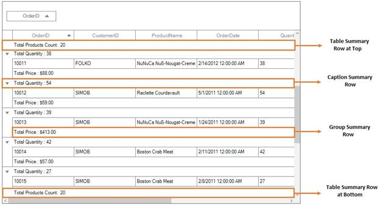

Summary rows are represented by using [GridSummaryRow](http://172.16.0.145:8093/Syncfusion.DataGrid.WinForms/api/Syncfusion.WinForms.DataGrid.GridSummaryRow.html) and each `GridSummaryRow` hold summary information of columns in [SummaryColumns](http://172.16.0.145:8093/Syncfusion.DataGrid.WinForms/api/Syncfusion.WinForms.DataGrid.GridSummaryRow.html#Syncfusion_WinForms_DataGrid_GridSummaryRow_SummaryColumns) property . The `SummaryColumns` contains the collection of [GridSummaryColumn](http://172.16.0.145:8093/Syncfusion.DataGrid.WinForms/api/Syncfusion.WinForms.DataGrid.GridSummaryColumn.html) which carries the name of column, format and its summary aggregate type.

## Aggregate Types
You can specify the different summary aggregate types by using `GridSummaryColumn.SummaryType` property and use the built-in function in `GridSummaryColumn.Format`.
The following are the list of predefined aggregate types and its built-in functions.

<table>
<tr>
<td>
{{'**Aggregate Type**'| markdownify }}
</td>
<td>
{{'**Built-in function**'| markdownify }}
</td>
</tr>
<tr>
<td>
CountAggregate
</td>
<td>
Count
</td>
</tr>
<tr>
<td>
Int32Aggregate
</td>
<td>
Count, Max, Min, Average and Sum
</td>
</tr>
<tr>
<td>
DoubleAggregate
</td>
<td>
Count, Max, Min, Average and Sum
</td>
</tr>
<tr>
<td>
Custom
</td>
<td>
Used for custom summaries
</td>
</tr>
</table>

## Table Summary
The table summary calculates the summary value over all the records. `SfDataGrid` allows you to add any number of table summary rows in top and bottom of `SfDataGrid`. 

### Adding table summary
You can add table summary row in `SfDataGrid` by adding [GridTableSummaryRow](http://172.16.0.145:8093/Syncfusion.DataGrid.WinForms/api/Syncfusion.WinForms.DataGrid.GridTableSummaryRow.html) to [SfDataGrid.TableSummaryRows](http://172.16.0.145:8093/Syncfusion.DataGrid.WinForms/api/Syncfusion.WinForms.DataGrid.SfDataGrid.html#Syncfusion_WinForms_DataGrid_SfDataGrid_TableSummaryRows) collection.

### Displaying table summary for column
You can display summary information in the column by setting [GridSummaryRow.ShowSummaryInRow](http://172.16.0.145:8093/Syncfusion.DataGrid.WinForms/api/Syncfusion.WinForms.DataGrid.GridSummaryRow.html#Syncfusion_WinForms_DataGrid_GridSummaryRow_ShowSummaryInRow) to `false` and defining summary columns. To calculate summary based on column you must specify the below properties,

1. [GridSummaryColumn.MappingName](http://172.16.0.145:8093/Syncfusion.DataGrid.WinForms/api/Syncfusion.WinForms.DataGrid.GridSummaryColumn.html#Syncfusion_WinForms_DataGrid_GridSummaryColumn_MappingName) – MappingName of the column (Property name of data object) that you want calculate summary.
2. [GridSummaryColumn.SummaryType](http://172.16.0.145:8093/Syncfusion.DataGrid.WinForms/api/Syncfusion.WinForms.DataGrid.GridSummaryColumn.html#Syncfusion_WinForms_DataGrid_GridSummaryColumn_SummaryType) – SfDataGrid provides different built-in summary calculation functions for various types.
3. [GridSummaryColumn.Format](http://172.16.0.145:8093/Syncfusion.DataGrid.WinForms/api/Syncfusion.WinForms.DataGrid.GridSummaryColumn.html#Syncfusion_WinForms_DataGrid_GridSummaryColumn_Format) – Used to define format string for summary based on support function name’s in specified SummaryType.

In the below code snippet, table summary is defined for `Total` column.



GridTableSummaryRow tableSummaryRow1 = new GridTableSummaryRow();
tableSummaryRow1.Name = "TableSummary";
tableSummaryRow1.ShowSummaryInRow = false;
tableSummaryRow1.Position = TableSummaryRowPosition.Bottom;

GridSummaryColumn summaryColumn1 = new GridSummaryColumn();
summaryColumn1.Name = "TotalSales";
summaryColumn1.SummaryType = SummaryType.DoubleAggregate;
summaryColumn1.Format = "TotalSales : {Sum:c}";
summaryColumn1.MappingName = "Total";

tableSummaryRow1.SummaryColumns.Add(summaryColumn1);

this.sfDataGrid.TableSummaryRows.Add(tableSummaryRow1);



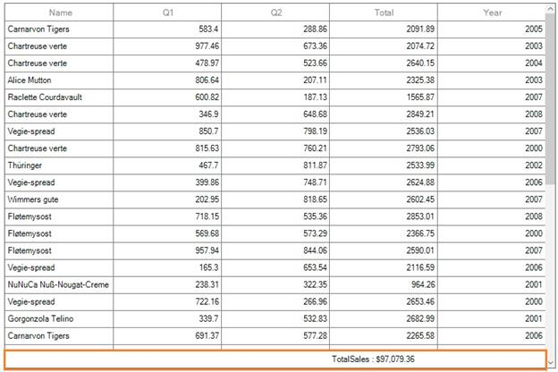

### Displaying table summary for row
You can display summary information in row by setting `GridSummaryRow.ShowSummaryInRow` to `true` and defining summary columns. You have to set [GridSummaryRow.Title](http://172.16.0.145:8093/Syncfusion.DataGrid.WinForms/api/Syncfusion.WinForms.DataGrid.GridSummaryRow.html#Syncfusion_WinForms_DataGrid_GridSummaryRow_Title) based on [GridSummaryColumn.Name](http://172.16.0.145:8093/Syncfusion.DataGrid.WinForms/api/Syncfusion.WinForms.DataGrid.GridSummaryColumn.html#Syncfusion_WinForms_DataGrid_GridSummaryColumn_Name) property to format summary columns values in row.


GridTableSummaryRow tableSummaryRow1 = new GridTableSummaryRow();
tableSummaryRow1.Name = "TableSummary";
tableSummaryRow1.ShowSummaryInRow = true;
tableSummaryRow1.Title = "Total Sales in all the year : {TotalSales}";
tableSummaryRow1.Position = TableSummaryRowPosition.Bottom;
GridSummaryColumn summaryColumn1 = new GridSummaryColumn();
summaryColumn1.Name = "TotalSales";
summaryColumn1.SummaryType = SummaryType.DoubleAggregate;
summaryColumn1.Format = "{Sum:c}";
summaryColumn1.MappingName = "Total";
tableSummaryRow1.SummaryColumns.Add(summaryColumn1);
this.sfDataGrid.TableSummaryRows.Add(tableSummaryRow1);



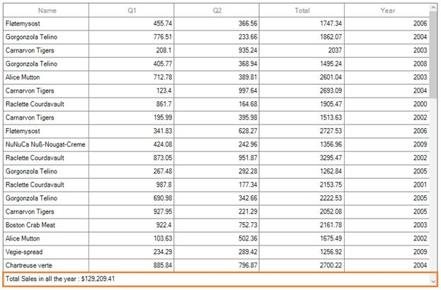

N> `GridSummaryRow.Title` must be specified if `GridSummaryRow.ShowSummaryInRow` is enabled.

### Positioning table summary row
You can position the table summary either at top or bottom of `SfDataGrid` by setting [GridTableSummaryRow.Position](http://172.16.0.145:8093/Syncfusion.DataGrid.WinForms/api/Syncfusion.WinForms.DataGrid.GridTableSummaryRow.html#Syncfusion_WinForms_DataGrid_GridTableSummaryRow_Position) property.



// Creates the TableSummaryRow.
GridTableSummaryRow tableSummaryRow1 = new GridTableSummaryRow();
tableSummaryRow1.Name = "TableSummary1";
tableSummaryRow1.ShowSummaryInRow = true;
tableSummaryRow1.Title = "Total Sales in all the year : {TotalSales}";
tableSummaryRow1.Position = TableSummaryRowPosition.Top;

GridTableSummaryRow tableSummaryRow2 = new GridTableSummaryRow();
tableSummaryRow2.Name = "TableSummary2";
tableSummaryRow2.ShowSummaryInRow = true;
tableSummaryRow2.Title = "Total Sales in all the year : {TotalSales}";
tableSummaryRow2.Position = TableSummaryRowPosition.Bottom;

// Creates the GridSummaryColumn.
GridSummaryColumn summaryColumn1 = new GridSummaryColumn();
summaryColumn1.Name = "TotalSales";
summaryColumn1.SummaryType = SummaryType.DoubleAggregate;
summaryColumn1.Format = "{Sum:c}";
summaryColumn1.MappingName = "Total";

// Adds the GridSummaryColumn in the SummaryColumns collection.
tableSummaryRow1.SummaryColumns.Add(summaryColumn1);
tableSummaryRow2.SummaryColumns.Add(summaryColumn1);

// Adds the GridTableSummaryRow in the TableSummaryRows collection.
this.sfDataGrid.TableSummaryRows.Add(tableSummaryRow1);
this.sfDataGrid.TableSummaryRows.Add(tableSummaryRow2);



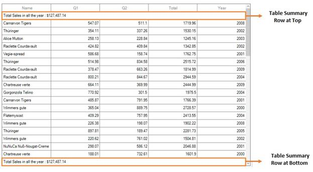

### Appearance
The appearance of the table summary can be customized by `SfDataGrid.Style.TableSummaryRowStyle` property. The `TableSummaryRowStyle` property contains all the settings that are needed for the table summary row appearance customization.



this.sfDataGrid.Style.TableSummaryRowStyle.BackColor = Color.LightSkyBlue;
this.sfDataGrid.Style.TableSummaryRowStyle.Borders.All = new GridBorder(Color.Black, GridBorderWeight.Medium);
this.sfDataGrid.Style.TableSummaryRowStyle.Font = new Font("Arial", 10f, FontStyle.Bold);



### Overriding table summary renderer
[GridTableSummaryRender](http://172.16.0.145:8093/Syncfusion.DataGrid.WinForms/api/Syncfusion.WinForms.DataGrid.Renderers.GridTableSummaryRenderer.html) is the cell renderer which renders the table summary row. The table summary row appearance and the summary value can be customized with the `GridTableSummaryRender`.

#### Creating custom renderer
You can apply number format for numeric values displayed on `GridTableSummaryRow` by overriding the `OnRender` method in `GridTableSummaryRenderer` class.



public class CustomGridTableSummaryRenderer : GridTableSummaryRenderer
{
    protected override void OnRender(Graphics paint, Rectangle cellRect, string cellValue,
        GridStyleInfo style, GridColumn column)
    {
        if (string.IsNullOrEmpty(cellValue))
            return;
        // Creates new number format and apply it to summary value. 
        NumberFormatInfo format = new NumberFormatInfo();
        format.NumberDecimalDigits = 3;
        format.NumberDecimalSeparator = "*";
        format.NumberGroupSeparator = ",";
        //Number format is applied to summary value.
        cellValue = Convert.ToDouble(double.Parse(cellValue, NumberStyles.Currency)).ToString("N", format);
        StringFormat stringFormat = new StringFormat();
        stringFormat.LineAlignment = StringAlignment.Center;
        stringFormat.Alignment = StringAlignment.Center;
        paint.DrawString(cellValue, style.Font, Brushes.Black, cellRect, stringFormat);
    }
}



#### Replacing custom renderer
The overridden custom table summary renderer can be replaced with default renderer by replacing the `CustomGridTableSummaryRenderer` to the `TableSummary` in the [CellRenderers](http://172.16.0.145:8093/Syncfusion.DataGrid.WinForms/api/Syncfusion.WinForms.DataGrid.SfDataGrid.html#Syncfusion_WinForms_DataGrid_SfDataGrid_CellRenderers) collection.



this.sfDataGrid.CellRenderers.Remove("TableSummary");
this.sfDataGrid.CellRenderers.Add("TableSummary", new CustomGridTableSummaryRenderer());


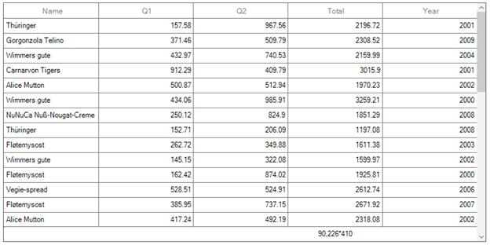

## Group Summary
Group summary values calculated based on the records in the group and the summary information will be displayed at the bottom of each group. You can view the group summary row by expanding the corresponding group header. `SfDataGrid` allows you to add any number of group summary rows.

### Adding group summary
You can add the group summary rows in `SfDataGrid` by adding the `GridSummaryRow` to [SfDataGrid.GroupSummaryRows](http://172.16.0.145:8093/Syncfusion.DataGrid.WinForms/api/Syncfusion.WinForms.DataGrid.SfDataGrid.html#Syncfusion_WinForms_DataGrid_SfDataGrid_GroupSummaryRows) collection.

### Displaying group summary for column
You can display summary information in the column by setting `GridSummaryRow.ShowSummaryInRow` to `false` and defining summary columns. To calculate summary based on column you have to specify the below properties,

1. `GridSummaryColumn.MappingName` – MappingName of the column (Property name of data object) that you want calculate summary.
2. `GridSummaryColumn.SummaryType` – SfDataGrid provides different built-in summary calculation functions for various types.
3. `GridSummaryColumn.Format` – Used to define format string for summary based on support function name’s in specified SummaryType.



// Creates the GridSummaryRow.
GridSummaryRow groupSummaryRow1 = new GridSummaryRow();
groupSummaryRow1.Name = "GroupSummary";
groupSummaryRow1.ShowSummaryInRow = false;

// Creates the GridSummaryColumn.
GridSummaryColumn summaryColumn1 = new GridSummaryColumn();
summaryColumn1.Name = "SQ4";
summaryColumn1.SummaryType = SummaryType.DoubleAggregate;
summaryColumn1.Format = "Total Sales : {Sum:c}";
summaryColumn1.MappingName = "Total";

// Adds the GridSummaryColumn in SummaryColumns collection.
groupSummaryRow1.SummaryColumns.Add(summaryColumn1);

// Adds the summary row in the GroupSummaryRows collection.
this.sfDataGrid.GroupSummaryRows.Add(groupSummaryRow1);



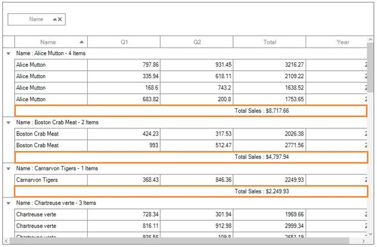

### Displaying group summary for row
You can display summary information in row by setting `GridSummaryRow.ShowSummaryInRow` to `true` and defining summary columns. You have to define `GridSummaryRow.Title` based on `GridSummaryColumn.Name` property to format summary columns values in row.



// Creates the GridSummaryRow.
GridSummaryRow groupSummaryRow1 = new GridSummaryRow();
groupSummaryRow1.Name = "GroupSummary";
groupSummaryRow1.ShowSummaryInRow = true;
groupSummaryRow1.Title = "Total Sales in the name of {Key} : {SQ4}";

// Creates the GridSummaryColumn.
GridSummaryColumn summaryColumn1 = new GridSummaryColumn();
summaryColumn1.Name = "SQ4";
summaryColumn1.SummaryType = SummaryType.DoubleAggregate;
summaryColumn1.Format = "{Sum:c}";
summaryColumn1.MappingName = "Total";

// Adds the GridSummaryColumn in SummaryColumns collection.
groupSummaryRow1.SummaryColumns.Add(summaryColumn1);

// Adds the summary row in the GroupSummaryRows collection.
this.sfDataGrid.GroupSummaryRows.Add(groupSummaryRow1);



N> `GridSummaryRow.Title` must be specified if `GridSummaryRow.ShowSummaryInRow` is enabled.

### Appearance
The appearance of the group summary can be customized by `SfDataGrid.Style.GroupSummaryRowStyle` property. The `GroupSummaryRowStyle` property contains all the settings that are needed for the group summary row appearance customization.



this.sfDataGrid.Style.GroupSummaryRowStyle.BackColor = Color.LightSkyBlue;
this.sfDataGrid.Style.GroupSummaryRowStyle.Borders.All = new GridBorder(Color.Black, GridBorderWeight.Medium);
this.sfDataGrid.Style.GroupSummaryRowStyle.Font = new Font("Arial", 10f, FontStyle.Bold);



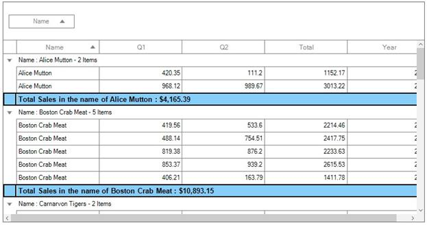

### Overriding group summary renderer
[GridGroupSummaryRenderer](http://172.16.0.145:8093/Syncfusion.DataGrid.WinForms/api/Syncfusion.WinForms.DataGrid.Renderers.GridGroupSummaryRenderer.html) is the cell renderer which renders the group summary row. The group summary row appearance and the summary value can be customized with the `GridGroupSummaryRender`.

#### Creating custom renderer
You can apply number format for numeric values displayed on group summary row by overriding the `OnRender` method in `GridGroupSummaryRenderer` class.



public class CustomGridGroupSummaryRenderer : GridGroupSummaryRenderer
{
    protected override void OnRender(Graphics paint, Rectangle cellRect, string cellValue,
        GridStyleInfo style, GridColumn column)
    {
        if (string.IsNullOrEmpty(cellValue))
            return;
        // Creates new number format and apply it to summary value. 
        NumberFormatInfo format = new NumberFormatInfo();
        format.NumberDecimalDigits = 3;
        format.NumberDecimalSeparator = "*";
        format.NumberGroupSeparator = ",";
        //Number format is applied to summary value.
        cellValue = Convert.ToDouble(double.Parse(cellValue, NumberStyles.Currency)).ToString("N", format);
        StringFormat stringFormat = new StringFormat();
        stringFormat.LineAlignment = StringAlignment.Center;
        stringFormat.Alignment = StringAlignment.Center;
        paint.DrawString(cellValue, style.Font, Brushes.Black, cellRect, stringFormat);
    }
}



#### Replacing custom renderer
The overridden custom group summary renderer can be replaced with default renderer by replacing the `CustomGridGroupSummaryRenderer` to the `GroupSummary` in the `CellRenderers` collection.



this.sfDataGrid.CellRenderers.Remove("GroupSummary");
this.sfDataGrid.CellRenderers.Add("GroupSummary", new CustomGridGroupSummaryRenderer());



## Caption Summary
SfDataGrid provides built-in support for caption summary. The caption summary value calculated based on the records in a group and the summary information will be displayed in the caption of group.
Below screen shot shows the built-in caption summary of Group.

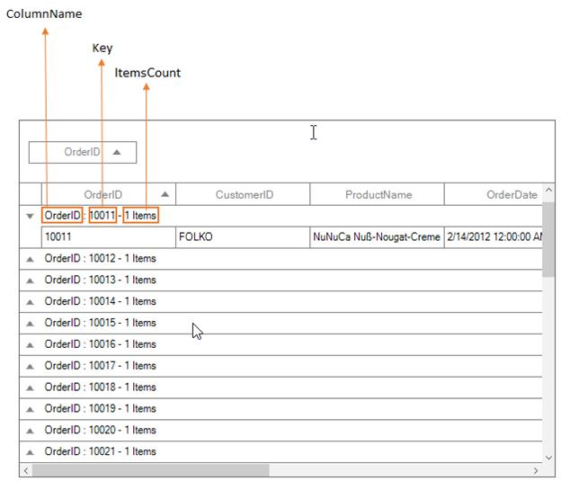

### Formatting built-in caption summary
[Caption summary](http://127.0.0.1:4000/windowsforms/sfdatagrid/grouping#formatting-built-in-group-caption)

### Displaying caption summary for column
You can display summary information in the column by setting `GridSummaryRow.ShowSummaryInRow` to `false` and defining summary columns. To calculate summary based on column you have to specify the below properties,

1. `GridSummaryColumn.MappingName` – MappingName of the column (Property name of data object) that you want calculate summary.
2. `GridSummaryColumn.SummaryType` – SfDataGrid provides different built-in summary calculation functions for various types.
3. `GridSummaryColumn.Format` – Used to define format string for summary based on support function name’s in specified SummaryType.



// Creates the GridSummaryRow.
GridSummaryRow captionSummaryRow = new GridSummaryRow();
captionSummaryRow.Name = "CaptionSummary";
captionSummaryRow.ShowSummaryInRow = false;

// Creates the GridSummaryColumn.
GridSummaryColumn summaryColumn1 = new GridSummaryColumn();
summaryColumn1.Name = "Column1";
summaryColumn1.SummaryType = SummaryType.DoubleAggregate;
summaryColumn1.Format = "{Sum:c}";
summaryColumn1.MappingName = "Total";

GridSummaryColumn summaryColumn2 = new GridSummaryColumn();
summaryColumn2.Name = "Column2";
summaryColumn2.SummaryType = SummaryType.Int32Aggregate;
summaryColumn2.Format = "{Count}";
summaryColumn2.MappingName = "Name";

// Adds the summary column in the SummaryColumns collection.
captionSummaryRow.SummaryColumns.Add(summaryColumn1);
captionSummaryRow.SummaryColumns.Add(summaryColumn2);

// Initializes the caption summary row.
this.sfDataGrid.CaptionSummaryRow = captionSummaryRow;



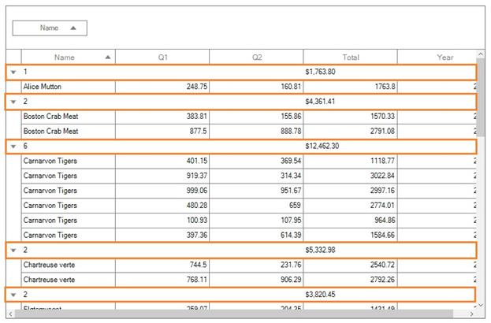

### Displaying caption summary for row
You can display summary information in row by setting `GridSummaryRow.ShowSummaryInRow` to `true` and defining summary columns. You have to define `GridSummaryRow.Title` based on `GridSummaryColumn.Name` property to format summary columns values in row.


// Creates the GridSummaryRow.
GridSummaryRow captionSummaryRow = new GridSummaryRow();
captionSummaryRow.Name = "CaptionSummary";
captionSummaryRow.ShowSummaryInRow = true;
captionSummaryRow.Title = "Total Sales in name of {Key} is {Sales}";

// Creates the GridSummaryColumn.
GridSummaryColumn summaryColumn1 = new GridSummaryColumn();
summaryColumn1.Name = "Sales";
summaryColumn1.SummaryType = SummaryType.DoubleAggregate;
summaryColumn1.Format = "{Sum:c}";
summaryColumn1.MappingName = "Total";

// Adds the summary column in the SummaryColumns collection.
captionSummaryRow.SummaryColumns.Add(summaryColumn1);

// Initializes the caption summary row.
this.sfDataGrid.CaptionSummaryRow = captionSummaryRow;



### Appearance
The appearance of the caption summary can be customized by `SfDataGrid.Style.CaptionSummaryRowStyle` property. The `CaptionSummaryRowStyle` property contains all the settings that are needed for the caption summary row appearance customization.



this.sfDataGrid.Style.GroupSummaryRowStyle.BackColor = Color.LightSkyBlue;
this.sfDataGrid.Style.GroupSummaryRowStyle.Borders.All = new GridBorder(Color.Black, GridBorderWeight.Medium);
this.sfDataGrid.Style.GroupSummaryRowStyle.Font = new Font("Arial", 10f, FontStyle.Bold);


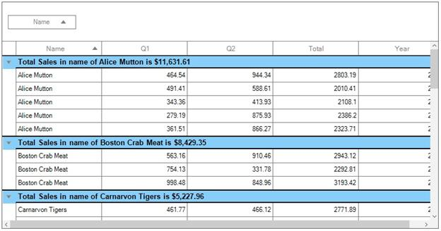

### Overriding caption summary renderer
[GridCaptionSummaryRenderer](http://172.16.0.145:8093/Syncfusion.DataGrid.WinForms/api/Syncfusion.WinForms.DataGrid.Renderers.GridCaptionSummaryRenderer.html) is the cell renderer which renders the caption summary row. The caption summary row appearance and the summary value can be customized with the `GridCaptionSummaryRender`.

#### Creating custom renderer
You can apply number format for numeric values displayed on caption summary row by overriding the `OnRender` method in `GridCaptionSummaryRenderer` class.



public class CustomGridCaptionSummaryRenderer : GridCaptionSummaryRenderer
{
    protected override void OnRender(Graphics paint, Rectangle cellRect, string cellValue,
        GridStyleInfo style, GridColumn column)
    {
        if (string.IsNullOrEmpty(cellValue))
            return;
        StringFormat stringFormat = new StringFormat();
        stringFormat.LineAlignment = StringAlignment.Center;
        stringFormat.Alignment = StringAlignment.Center;
        if (column.MappingName == "Total")
        {
            // Creates new number format and apply it to summary value. 
            NumberFormatInfo format = new NumberFormatInfo();
            format.NumberDecimalDigits = 3;
            format.NumberDecimalSeparator = "*";
            format.NumberGroupSeparator = ",";
            //Number format is applied to summary value.
            cellValue = Convert.ToDouble(double.Parse(cellValue, NumberStyles.Currency)).ToString("N", format);
        }
        paint.DrawString(cellValue, style.Font, Brushes.Black, cellRect, stringFormat);
    }
}



#### Replacing custom renderer
The overridden custom caption summary renderer can be replaced with default renderer by replacing the `CustomGridCaptionSummaryRenderer` to the `CaptionSummary` in the `CellRenderers` collection.



this.sfDataGrid.CellRenderers.Remove("CaptionSummary");
this.sfDataGrid.CellRenderers.Add("CaptionSummary", new CustomGridCaptionSummaryRenderer());



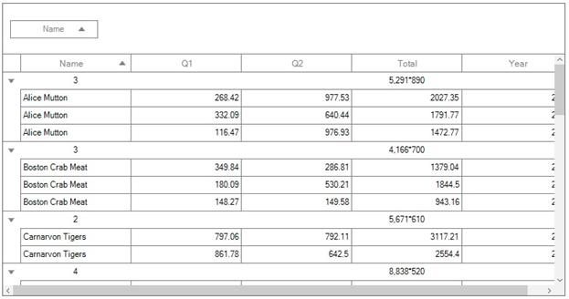

## Formatting summary
In the below sections, formatting is explained using table summary. In the same way, you can format group and caption summaries also.

### Defining summary function
In the below code snippet `Format` property is defined to display sum of `Total` by specifying the function name inside curly braces.

N> `DoubleAggregate` is used as `SummaryType` which has Count, Max, Min, Average and Sum functions.



// Creates the TableSummaryRow.
GridTableSummaryRow tableSummaryRow1 = new GridTableSummaryRow();
tableSummaryRow1.Name = "TableSummary";
tableSummaryRow1.ShowSummaryInRow = false;
tableSummaryRow1.Position = TableSummaryRowPosition.Bottom;

// Creates the GridSummaryColumn.
GridSummaryColumn summaryColumn1 = new GridSummaryColumn();
summaryColumn1.Name = "TotalSales";
summaryColumn1.SummaryType = SummaryType.DoubleAggregate;
summaryColumn1.Format = "{Sum}";
summaryColumn1.MappingName = "Total";

// Adds the GridSummaryColumn in the SummaryColumns collection.
tableSummaryRow1.SummaryColumns.Add(summaryColumn1);

// Adds the GridTableSummaryRow in the TableSummaryRows collection.
this.sfDataGrid.TableSummaryRows.Add(tableSummaryRow1);



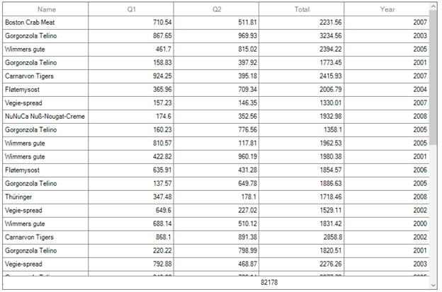

### Formatting summary value
You can format the summary value by setting the appropriate format after the aggregate function followed by colon(:) in `GridSummaryColumn.Format` property.
In the below code snippet `Total` column summary is formatted using `c` format specifier. Refer [here](https://docs.microsoft.com/en-us/dotnet/standard/base-types/standard-numeric-format-strings) to know about how to set different format.



// Creates the GridSummaryColumn.
GridSummaryColumn summaryColumn1 = new GridSummaryColumn();
summaryColumn1.Name = "TotalSales";
summaryColumn1.SummaryType = SummaryType.DoubleAggregate;
summaryColumn1.Format = "{Sum:c}";
summaryColumn1.MappingName = "Total";

// Adds the GridSummaryColumn in the SummaryColumns collection.
tableSummaryRow1.SummaryColumns.Add(summaryColumn1);

// Adds the GridTableSummaryRow in the TableSummaryRows collection.
this.sfDataGrid.TableSummaryRows.Add(tableSummaryRow1);



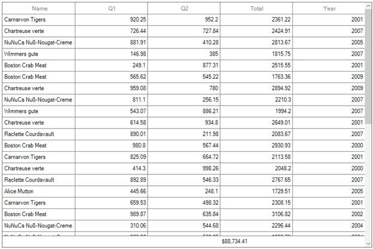

### Displaying additional content in summary
You can append additional content with summary value using [GridSummaryColumn.Format](http://172.16.0.145:8093/Syncfusion.DataGrid.WinForms/api/Syncfusion.WinForms.DataGrid.GridSummaryColumn.html#Syncfusion_WinForms_DataGrid_GridSummaryColumn_Format) property.



// Creates the GridSummaryColumn.
GridSummaryColumn summaryColumn1 = new GridSummaryColumn();
summaryColumn1.Name = "TotalSales";
summaryColumn1.SummaryType = SummaryType.DoubleAggregate;
summaryColumn1.Format = "Total Sales : {Sum:c}";
summaryColumn1.MappingName = "Total";

// Adds the GridSummaryColumn in the SummaryColumns collection.
tableSummaryRow1.SummaryColumns.Add(summaryColumn1);

// Adds the GridTableSummaryRow in the TableSummaryRows collection.
this.sfDataGrid.TableSummaryRows.Add(tableSummaryRow1);



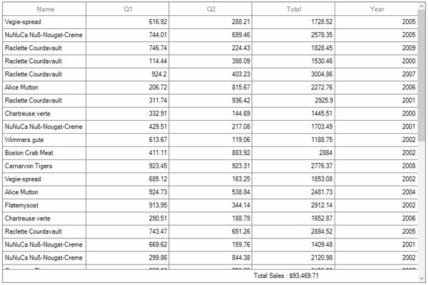

### Formatting summary for Row
You can format the summary value for row using [GridSummaryRow.Title](http://172.16.0.145:8093/Syncfusion.DataGrid.WinForms/api/Syncfusion.WinForms.DataGrid.GridSummaryRow.html#Syncfusion_WinForms_DataGrid_GridSummaryRow_Title) when `ShowSummaryInRow` set to `true`.



// Creates the TableSummaryRow.
GridTableSummaryRow tableSummaryRow1 = new GridTableSummaryRow();
tableSummaryRow1.Name = "TableSummary";
tableSummaryRow1.ShowSummaryInRow = true;
tableSummaryRow1.Title = "TotalSales in all Year : {TotalSales}";
tableSummaryRow1.Position = TableSummaryRowPosition.Bottom;
// Creates the GridSummaryColumn.
GridSummaryColumn summaryColumn1 = new GridSummaryColumn();
summaryColumn1.Name = "TotalSales";
summaryColumn1.SummaryType = SummaryType.DoubleAggregate;
summaryColumn1.Format = "{Sum:c}";
summaryColumn1.MappingName = "Total";
// Adds the GridSummaryColumn in the SummaryColumns collection.
tableSummaryRow1.SummaryColumns.Add(summaryColumn1);
// Adds the GridTableSummaryRow in the TableSummaryRows collection.
this.sfDataGrid.TableSummaryRows.Add(tableSummaryRow1);



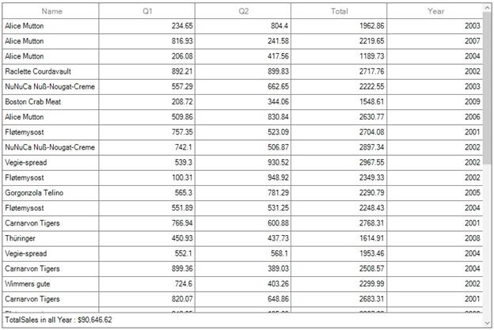

## Custom summaries
`SfDataGrid` allows you to implement your own aggregate functions, when the built-in aggregate functions don’t meet your requirement.
You can calculate the summary values based on custom logic using [GridSummaryColumn.CustomAggregate](http://172.16.0.145:8093/Syncfusion.DataGrid.WinForms/api/Syncfusion.WinForms.DataGrid.GridSummaryColumn.html#Syncfusion_WinForms_DataGrid_GridSummaryColumn_CustomAggregate) property.

### Implementing custom aggregate

1) Create custom aggregate class by deriving from [ISummaryAggregate](http://172.16.0.145:8099/Syncfusion.Data.WinForms_2015/api/Syncfusion.Data.ISummaryAggregate.html) interface.

2) In the [CalculateAggregateFunc](http://172.16.0.145:8099/Syncfusion.Data.WinForms_2015/api/Syncfusion.Data.ISummaryAggregate.html#Syncfusion_Data_ISummaryAggregate_CalculateAggregateFunc) method, you have to calculate the summary and assign it to the property.

In the below code snippet, the Standard Deviation is calculated for quantity of products.



public class CustomAggregate : ISummaryAggregate
{
    public CustomAggregate()
    {
    }
    public double StdDev { get; set; }
    Action&lt;IEnumerable, string, PropertyDescriptor&gt; ISummaryAggregate.CalculateAggregateFunc()
    {
        return (items, property, pd) =>
        {
            var enumerableItems = items as IEnumerable&lt;SalesByYear&gt;;
            if (pd.Name == "StdDev")
            {
                this.StdDev = enumerableItems.StdDev&lt;SalesByYear&gt;(q => q.Total);
            }
        };
    }
}
public static class LinqExtensions
{
    public static double StdDev&lt;T&gt;(this IEnumerable&lt;T&gt; values, Func&lt;T, double?&gt; selector)
    {
        double ret = 0;
        var count = values.Count();
        if (count > 0)
        {
            double? avg = values.Average(selector);
            double sum = values.Select(selector).Sum(d =>
            {
                if (d.HasValue)
                {
                    return Math.Pow(d.Value - avg.Value, 2);
                }
                return 0.0;
            });
            ret = Math.Sqrt((sum) / (count - 1));
        }
        return ret;
    }
}


3) Assign the custom aggregate to `GridSummaryColumn.CustomAggregate` property and set the `SummaryType` as `Custom`. `GridSummaryColumn.Format` property is defined based on property name in custom aggregate `StdDev`.



// Creates the TableSummaryRow.
GridTableSummaryRow tableSummaryRow1 = new GridTableSummaryRow();
tableSummaryRow1.Name = "TableSummary";
tableSummaryRow1.ShowSummaryInRow = true;
tableSummaryRow1.Title = "Standard Deviation for Total Sales : {TotalSales}";
tableSummaryRow1.Position = TableSummaryRowPosition.Top;
// Creates the GridSummaryColumn.
GridSummaryColumn summaryColumn1 = new GridSummaryColumn();
summaryColumn1.Name = "TotalSales";
summaryColumn1.SummaryType = SummaryType.Custom;
// Initialize the CustomAggregate.
summaryColumn1.CustomAggregate = new CustomAggregate();
summaryColumn1.Format = "{StdDev}";
// Adds the GridSummaryColumn in the SummaryColumns collection.
tableSummaryRow1.SummaryColumns.Add(summaryColumn1);
// Adds the GridTableSummaryRow in the TableSummaryRows collection.
this.sfDataGrid.TableSummaryRows.Add(tableSummaryRow1);



You can download the custom summaries demo [here](http://www.syncfusion.com/downloads/support/directtrac/general/ze/CustomSummaries462849974).
