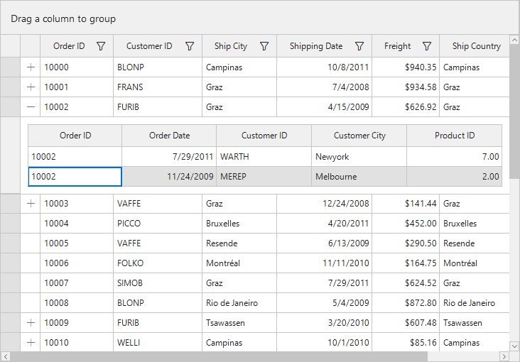
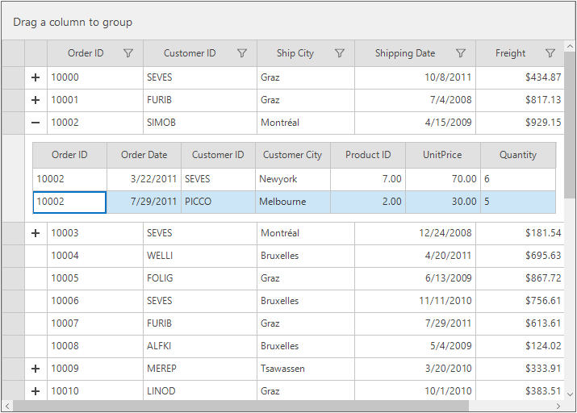
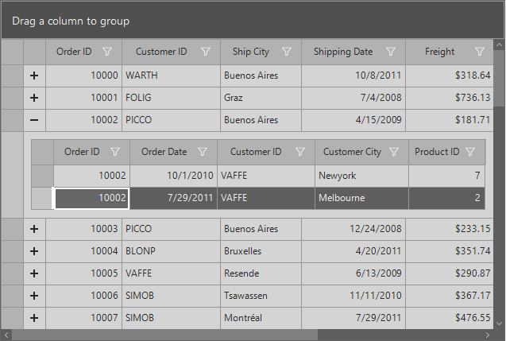
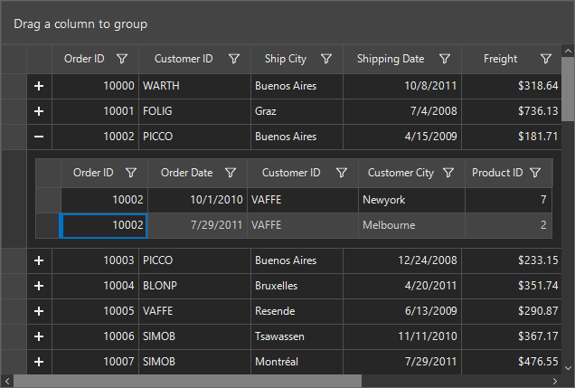

## Themes
SfDataGrid offers four built in themes for professional representation as follows.

* Office2016Colorful
* Office2016White
* Office2016DarkGray
* Office2016Black

Theme can be applied to SfDataGrid by following the below steps:

* [Load theme assembly](#load-theme-assembly)
* [Apply theme](#apply-theme)

### Load theme assembly
Syncfusion.Office2016Theme.WinForms assembly should be added as reference to set theme for SfDataGrid in any application:
Before apply theme to SfDataGrid, required theme assembly should be loaded as follows.



using Syncfusion.WinForms.Controls;

static class Program
{
        /// 

        /// The main entry point for the application.
        /// 

        
        static void Main()
        {
            SfSkinManager.LoadAssembly(typeof(Office2016Theme).Assembly);
            Application.EnableVisualStyles();
            Application.SetCompatibleTextRenderingDefault(false);
            Application.Run(new Form1());
        }
}



Imports Syncfusion.WinForms.Controls

Friend Module Program
        ''' 

        ''' The main entry point for the application.
        ''' 

        Sub Main()
            SfSkinManager.LoadAssembly(GetType(Office2016Theme).Assembly)
            Application.EnableVisualStyles()
            Application.SetCompatibleTextRenderingDefault(False)
            Application.Run(New Form1())
        End Sub
End Module



### Apply theme
Appearance of SfDataGrid can be changed by `ThemeName` of SfDataGrid.

### Office2016Colorful
This option helps to set the Office2016Colorful Theme.



// Office2016Colorful
 this.sfDataGrid.ThemeName = "Office2016Colorful";


' Office2016Colorful
 this.sfDataGrid.ThemeName = "Office2016Colorful"



### Office2016White
This option helps to set the Office2016White Theme.



// Office2016White
 this.sfDataGrid.ThemeName = " Office2016White ";


' Office2016White
 this.sfDataGrid.ThemeName = " Office2016White "



### Office2016DarkGray
This option helps to set the Office2016DarkGray Theme.



// Office2016DarkGray
 this.sfDataGrid.ThemeName = " Office2016DarkGray ";


' Office2016DarkGray
 this.sfDataGrid.ThemeName = " Office2016DarkGray "



### Office2016Black
This option helps to set the Office2016Black Theme.



// Office2016DarkGray
 this.sfDataGrid.ThemeName = " Office2016Black ";


' Office2016DarkGray
 this.sfDataGrid.ThemeName = " Office2016Black "



