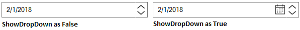
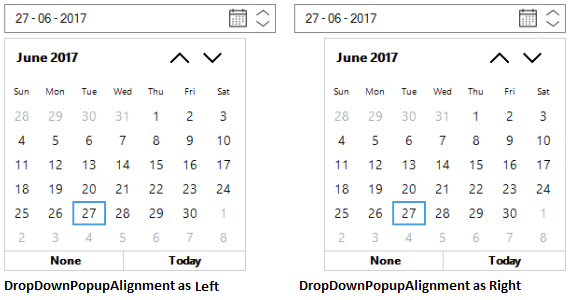
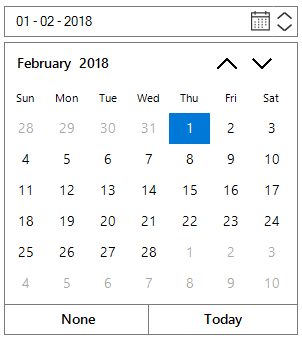

# Customizations

## Customize the UpDown Button

UpDown allows to change the value by Keyboard or Mouse interaction and it also allows to define increment or decrement the values of date, month and year when change the value by clicking Up and Down buttons. Shows or hides the UpDown buttons using the `ShowUpDown` property. The following code snippets illustrates the same.





//Enable the UpDown Button

this.dateTimeEdit.ShowUpDown = true;

//Disable the UpDown Button

this.dateTimeEdit.ShowUpDown = false;





'Enable the UpDown Button

this.dateTimeEdit.ShowUpDown = True

'Disable the UpDown Button

this.dateTimeEdit.ShowUpDown = False



 

## Customize the DropDown Button

DropDown allows to open the Calendar Popup by Keyboard or Mouse interaction. Shows or hides the DropDown button using the `ShowDropDown` property. The following code snippets illustrates the same.





//Enable the DropDown Button

this.dateTimeEdit.ShowDropDown = true;

//Disable the DropDown Button

this.dateTimeEdit.ShowDropDown = false;





'Enable the DropDown Button

this.dateTimeEdit.ShowDropDown = True

'Disable the DropDown Button

this.dateTimeEdit.ShowDropDown = False



 

## Key Navigation Support

`DateTimeField` can be chosen and `DateTime` Value can be increment / decrement with Left Arrow Key, Right Arrow Key , Up Arrow Key, Down Arrow Key combinations. This can be enabled / disabled by using `InterceptArrowKeys` property. The following code snippets illustrates the same.





//Allow the arrow keys functionalities

this.dateTimeEdit.InterceptArrowKeys = true;

//Disable the arrow keys functionalities

this.dateTimeEdit.InterceptArrowKeys = false;





'Allow the arrow keys functionalities

this.dateTimeEdit.InterceptArrowKeys = True

'Disable the arrow keys functionalities

this.dateTimeEdit.InterceptArrowKeys = False



 

## DropDown Popup Alignment customization

`DateTime` Value can be chosen from Popup Calendar. By default it will be displayed from Left position and its initial display position can be customized by `DropDownPopupAlignment` property. The following code snippets illustrates the same.





//Setting Left Popup alignment

this.dateTimeEdit.DropDownPopupAlignment = DropDownPopupAlignment.Left;

//Setting Right Popup alignment

this.dateTimeEdit.DropDownPopupAlignment = DropDownPopupAlignment.Right;





'Setting Left Popup alignment

this.dateTimeEdit.DropDownPopupAlignment = DropDownPopupAlignment.Left

'Setting Right Popup alignment

this.dateTimeEdit.DropDownPopupAlignment = DropDownPopupAlignment.Right



 

## DropDown Popup Size customization

By default it will be displayed from Left position with default Popup Width and it can be customized by `DropDownSize` property. The following code snippets illustrates the same.





//Setting DropDownSize

this.dateTimeEdit.DropDownSize = new Size(294, 293);

this.dateTimeEdit.Width = 294;





'Setting DropDownSize

this.dateTimeEdit.DropDownSize = new Size(294, 293)

this.dateTimeEdit.Width = 294



 

