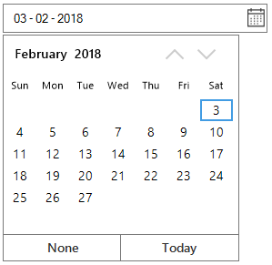

# Date Range

Prevent user from setting a date and time within a specified range can be achieved by `MinDateTime` and `MaxDateTime` property of SfDateTimeEdit.

## Change the Value

Date and time of SfDateTimeEdit can be changed by `Value` property. Value can be set as null when `AllowNull` is true. Default mode of DateTimeEditing only allows to change the selected value as null. Mask mode will not allows to change the value as null. Value can also be edited by selecting  `DateTimeField` and edit the value. Value will be validated when control lost it's focus or press enter key.

`ValueChanged` event will be invoke when change on `Value` property of SfDateTimeEdit. If any custom actions need to 

### Change Value by DateTimeText

Value of SfDateTimeEdit can also be changed by `DateTimeText`. DateTimeText should be provided in the same pattern as `DateTimePattern`.

## Minimum DateTime

`MinDateTime` can help to restrict the DateTime value set lesser than specific DateTime Value. If the `Value` of SfDateTimeEdit is less than `MinDateTime`, then the Value property reset to MinDateTime. `MinDateTime` should be lesser than `MaxDateTime` of SfDateTimeEdit. When the MinDateTime is set, if the new `MinDateTime` value is greater than the `MaxDateTime`, then the MaxDateTime reset to the MinDateTime.

## Maximum DateTime

`MaxDateTime` can help to restrict the DateTime value set greater than specific DateTime Value. If the `Value` of SfDateTimeEdit is greater than `MaxDateTime`, then the Value property reset to MaxDateTime. `MaxDateTime` should be greater than `MinDateTime` of SfDateTimeEdit. When the MaxDateTime is set, if the `MinDateTime` property is greater than the new `MaxDateTime`, then the MinDateTime reset to the MaxDateTime. 

Sometimes, the value needs to be restricted in between some particular date range. Lets Consider a project for hotel reservation system. The “In DateTime” has to be lesser than the “Out DateTime” and vice versa. So “In DateTime” has to be set as minimum DateTime and “Out DateTime” has to be set as maximum DateTime in the `SfDateTimeEdit` control.





Syncfusion.WinForms.Input.SfDateTimeEdit dateTimeEdit = new Syncfusion.WinForms.Input.SfDateTimeEdit();

this.Controls.Add(dateTimeEdit);

dateTimeEdit.Value = new DateTime(2018, 2, 1);

dateTimeEdit.MinDateTime = new DateTime(2018, 2, 1);

dateTimeEdit.MaxDateTime = new DateTime(2018, 2, 28);





Dim dateTimeEdit As Syncfusion.WinForms.Input.SfDateTimeEdit = New Syncfusion.WinForms.Input.SfDateTimeEdit

Me.Controls.Add(dateTimeEdit)

dateTimeEdit.Value = New DateTime(2018, 2, 1)

dateTimeEdit.MinDateTime = New DateTime(2018, 2, 1)

dateTimeEdit.MaxDateTime = New DateTime(2018, 2, 28)





## Detect the Value change

`Value` property is used to set the current selected DateTime of `SfDateTimeEdit`. The value change can be detected by handling the `ValueChanged` event.





private void DateTimeEdit_ValueChanged(object sender, EventArgs e)
{
     MessageBox.Show("SfDateTimeEdit value has been changed");
}





Private Sub DateTimeEdit_ValueChanged(ByVal sender As Object, ByVal e As EventArgs)

        MessageBox.Show("SfDateTimeEdit value has been changed")

End Sub



 