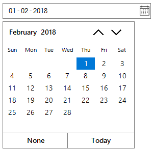

# Date Range

**Date Range** between two dates is achieved by `MinDateTime`, `MaxDateTime` property of SfDateTimeEdit.

## Minimum DateTime

`MinDateTime` can help to restrict the DateTime value set lesser than specific DateTime Value. If the `Value` of SfDateTimeEdit is less than `MinDateTime`, then the Value property reset to MinDateTime. When the MinDateTime is set, if the new `MinDateTime` value is greater than the `MaxDateTime`, then the MaxDateTime reset to the MinDateTime. 

## Maximum DateTime

`MaxDateTime` can help to restrict the DateTime value set greater than specific DateTime Value. If the `Value` of SfDateTimeEdit is greater than `MaxDateTime`, then the Value property reset to MaxDateTime. When the MaxDateTime is set, if the `MinDateTime` property is greater than the new `MaxDateTime`, then the MinDateTime reset to the MaxDateTime. 

Sometimes, the value needs to be restricted in between some particular date range. Lets Consider a project for hotel reservation system. The “In DateTime” has to be lesser than the “Out DateTime” and vice versa. So “In DateTime” has to be set as minimum DateTime and “Out DateTime” has to be set as maximum DateTime in the `SfDateTimeEdit` control.





Syncfusion.WinForms.Input.SfDateTimeEdit dateTimeEdit = new Syncfusion.WinForms.Input.SfDateTimeEdit();

this.Controls.Add(dateTimeEdit);

dateTimeEdit.Value = new DateTime(2018, 2, 1);

dateTimeEdit.MinDateTime = new DateTime(2018, 2, 1);

dateTimeEdit.MaxDateTime = new DateTime(2018, 2, 28);





Dim dateTimeEdit As New Syncfusion.WinForms.Input.SfDateTimeEdit()

Me.Controls.Add(dateTimeEdit)

dateTimeEdit.Value = New DateTime(2018, 2, 1)

dateTimeEdit.MinDateTime = New DateTime(2018, 2, 1)

dateTimeEdit.MaxDateTime = New DateTime(2018, 2, 28)





## Detect the Value change of SfDateTimeEdit

`Value` property is used to set the current selected DateTime of `SfDateTimeEdit`. The value change cab be detected by handling the `ValueChanged` event.





private void DateTimeEdit_ValueChanged(object sender, EventArgs e)
{
     MessageBox.Show("SfDateTimeEdit value has been changed");
}





Private Sub DateTimeEdit_ValueChanged(sender As Object, e As EventArgs)

	MessageBox.Show("SfDateTimeEdit value has been changed")
    
End Sub



 