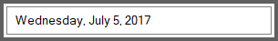
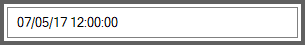

# DateTime Display Patterns

The display format of the date in `SfDateTimeEdit` control can be customized by the Pattern and Custom display Pattern properties.

## DateTime Format

`SfDateTimeEdit` control can support the following DateTime format, 

* LongDate 
* LongTime 
* ShortDate 
* ShortTime
* FullDateTime
* MonthDay 
* Custom 
* ShortableDateTime 
* UniversalShortableDateTime 
* RFC1123 
* YearMonth 

The different display format of DateTime can be set by `DateTimePattern` property. The following code snippet illustrates how to set the format as LongDate:





Syncfusion.WinForms.Input.SfDateTimeEdit dateTimeEdit = new  Syncfusion.WinForms.Input.SfDateTimeEdit();

this.Controls.Add(dateTimeEdit);

dateTimeEdit.Value = new DateTime(2017, 07, 05);

dateTimeEdit.DateTimePattern = DateTimePattern.LongDate;





Dim dateTimeEdit As New Syncfusion.WinForms.Input.SfDateTimeEdit()

Me.Controls.Add(dateTimeEdit)

dateTimeEdit.Value = New DateTime(2017, 7, 5)

dateTimeEdit.DateTimePattern = DateTimePattern.LongDate



 

Long Date
{:.caption}

## Custom Display Pattern

The custom pattern can be displayed in the `SfDateTimeEdit` control using the `Format` property. Refer the following list to create the custom format for `SfDateTimeEdit`.

* d - Day of the month.
* ddd - Short name of day of the week.
* dddd - Full name of day of the week.
* M – The month, from 1 to 12.
* MMM- Short name of Month.
* MMMM- Long name of the Month.
* yy - Last two digit of year.
* yyyy - Full Year.
* hh – Hour.
* mm – Minutes.
* ss – Seconds.
* tt - The AM/PM Meridiem.





Syncfusion.WinForms.Input.SfDateTimeEdit dateTimeEdit = new Syncfusion.WinForms.Input.SfDateTimeEdit();

this.Controls.Add(dateTimeEdit);

dateTimeEdit.Value = new DateTime(2017, 07, 05);

dateTimeEdit.DateTimePattern = DateTimePattern.Custom;

//Setting Custom Pattern

dateTimeEdit.Format = "MM/dd/yy hh:mm:ss";





Dim dateTimeEdit As New Syncfusion.WinForms.Input.SfDateTimeEdit()

Me.Controls.Add(dateTimeEdit)

dateTimeEdit.Value = New DateTime(2017, 7, 5)

dateTimeEdit.DateTimePattern = DateTimePattern.[Custom]

'Setting Custom Pattern

dateTimeEdit.Format = "MM/dd/yy hh:mm:ss"



 

N> CustomPattern support can be enabled by setting the `DateTimePattern` to the `Custom`.
