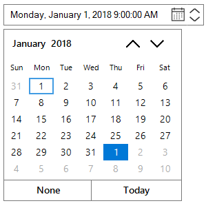

# Getting Started

This section briefly describes how to design a `SfDateTimeEdit` Control in a Windows Forms Application.

* Adding SfDateTimEdit Control 
* Configuring SfDateTimeEdit Values

## Adding SfDateTimeEdit Control

### Through Designer

The following steps illustrate how to create an Edit Control through designer.

* Create a new Windows Forms Application Project in VS IDE through New Project Wizard.
* Drag and Drop `SfDateTimeEdit` control in the Form from Toolbox.

 

### Configuring SfDateTimeEdit Values

The most commonly used settings of the `SfDateTimeEdit` control are configured either through Designer using the Smart tag or through the Properties window or through code.

### Through Code

There are several ways to add Syncfusion control in to the Visual Studio Windows Forms project. The following steps help to add a SfDateTimeEdit control through Code.

1) Create a Windows Forms project in Visual Studio and refer to the following assemblies.

* Syncfusion.Core.Windows.dll
* Syncfusion.Grid.Base.dll
* Syncfusion.Grid.Windows.dll
* Syncfusion.Shared.Base.dll
* Syncfusion.Shared.Windows.dll
* Syncfusion.SpellChecker.Base.dll
* Syncfusion.Tools.Windows.dll
* Syncfusion.SfInput.Windows.dll

2) Now add the `SfDateTimeEdit` control with a required optimal name by using the included namespace.

To add `SfDateTimeEdit` Control to a Windows Forms Application through code behind.

1. Include the namespaces Syncfusion.WinForms.Input





using Syncfusion.WinForms.Input;





Imports Syncfusion.WinForms.Input



 

2. Create an instance of the `SfDateTimeEdit` control and add it to the Form.





SfDateTimeEdit sfDateTimeEdit = new SfDateTimeEdit();

this.Controls.Add(sfDateTimeEdit);





Dim SfDateTimeEdit As New SfDateTimeEdit()

Me.Controls.Add(sfDateTimeEdit)





### Set the Min and Max Date with Time Interval

In a real-time appointment scenario, the appointment is open only for a limited number of days. You have to select a date and time within the given range. This can be achieved by using the properties minimum and maximum that enables the specified date range in the SfDateTimeEdit control. The following code snippets illustrates the same.





Syncfusion.WinForms.Input.SfDateTimeEdit dateTimeEdit = new Syncfusion.WinForms.Input.SfDateTimeEdit();

this.Controls.Add(dateTimeEdit);

dateTimeEdit.Value = new DateTime(2018, 1, 2);

dateTimeEdit.MinDateTime = new DateTime(2018, 1, 2);

dateTimeEdit.MaxDateTime = new DateTime(2018, 28, 2);





Dim dateTimeEdit As New Syncfusion.WinForms.Input.SfDateTimeEdit()

Me.Controls.Add(dateTimeEdit)

dateTimeEdit.Value = New DateTime(2018, 1, 2)

dateTimeEdit.MinDateTime = New DateTime(2010, 01, 01)

dateTimeEdit.MaxDateTime = New DateTime(2030, 01, 01)





### Set the Culture

This control provides globalization support through the Culture property. If the `Culture` property is changed, then the DateTime displayed as per the Culture. The following code snippets illustrates the same





Syncfusion.WinForms.Input.SfDateTimeEdit dateTimeEdit = new Syncfusion.WinForms.Input.SfDateTimeEdit();

dateTimeEdit.Value = new DateTime(2010, 07, 05);

dateTimeEdit.DateTimePattern = DateTimePattern.LongDate;

dateTimeEdit.Culture = new CultureInfo("en-US");





Dim dateTimeEdit As New Syncfusion.WinForms.Input.SfDateTimeEdit()

dateTimeEdit.Value = New DateTime(2010, 7, 5)

dateTimeEdit.DateTimePattern = DateTimePattern.LongDate

dateTimeEdit.Culture = New CultureInfo("en-US")



 





Syncfusion.WinForms.Input.SfDateTimeEdit dateTimeEdit = new Syncfusion.WinForms.Input.SfDateTimeEdit();

dateTimeEdit.Value = new DateTime(2010, 07, 05);

dateTimeEdit.DateTimePattern = DateTimePattern.LongDate;

dateTimeEdit.Culture = new CultureInfo("fr-FR");





Dim dateTimeEdit As New Syncfusion.WinForms.Input.SfDateTimeEdit()

dateTimeEdit.Value = New DateTime(2010, 7, 5)

dateTimeEdit.DateTimePattern = DateTimePattern.LongDate

dateTimeEdit.Culture = New CultureInfo("fr-FR")



 

