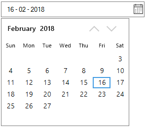
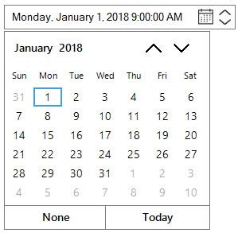

# Getting Started

This section briefly describes how to design a `SfDateTimeEdit` control in a Windows Forms Application.

* Adding SfDateTimeEdit Control 
* Configuring SfDateTimeEdit Values

## Creating simple application with SfDateTimeEdit

In this walk through, you will create Windows Forms Application that contains SfDateTimEdit control.

1. [Creating project](#creating-the-project)
2. [Adding control via Designer](#adding-control-via-designer)
3. [Adding control manually in code](#adding-control-manually-in-code)
4. [Configuring date range](#configuring-date-range)
5. [Configure editing mode](#configure-editing-mode)
6. [Configure allow null value](#configure-allow-null-value)
7. [Configure custom format](#configure-custom-format)
8. [Configure UpDown DateTimeEdit](#configure-updown-datetimeedit)

### Creating the project

Create new Windows Forms Project in Visual Studio to display SfDateTimEdit with date and time information.

### Adding control via Designer

`SfDateTimEdit` control can be added to the application by dragging it from Toolbox and dropping it in designer view. The required assembly references will be added automatically.

### Adding control manually in Code

In order to add control manually in C#, do the below steps,

1. Add the below required assembly references to the project,
	* Syncfusion.Core.WinForms.dll
	* Syncfusion.SfInput.WinForms.dll

2. Include the namespaces **Syncfusion.WinForms.Input**





using Syncfusion.WinForms.Input;





Imports Syncfusion.WinForms.Input



 

2. Create `SfDateTimeEdit` control instance and add it to the Form.





SfDateTimeEdit sfDateTimeEdit = new SfDateTimeEdit();

this.Controls.Add(sfDateTimeEdit);





Dim SfDateTimeEdit As New SfDateTimeEdit()

Me.Controls.Add(sfDateTimeEdit)





## Configure date range

In a real-time appointment scenario, the appointment is open only for a limited number of days. You have to select a date and time within the given range. This can be achieved by the properties minimum and maximum that enables the specified date range in the SfDateTimeEdit control. The following code snippets illustrates the same.





Syncfusion.WinForms.Input.SfDateTimeEdit dateTimeEdit = new Syncfusion.WinForms.Input.SfDateTimeEdit();

this.Controls.Add(dateTimeEdit);

dateTimeEdit.Value = new DateTime(2018, 2, 16);

dateTimeEdit.MinDateTime = new DateTime(2018, 2, 3);

dateTimeEdit.MaxDateTime = new DateTime(2018, 2, 27);





Dim dateTimeEdit As New Syncfusion.WinForms.Input.SfDateTimeEdit()

Me.Controls.Add(dateTimeEdit)

dateTimeEdit.Value = New DateTime(2018, 2, 16)

dateTimeEdit.MinDateTime = New DateTime(2018, 2, 3)

dateTimeEdit.MaxDateTime = New DateTime(2018, 2, 27)





## Configure editing mode

Date-time value in DateTimeEdit can be edited by two ways. 

* Default Editing 
* Mask Editing

Editing modes can be changed by `DateTimeEditingMode` of SfDateTimEdit. The following code example illustrates how to change the date time edting mode.





dateTimeEdit.DateTimeEditingMode = DateTimeEditingMode.Mask;





dateTimeEdit.DateTimeEditingMode = DateTimeEditingMode.Mask



 

## Configure allow null value

SfDateTimEdit allow to set the `Value` as null in Mask mode of DateTimeEditing when `AllowNull` is true. The following code snippets illustrates the same





dateTimeEdit.DateTimeEditingMode = DateTimeEditingMode.Mask;

dateTimeEdit.AllowNull = true;





dateTimeEdit.DateTimeEditingMode = DateTimeEditingMode.Mask

dateTimeEdit.AllowNull = true



 

## Configure custom format

The custom pattern can be displayed in the `SfDateTimeEdit` control using the `Format` property when `DateTimePattern` is Custom. Refer the following list to create the custom format for `SfDateTimeEdit`.





Syncfusion.WinForms.Input.SfDateTimeEdit dateTimeEdit = new Syncfusion.WinForms.Input.SfDateTimeEdit();

this.Controls.Add(dateTimeEdit);

dateTimeEdit.Value = new DateTime(2017, 07, 05);

dateTimeEdit.DateTimePattern = DateTimePattern.Custom;

//Setting Custom Pattern

dateTimeEdit.Format = "MM/dd/yy hh:mm:ss";





Dim dateTimeEdit As Syncfusion.WinForms.Input.SfDateTimeEdit = New Syncfusion.WinForms.Input.SfDateTimeEdit

Me.Controls.Add(dateTimeEdit)

dateTimeEdit.Value = New DateTime(2017, 7, 5)

dateTimeEdit.DateTimePattern = DateTimePattern.Custom

'Setting Custom Pattern

dateTimeEdit.Format = "MM/dd/yy hh:mm:ss"



 

## Configure UpDown DateTimeEdit

To Make the DateTimeEdit as UpDown control set `ShowUpDown` property as `true`. UpDown will appear only when `DateTimeEditingMode` is Mask.





//Enable the UpDown Button

this.dateTimeEdit.ShowUpDown = true;





'Enable the UpDown Button

Me.dateTimeEdit.ShowUpDown = true



 

