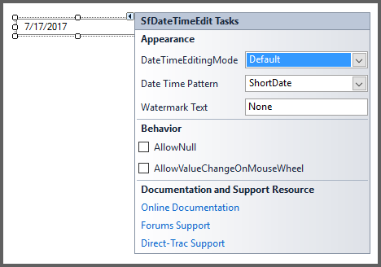

# Getting Started

This section briefly describes how to design a `SfDateTimeEdit` Control in a Windows Forms Application.

* Adding SfDateTimEdit Control 
* Configuring SfDateTimeEdit Values

## Adding SfDateTimeEdit Control

* Create a new Windows Forms Application Project in VS IDE through New Project Wizard.
* Drag and Drop `SfDateTimeEdit` control in the Form from Toolbox.

 

## Configuring SfDateTimeEdit Values

The most commonly used settings of the `SfDateTimeEdit` control are configured either through Designer using the Smart tag or through the Properties window or through code.

To add `SfDateTimeEdit` Control to a Windows Forms Application through code behind.

1. Include the namespaces Syncfusion.WinForms.Input





using Syncfusion.WinForms.Input;





Imports Syncfusion.WinForms.Input



 

2. Create an instance of the `SfDateTimeEdit` control and add it to the Form.





SfDateTimeEdit sfDateTimeEdit = new SfDateTimeEdit();

this.Controls.Add(sfDateTimeEdit);





Dim SfDateTimeEdit As New SfDateTimeEdit()

Me.Controls.Add(sfDateTimeEdit)




