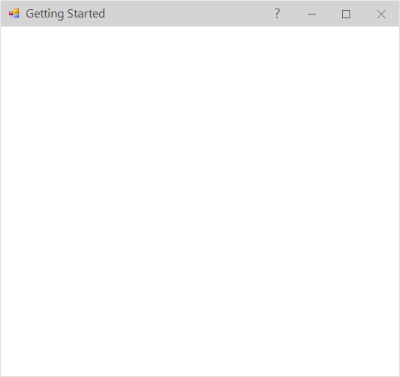
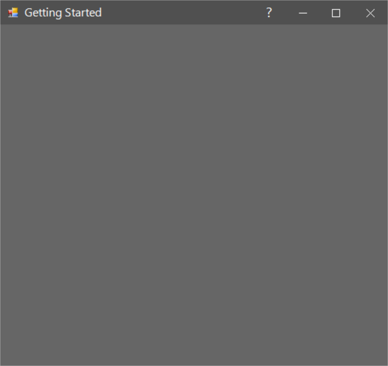

# Themes
SfForm  offers four six in themes for professional representation as follows.

* Office2016Colorful
* Office2016White
* Office2016DarkGray
* Office2016Black
* Office2019Colorful
* HighContrastBlack

Theme can be applied to `SfForm` by following the below steps:

* `Load theme assembly`
* `Apply theme`

## Load theme assembly
Syncfusion.Office2016Theme.WinForms, Syncfusion.Office2019Theme.WinForms and Syncfusion.HighContrastTheme.WinForms assemblies should be added as reference to set theme for `SfForm` in any application:
Before apply theme to `SfForm`, required theme assembly should be loaded as follows.



using Syncfusion.WinForms.Controls;

static class Program
{
        /// 

        /// The main entry point for the application.
        /// 

        
        static void Main()
        {
            SfSkinManager.LoadAssembly(typeof(Office2016Theme).Assembly);
			SfSkinManager.LoadAssembly(typeof(Office2019Theme).Assembly);
            SfSkinManager.LoadAssembly(typeof(HighContrastTheme).Assembly);
			Application.EnableVisualStyles();
            Application.SetCompatibleTextRenderingDefault(false);
            Application.Run(new Form1());
        }
}



Imports Syncfusion.WinForms.Controls

Friend NotInheritable Class Program
		''' 

		''' The main entry point for the application.
		''' 

		Private Sub New()
		End Sub
		Shared Sub Main()
			SfSkinManager.LoadAssembly(GetType(Office2016Theme).Assembly)
			SfSkinManager.LoadAssembly(GetType(Office2019Theme).Assembly)
			SfSkinManager.LoadAssembly(GetType(HighContrastTheme).Assembly)
			Application.EnableVisualStyles()
			Application.SetCompatibleTextRenderingDefault(False)
			Application.Run(New Form1())
		End Sub
End Class



## Apply theme
Appearance of `SfForm` can be changed by [ThemeName](https://help.syncfusion.com/cr/windowsforms/Syncfusion.Shared.Base~Syncfusion.WinForms.Controls.SfForm~ThemeName.html) of `SfForm`.

### Office2016Colorful
This option helps to set the Office2016Colorful Theme.



 sfForm.ThemeName = "Office2016Colorful";


 sfForm.ThemeName = "Office2016Colorful"



### Office2016White
This option helps to set the Office2016White Theme.



 sfForm.ThemeName = "Office2016White";


 sfForm.ThemeName = "Office2016White"



### Office2016DarkGray
This option helps to set the Office2016DarkGray Theme.



 sfForm.ThemeName = "Office2016DarkGray";


 sfForm.ThemeName = "Office2016DarkGray"



### Office2016Black
This option helps to set the Office2016Black Theme.



 sfForm.ThemeName = "Office2016Black";


 sfForm.ThemeName = "Office2016Black"



### Office2019Colorful
This option helps to set the Office2019Colorful Theme.



 sfForm.ThemeName = "Office2019Colorful";


 sfForm.ThemeName = "Office2019Colorful"



### HighContrastBlack
This option helps to set the HighContrastBlack Theme.



 sfForm.ThemeName = "HighContrastBlack";


 sfForm.ThemeName = "HighContrastBlack"



