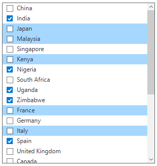
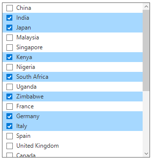
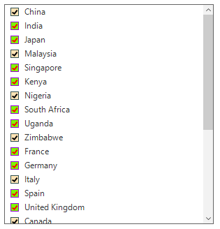

# Check Box Selection 
SfListView provides support for loading CheckBox to each item, which allows the user to check/uncheck the corresponding item. You can display check box in each item by setting `SfListView.ShowCheckBoxes` property as true.
 
## Check Box Selection Mode
The checkbox also provides support to process the selection in the context of state of the checkbox based on SfListView.CheckBoxSelectionMode property.                                    

SfListView has following modes for processing selection based on check box state.

1.	Default – Selection and state of checkbox works independent of each other.
2.	SelectOnCheck – Item can be selected or deselected based on state of checkbox.
3.	SynchronizeSelection – Item can be selected or deselected based on state of checkbox and vice versa.
4.	CheckOnItemClick – Checkbox can be check/uncheck by clicking on item.

* Default Mode: If you don’t want to affect the selection while checking/unchecking the item CheckBox, you need to set `SfListView.CheckBoxSelectionMode` as Default.



sfListView1.CheckBoxSelectionMode = CheckBoxSelectionMode.Default;


sfListView1.CheckBoxSelectionMode = CheckBoxSelectionMode.Default

         

* SelectOnCheck: If you want to select/deselect the items using CheckBox only, you need to set `SfListView.CheckBoxSelectionMode` as SelectOnCheck. 
Navigation, editing and programmatic selection are not supported in this mode.



sfListView1.CheckBoxSelectionMode = CheckBoxSelectionMode.SelectOnCheck;


sfListView1.CheckBoxSelectionMode = CheckBoxSelectionMode.SelectOnCheck



* SynchronizeSelection: If you want to synchronize the selection with item CheckBox’s IsChecked state, you need to set `SfListView.CheckBoxSelectionMode` as SynchronizeSelection. In this mode, you can select by checking checkbox and select/deselect the item will check/uncheck the corresponding item checkbox.



sfListView1.CheckBoxSelectionMode = CheckBoxSelectionMode.SynchronizeSelection;


sfListView1.CheckBoxSelectionMode = CheckBoxSelectionMode.SynchronizeSelection



* CheckOnItemClick: If you want to change check/uncheck the item checkbox state by clicking item, you need to set `SfListView.CheckBoxSelectionMode` is CheckOnItemClick.
`MultiSimple` and `MultiExtended` selection mode was not supported in this mode.



sfListView1.CheckBoxSelectionMode = CheckBoxSelectionMode.CheckOnItemClick;


sfListView1.CheckBoxSelectionMode = CheckBoxSelectionMode.CheckOnItemClick



## TriStateMode
SfListView allows to enable or disable the indeterminate state for item CheckBox using `SfListView.AllowTriStateMode` property. The tri state mode can only be supported in data bound mode i.e. The `SfListView.CheckedMember` property must have the underlying datasource property in type of `CheckState`.



public class CountryInfo
{
   public string CountryName{ get;  set;} 

   public string Continent { get; set; }

   public CheckState CheckedState { get; set; }
}

public ObservableCollection<CountryInfo> GetDataSource()
{
   countryInfoCollection.Add(new CountryInfo() { CountryName = "China", Continent = "Asia", CheckedState = CheckState.Checked });
   countryInfoCollection.Add(new CountryInfo() { CountryName = "India", Continent = "Asia" , CheckedState = CheckState.Indeterminate});
   countryInfoCollection.Add(new CountryInfo() { CountryName = "Japan", Continent = "Asia", CheckedState = CheckState.Unchecked });
   countryInfoCollection.Add(new CountryInfo() { CountryName = "Singapore", Continent = "Asia", CheckedState = CheckState.Checked});
   countryInfoCollection.Add(new CountryInfo() { CountryName = "Kenya", Continent = "Africa" , CheckedState = CheckState. Indeterminate});
   countryInfoCollection.Add(new CountryInfo() { CountryName = "Nigeria", Continent = "Africa" , CheckedState = CheckState. Unchecked});
   countryInfoCollection.Add(new CountryInfo() { CountryName = "South Africa", Continent = "Africa" , CheckedState = CheckState.Checked});
   countryInfoCollection.Add(new CountryInfo() { CountryName = "Uganda", Continent = "Africa" , CheckedState = CheckState. Indeterminate});
   countryInfoCollection.Add(new CountryInfo() { CountryName = "Zimbabwe", Continent = "Africa" , CheckedState = CheckState. Unchecked});  
   return countryInfoCollection;
}

sfListView1.DataSource = GetDataSource();
sfListView1.DisplayMember = "CountryName";
sfListView1.ShowCheckBoxes = true;
sfListView1.AllowTriStateMode = true;
sfListView1.CheckedMember = "CheckedState";


Public Class CountryInfo
   Public Property CountryName() As String

   Public Property Continent() As String

   Public Property CheckedState() As CheckState
End Class

Public Function GetDataSource() As ObservableCollection(Of CountryInfo)
   countryInfoCollection.Add(New CountryInfo() With {.CountryName = "China", .Continent = "Asia", .CheckedState = CheckState.Checked})
   countryInfoCollection.Add(New CountryInfo() With {.CountryName = "India", .Continent = "Asia", .CheckedState = CheckState.Indeterminate})
   countryInfoCollection.Add(New CountryInfo() With {.CountryName = "Japan", .Continent = "Asia", .CheckedState = CheckState.Unchecked})
   countryInfoCollection.Add(New CountryInfo() With {.CountryName = "Singapore", .Continent = "Asia", .CheckedState = CheckState.Checked})
   countryInfoCollection.Add(New CountryInfo() With {.CountryName = "Kenya", .Continent = "Africa", .CheckedState = CheckState.Indeterminate})
   countryInfoCollection.Add(New CountryInfo() With {.CountryName = "Nigeria", .Continent = "Africa", .CheckedState = CheckState.Unchecked})
   countryInfoCollection.Add(New CountryInfo() With {.CountryName = "South Africa", .Continent = "Africa", .CheckedState = CheckState.Checked})
   countryInfoCollection.Add(New CountryInfo() With {.CountryName = "Uganda", .Continent = "Africa", .CheckedState = CheckState.Indeterminate})
   countryInfoCollection.Add(New CountryInfo() With {.CountryName = "Zimbabwe", .Continent = "Africa", .CheckedState = CheckState.Unchecked})
   Return countryInfoCollection
End Function

sfListView1.DataSource = GetDataSource()
sfListView1.DisplayMember = "CountryName"
sfListView1.ShowCheckBoxes = true
sfListView1.AllowTriStateMode = true
sfListView1.CheckedMember = "CheckedState"


 

## Checked Items

### Get Checked Items

The SfListView gets all the checked items through the `SfListView.CheckedItems` property. 
     
### Clear Checked Items 
      
The checked items can be cleared by calling the ‘CheckedItems.Clear()` method.



sfListView1.CheckedItems.Clear();


sfListView1.CheckedItems.Clear()



## Select all the items
SfListview allows all items to change checked state by checking `SelectAll` item. You can enable select all item by `SfListView.AllowSelectAll` and `SfListView.ShowCheckBoxes` property as true.



sfListView1.ShowCheckBoxes = true;
sfListView1.AllowSelectAll = true;


sfListView1.ShowCheckBoxes = true
sfListView1.AllowSelectAll = true


  
  
  
## Recursive Checking
SfListView provides support for recursive checking where the checked state of group header item and group items is changed recursively based on the state of currently changed item.
You can enable recursive checking by setting `SfListView.AllowRecursiveChecking` property and `SfListView.ShowCheckBoxes` property as true.

*	The group header item will be checked only if all its group items are checked.
*	The group header item will be unchecked if all its group items are unchecked.
*	The group header item will be in Indeterminate state in other combinations of its group items.



sfListView1.ShowCheckBoxes = true;
sfListView1.AllowRecursiveChecking = true;


sfListView1.ShowCheckBoxes = true
sfListView1.AllowSelectAll = true



## Appearance
SfListView allows the item checkbox can be customized by using through `SfListView.Style.CheckBoxStyle` property.



sfListView1.Style.CheckBoxStyle.CheckedBackColor = Color.BlueViolet;
sfListView1.Style.CheckBoxStyle.CheckedBorderColor = Color.Black;
sfListView1.Style.CheckBoxStyle.CheckedTickColor = Color.White;


sfListView1.Style.CheckBoxStyle.CheckedBackColor = Color.BlueViolet
sfListView1.Style.CheckBoxStyle.CheckedBorderColor = Color.Black
sfListView1.Style.CheckBoxStyle.CheckedTickColor = Color.White


 
 
 
## Conditional Styling
SfListView allows the item checkbox can be customized by using `SfListView.DrawCheckBox` event.



sfListView1.DrawCheckBox += new EventHandler<DrawCheckBoxEventArgs>(SfListView1_DrawCheckBox);
private void SfListView1_DrawCheckBox(object sender, DrawCheckBoxEventArgs e)
{
   if (e.ItemType == ItemType.Record && e.ItemIndex % 3 == 0)
   {
       e.Style.CheckedBackColor = Color.Moccasin;
       e.Style.CheckedBorderColor = Color.DarkSlateGray;
       e.Style.CheckedTickColor = Color.Black;
   }       
}


AddHandler sfListView1.DrawCheckBox, AddressOf SfListView1_DrawCheckBox
Private Sub SfListView1_DrawCheckBox(ByVal sender As Object, ByVal e As DrawCheckBoxEventArgs)
   If e.ItemType Is ItemType.Record AndAlso e.ItemIndex Mod 3 = 0 Then
	   e.Style.CheckedBackColor = Color.Moccasin
	   e.Style.CheckedBorderColor = Color.DarkSlateGray
	   e.Style.CheckedTickColor = Color.Black
   End If
End Sub



## Events 

### ItemChecking Event

The `ItemChecking` event is raised while checking an item at the execution time by using ItemChecking event:

*	`ItemData`: Gets the checked item data object.
*	`ItemIndex`: Gets an index of checked item.
*	`NewState`: Gets the new check state of checked item.
*	`OldState`: Gets the old check state of checked item.

You can cancel the checking process within this event by setting the `ItemCheckingEventArgs.Cancel` property to true.

The ItemChecking event is used for the following use case:
*	Disable the checking process of the particular item based on the underlying data.



sfListView1.ItemChecking += new EventHandler<ItemCheckingEventArgs>(SfListView1_ItemChecking);
private void SfListView1_ItemChecking(object sender, ItemCheckingEventArgs e)
{
  if ((sender as SfListView).CheckedItems.Count > 0)
      e.Cancel = true;
}


AddHandler sfListView1.ItemChecking, AddressOf SfListView1_ItemChecking
Private Sub SfListView1_ItemChecking(ByVal sender As Object, ByVal e As ItemCheckingEventArgs)
  If (TryCast(sender, SfListView)).CheckedItems.Count > 0 Then
	  e.Cancel = True
  End If
End Sub



### ItemCheckedEvent
The `ItemChecked` event will occur once checking process is completed for the checked item in the SfListView by using ItemChecked event.

The ItemChecked event used for the following use cases:

*	`ItemData`: Gets the checked item data object.
*	`ItemIndex`: Gets an index of checked item.
*	`NewState`: Gets the new check state of checked item.
*	`OldState`: Gets the old check state of checked item.



sfListView1.ItemChecked += new EventHandler<Syncfusion.WinForms.ListView.Events.ItemCheckedEventArgs>(SfListView1_ItemChecked);
private void SfListView1_ItemChecked(object sender, Syncfusion.WinForms.ListView.Events.ItemCheckedEventArgs e)
{
  if ((sender as SfListView).CheckedItems.Count > 0)
      (sender as SfListView).CheckedItems.Clear();
}


AddHandler sfListView1.ItemChecked, AddressOf SfListView1_ItemChecked
Private Sub SfListView1_ItemChecked(ByVal sender As Object, ByVal e As Syncfusion.WinForms.ListView.Events.ItemCheckedEventArgs)
  If (TryCast(sender, SfListView)).CheckedItems.Count > 0 Then
	  TryCast(sender, SfListView).CheckedItems.Clear()
  End If
End Sub


