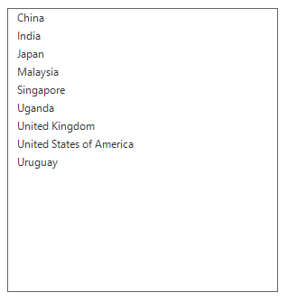
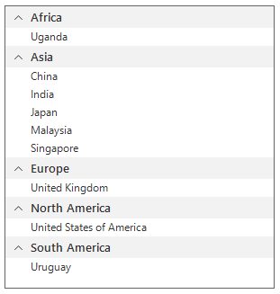

# Filtering
This section explains how to filter the data and its related operations in the SfListView.

## Programmatic Filtering
The `SfListView` supports to filter the data by setting the `SfListView.View.Filter` property. You have to call the `SfListView.View.RefreshFilter()` method after assigning the Filter Property for refreshing the view.

The `FilterChanged` event is raised once filtering is applied to the SfListView.                                   



listView.View.Filter = CustomFilter;
listView.View.RefreshFilter();
public bool CustomFilter(object obj)
{
   if ((obj as Country).Continent == "Asia" || (obj as Country).Continent == "North America" || (obj as Country).Continent == "Oceania")
       return true;
   return false;
}


listView.View.Filter = AddressOf CustomFilter
listView.View.RefreshFilter()
public Boolean CustomFilter(Object obj)
   If (TryCast(obj, Country)).Continent = "Asia" OrElse (TryCast(obj, Country)).Continent = "North America" OrElse (TryCast(obj, Country)).Continent = "Oceania" Then
	   Return True
   End If
   Return False



## Filter based on multiple criteria
The `SfListView` allows filtering the items based on multiple criteria.



sfListView1.View.Filter = FilterOnMultipleCriteria;
sfListView1.View.RefreshFilter();
public bool FilterOnMultipleCriteria (object obj)
{
   if ((obj as CountryInfo).Continent == "Asia" || (obj as CountryInfo).CountryName[0].ToString().Equals("U"))
        return true;
   return false;
}


sfListView1.View.Filter = AddressOf FilterOnMultipleCriteria
sfListView1.View.RefreshFilter()
public Boolean FilterOnMultipleCriteria (Object obj)
   If (TryCast(obj, CountryInfo)).Continent = "Asia" OrElse (TryCast(obj, CountryInfo)).CountryName(0).ToString().Equals("U") Then
		Return True
   End If
   Return False



## Getting the Filtered Data                                                                                         
You can get the filtered items from the view and modify it in the `SfListView.View.FilterChanged` event. When filter is applied, the filtered items are available in the `SfListView.View.DisplayItems`.



sfListView1.View.FilterChanged += new NotifyCollectionChangedEventHandler(View_FilterChanged);
private void View_FilterChanged(object sender, NotifyCollectionChangedEventArgs e)
{
   ObservableCollection<object> country = new ObservableCollection<object>();
   var items = (sender as DataSource).DisplayItems;
   foreach (var item in items)
     country.Add(item);
}



AddHandler sfListView1.View.FilterChanged, AddressOf View_FilterChanged
Private Sub View_FilterChanged(ByVal sender As Object, ByVal e As NotifyCollectionChangedEventArgs)
   Dim country As New ObservableCollection(Of Object)()
   Dim items = (TryCast(sender, DataSource)).DisplayItems
   For Each item In items
	 country.Add(item)
   Next item
End Sub


            
## Clear filtering
The SfListView allows clearing the filters by setting the `View.Filter` to null and call the `View.RefreshFilter` method.



sfListView1.View.Filter = null;
sfListView1.View.RefreshFilter();


sfListView1.View.Filter = null
sfListView1.View.RefreshFilter()



## Sort the Filtered Items                  
Order of the filtered items can be rearranged in the `FilterChanged` event by adding `SortDescriptor`.



sfListView1.View.FilterChanged += new NotifyCollectionChangedEventHandler(View_FilterChanged);

sfListView1.View.GroupDescriptors.Add(new GroupDescriptor()
{
    PropertyName = "Continent",                
});
sfListView1.View.SortDescriptors.Add(new SortDescriptor()
{
    PropertyName = "Continent",
    Direction = Syncfusion.DataSource.ListSortDirection.Ascending,
});


AddHandler sfListView1.View.FilterChanged, AddressOf View_FilterChanged

sfListView1.View.GroupDescriptors.Add(New GroupDescriptor() With {.PropertyName = "Continent"})
sfListView1.View.SortDescriptors.Add(New SortDescriptor() With {.PropertyName = "Continent", .Direction = Syncfusion.DataSource.ListSortDirection.Ascending})




