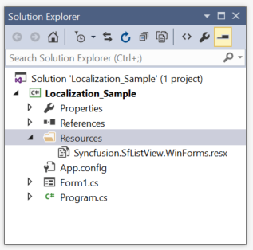

#Localization           
Localization is the process of translating the application resources into different language for the specific cultures. The SfListView can be localized by adding resource file. Application culture can be changed by setting `CurrentUICulture` before InitializeComponent method.

##Localize at sample level
To localize the SfListView based on ` CurrentUICulture ` using resource files, follow the below steps.

1)	Create new folder and named as Resources in your application.

2)	Add the default resource file of SfListView into Resources folder.You can download the Syncfusion.SfListView.WinForms.resx [here](http://www.syncfusion.com/downloads/support/directtrac/general/ze/ResourceFile1283641291).

                     
3)	Right-click on the Resources folder, select Add and then NewItem.

4)	In Add New Item wizard, select the Resource File option and name the filename as Syncfusion.SfListView.WinForms.<culture name>.resx. For example, have to give name as Syncfusion.SfListView.WinForms.de-DE.resx for German culture.

5)	 The culture name that indicates the name of language and country.

6)	Now, select Add option to add the resource file in Resources folder.

7)	 Add the Name/Value pair in Resource Designer of Syncfusion. SfListView.WinForms.de-DE.resx file and change its corresponding value to corresponding culture.
 
 
 
8)	Now, set the CurrentCulture of the Application before the InitializeComponent method and Run the sample.



public Form1()
{
 System.Threading.Thread.CurrentThread.CurrentCulture = new System.Globalization.CultureInfo("de-DE"); 
 System.Threading.Thread.CurrentThread.CurrentUICulture = new System.Globalization.CultureInfo("de-DE"); 
 InitializeComponent();
}


Public Sub New()
 System.Threading.Thread.CurrentThread.CurrentCulture = New System.Globalization.CultureInfo("de-DE")
 System.Threading.Thread.CurrentThread.CurrentUICulture = New System.Globalization.CultureInfo("de-DE")
 InitializeComponent()
End Sub


 

 
## Editing Default Resource File
The default resource file can be edited by adding it to Resources folder of the application where SfListView reads the static texts from here.
The default resource file can be download from [here](http://www.syncfusion.com/downloads/support/directtrac/general/ze/ResourceFile1283641291).

Now, change the Name/Value pair in Resource Designer of Syncfusion.SfListView.WinForms.resx file.

Now run the sample,

 
 
## Localize resource file with different assembly or namespace
By default, SfListView try to read the resource file from executing assembly and its default namespace by using `Assembly.GetExecuteAssembly` method. When the resource file is located at different assembly or namespace, then it can be set to the SfListView by using `SR.SetResources` method.



public Form1()
{
  System.Threading.Thread.CurrentThread.CurrentCulture = new System.Globalization.CultureInfo("de-DE");
  System.Threading.Thread.CurrentThread.CurrentUICulture = new System.Globalization.CultureInfo("de-DE");
  SR.SetResources(typeof(CustomListView).Assembly, "SfListViewExt");
  InitializeComponent();
}


Public Sub New()
  System.Threading.Thread.CurrentThread.CurrentCulture = New System.Globalization.CultureInfo("de-DE")
  System.Threading.Thread.CurrentThread.CurrentUICulture = New System.Globalization.CultureInfo("de-DE")
  SR.SetResources(GetType(CustomListView).Assembly, "SfListViewExt")
  InitializeComponent()
End Sub



## RightToLeft
The items of the SfListView can be aligned from right to left and vice versa using the property given below.



sfListView1.RightToLeft = RightToLeft.Yes;


sfListView1.RightToLeft = RightToLeft.Yes



