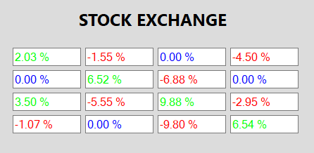

## Fore color for positive, negative and zero color

Fore color for positive, negative and zero color
SfNumericTextBox UI can be customized with the following properties. It helps in differentiating the values easily. 
*	NegativeColor – Assign the foreground color to the control, when Value is negative.
*	PositiveColor - Assign the foreground color to the control, when Value is positive.
*	ZeroColor - Assign the foreground color to the control, when Value is zero.



this.numericTextBox.Style.PositiveForeColor = Color.Green;
this.numericTextBox.Style.NegativeForeColor = Color.Red;
this.numericTextBox.Style.ZeroForeColor = Color.Blue;





Me.numericTextBox.Style.PositiveForeColor = Color.Green
Me.numericTextBox.Style.NegativeForeColor = Color.Red
Me.numericTextBox.Style.ZeroForeColor = Color.Blue



## WatermarkForeColor

Assign the fore color to the watermark text. The Watermark text will be displayed in the control when the Value is null.



this.numericTextBox.Style.WatermarkForeColor = Color.IndianRed;





Me.numericTextBox.Style.WatermarkForeColor = Color.IndianRed



## BorderColor

We can customize the UI of the control by changing border color in different states like Focus and mouse hover. The properties available to customize are
*	BorderColor- Assign the border color to the control.
*	FocusBorderColor  - Assign the border color to the control, when the control gets its focus.
*	HoverBorderColor - Assign the border color to the control, when the mouse is hover on it.



this.numericTextBox.Style.BorderColor = ColorTranslator.FromHtml("#ababab");
this.numericTextBox.Style.FocusBorderColor = SystemColors.MenuHighlight;
this.numericTextBox.Style.HoverBorderColor = ColorTranslator.FromHtml("#e5c365");





Me.numericTextBox.Style.BorderColor = ColorTranslator.FromHtml("#ababab")
Me.numericTextBox.Style.FocusBorderColor = SystemColors.MenuHighlight
Me.numericTextBox.Style.HoverBorderColor = ColorTranslator.FromHtml("#e5c365")



