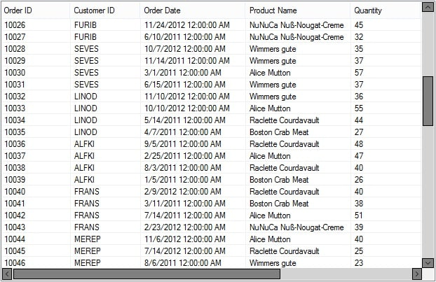
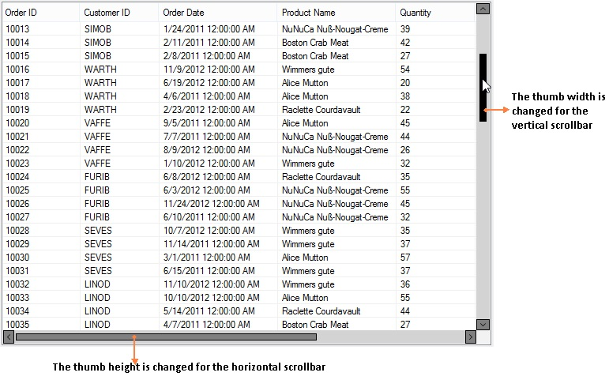
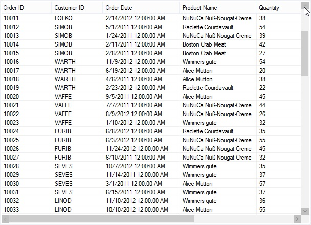
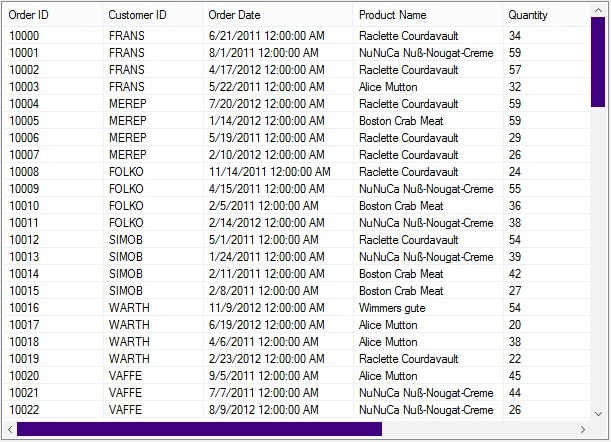

## Appearance

This section explains how to customize the default appearance of the scrollbars using the style properties. By default, the `SfScrollFrame` loads the scrollbars with default appearance. 

### Scrollbar appearance

The inner elements of the scrollbar can be customized by using the ScrollBarStyleInfo property, that allows changing the appearance of the horizontal and vertical scrollbars separately.

The horizontal scrollbar appearance can be customized by using the HorizontalScrollBar.Style property. The ScrollBarStyleInfo contains all the settings that controls the appearance of the scrollbar.



//Sets the back color of the horizontal scrollbar arrow button.
this.sfScrollFrame1.HorizontalScrollBar.Style.ArrowButtonBackColor = Color.Gray;
this.sfScrollFrame1.HorizontalScrollBar.Style.ArrowButtonHoverBackColor = Color.White;
this.sfScrollFrame1.HorizontalScrollBar.Style.ArrowButtonPressedBackColor = Color.Blue;

//Sets the fore color of the horizontal scrollbar arrow button.
this.sfScrollFrame1.HorizontalScrollBar.Style.ArrowButtonForeColor = Color.Black;
this.sfScrollFrame1.HorizontalScrollBar.Style.ArrowButtonHoverForeColor = Color.Black;
this.sfScrollFrame1.HorizontalScrollBar.Style.ArrowButtonPressedForeColor = Color.Gray;
this.sfScrollFrame1.HorizontalScrollBar.Style.ArrowButtonBorderColor = Color.Black;

// Specify the border style properties
this.sfScrollFrame1.HorizontalScrollBar.Style.ThumbColor = Color.Gray;
this.sfScrollFrame1.HorizontalScrollBar.Style.ThumbHoverColor = Color.Black;
this.sfScrollFrame1.HorizontalScrollBar.Style.ThumbPressedColor = Color.Blue;
this.sfScrollFrame1.HorizontalScrollBar.Style.ThumbBorderColor = Color.Black;

// Sets the back color of the horizontal scrollbar.
this.sfScrollFrame1.HorizontalScrollBar.Style.ScrollBarBackColor = Color.LightGray;



The vertical scroll bar appearance can be customized by using the VerticalScrollBar.Style property.



//Sets the back color of the vertical scrollbar arrow button.
this.sfScrollFrame1.VerticalScrollBar.Style.ArrowButtonBackColor = Color.Gray;
this.sfScrollFrame1.VerticalScrollBar.Style.ArrowButtonHoverBackColor = Color.White;
this.sfScrollFrame1.VerticalScrollBar.Style.ArrowButtonPressedBackColor = Color.Blue;

//Sets the fore color of the vertical scrollbar arrow button.
this.sfScrollFrame1.VerticalScrollBar.Style.ArrowButtonForeColor = Color.Black;
this.sfScrollFrame1.VerticalScrollBar.Style.ArrowButtonHoverForeColor = Color.Black;
this.sfScrollFrame1.VerticalScrollBar.Style.ArrowButtonPressedForeColor = Color.Gray;
this.sfScrollFrame1.VerticalScrollBar.Style.ArrowButtonBorderColor = Color.Black;

// Sets the style properties of the thumb.
this.sfScrollFrame1.VerticalScrollBar.Style.ThumbColor = Color.Gray;
this.sfScrollFrame1.VerticalScrollBar.Style.ThumbHoverColor = Color.Black;
this.sfScrollFrame1.VerticalScrollBar.Style.ThumbPressedColor = Color.Blue;
this.sfScrollFrame1.VerticalScrollBar.Style.ThumbBorderColor = Color.Black;

// Sets the back color of the vertical scrollbar.
this.sfScrollFrame1.VerticalScrollBar.Style.ScrollBarBackColor = Color.LightGray;



### Changing the Scrollbar thumb width

The size of the scrollbar thumb can be changed by using the ThumbWidth property of the corresponding style property.



// To set the height of the horizontal scrollbar thumb.
this.sfScrollFrame1.HorizontalScrollBar.Style.ThumbWidth = 8;

// To set the width of the vertical scrollbar thumb.
this.sfScrollFrame1.VerticalScrollBar.Style.ThumbWidth = 8;



**Note**: This width can be set maximum to the width and height of the vertical and horizontal scrollbars respectively. 

## Disabling the maximum and minimum buttons

The minimum and maximum arrow buttons of the scrollbar can be disabled by setting the `EnableMaximumArrow` and `EnableMinimumArrow` properties to `false`. The default value is `true`. 

If you disable the max or min button, the scrollbar cannot be scrolled using those buttons.



//Disable the maximum and minimum arrows of the vertical scrollbar. 
this.sfScrollFrame1.VerticalScrollBar.EnableMaximumArrow = false;
this.sfScrollFrame1.VerticalScrollBar.EnableMinimumArrow = false;

//Disable the maximum and minimum arrows of the horizontal scrollbar. 
this.sfScrollFrame1.HorizontalScrollBar.EnableMaximumArrow = false;
this.sfScrollFrame1.HorizontalScrollBar.EnableMinimumArrow = false;



The color of the disabled arrow button can also be specified by using `ArrowButtonDisabledBackColor` and `ArrowButtonDisabledForeColor` of the corresponding scrollbar.



//Set the arrow button disabled back color
this.sfScrollFrame1.VerticalScrollBar.Style.ArrowButtonDisabledBackColor = Color.Silver;
this.sfScrollFrame1.HorizontalScrollBar.Style.ArrowButtonDisabledBackColor = Color.Silver;

//Sets the arrow button disabled fore color
this.sfScrollFrame1.VerticalScrollBar.Style.ArrowButtonDisabledForeColor = Color.Gray;
this.sfScrollFrame1.HorizontalScrollBar.Style.ArrowButtonDisabledForeColor = Color.Gray;



## Disabling the Scrollbar Thumb

The scrollbar thumb can be disabled by setting the `EnableThumb` property to `false`. The default value is `true`.



//Disables the thumb for vertical and horizontal scrollbar.
this.sfScrollFrame1.HorizontalScrollBar.EnableThumb = false;
this.sfScrollFrame1.VerticalScrollBar.EnableThumb = false;



The disabled state thumb color can also be specified by using the `ThumbDisabledColor` property of the corresponding scrollbar style info.



// Sets the disabled thumb color of the scrollbar.
this.sfScrollFrame1.VerticalScrollBar.Style.ThumbDisabledColor = Color.Indigo;
this.sfScrollFrame1.HorizontalScrollBar.Style.ThumbDisabledColor = Color.Indigo;



