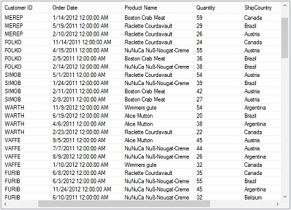

# Getting Started

## Assembly deployment

Refer [control dependencies](https://help.syncfusion.com/windowsforms/control-dependencies#sfscrollframe) section to get the list of assemblies or NuGet package needs to be added as reference to use the control in any application. 

## Attaching SfScrollFrame to a control

This section describes how to attach the `SfScrollFrame` to a `ListView` Control.

### Through designer

The `SfScrollFrame` can be attached to any control through designer by assigning the `Control` property.

#### Designer generated code



SfScrollFrame sfScrollFrame1 = new SfScrollFrame();
ListView listView1 = new System.Windows.Forms.ListView(); 
 this.OrderID = ((System.Windows.Forms.ColumnHeader)(new System.Windows.Forms.ColumnHeader()));
this.CustomerID = ((System.Windows.Forms.ColumnHeader)(new System.Windows.Forms.ColumnHeader()));
this.columnHeader1 = ((System.Windows.Forms.ColumnHeader)(new System.Windows.Forms.ColumnHeader()));
this.Quantity = ((System.Windows.Forms.ColumnHeader)(new System.Windows.Forms.ColumnHeader()));
this.sfScrollFrame1 = new Syncfusion.WinForms.Scroll.SfScrollFrame();
this.SuspendLayout();
// 
// listView1
// 
this.listView1.Columns.AddRange(new System.Windows.Forms.ColumnHeader[] {
this.OrderID,
this.CustomerID,
this.columnHeader1,
this.Quantity});
this.listView1.Location = new System.Drawing.Point(30, 29);
this.listView1.Name = "listView1";
this.listView1.Size = new System.Drawing.Size(379, 285);
this.listView1.TabIndex = 6;
this.listView1.UseCompatibleStateImageBehavior = false;
this.listView1.View = System.Windows.Forms.View.Details;
// 
// sfScrollFrame1
// 
this.sfScrollFrame1.Control = this.listView1;



### Through code

To programmatically attach the `SfScrollFrame` to a control, set the `Control` property to the appropriate value. 



//Attach SfScrollFrame to the list view control.
this.sfScrollFrame1.Control = listView1;



## Programmatic scrolling

The scroll frame can be programmatically scrolled by setting the `Value` property of the corresponding scrollbar.  



// To scroll the control to the specific position.
this.sfScrollFrame1.HorizontalScrollBar.Value = 100;
this.sfScrollFrame1.VerticalScrollBar.Value = 100;



### Changing the SmallChange value

The scrolling speed of the horizontal and vertical scrollbars of the `SfScrollFrame` can be customized by setting the `SmallChange` property to increase the scroll speed for the min or max button click of the scrollbar.



//Set Horizontal & vertical scrollbar small change
this.sfScrollFrame1.HorizontalScrollBar.SmallChange = 10;
this.sfScrollFrame1.VerticalScrollBar.SmallChange = 10;

