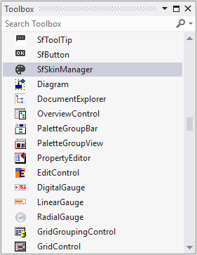
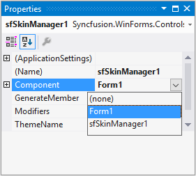

# Getting Started

## Assembly deployment

Refer [control dependencies](https://help.syncfusion.com/windowsforms/control-dependencies#sfskinmanager) section to get the list of assemblies or NuGet package needs to be added as reference to use the control in any application. 

## Creating application with SfSkinManger

Follow the steps to create an application with SfSkinManager:

1. Drag the SfSkinManager component from the toolbox to the form.

	

2. Open the properties window and select value for the `Component` property of SfSkinManager. Select a control or component from the drop-down for which the theme should be applied. The theme will be applied for the selected control and its child controls.

	

## Applying theme

Given steps should be followed to apply theme for the controls in an application using SfSkinManager:

1. Load theme assembly 

2. Apply theme

### Load theme assembly

Assembly for the corresponding theme should be added as reference to set the theme for the child controls in the application.

Before applying theme for the SfSkinManager, required theme assembly should be loaded to the application.



using Syncfusion.WinForms.Controls;

static class Program
{
    /// 

    /// The main entry point for the application.
    /// 

    [STAThread]
    static void Main()
    {
        SfSkinManager.LoadAssembly(typeof(Office2016Theme).Assembly);
        Application.EnableVisualStyles();
        Application.SetCompatibleTextRenderingDefault(false);
        Application.Run(new Form1());
    }
}


Imports Syncfusion.WinForms.Controls

Friend NotInheritable Class Program
	''' 

	''' The main entry point for the application.
	''' 

	Private Sub New()
	End Sub
	<STAThread>
	Shared Sub Main()
		SfSkinManager.LoadAssembly(GetType(Office2016Theme).Assembly)
		Application.EnableVisualStyles()
		Application.SetCompatibleTextRenderingDefault(False)
		Application.Run(New Form1())
	End Sub
End Class



### Apply theme

Theme for the controls in an application can be set by using the `ThemeName` property.



this.sfSkinManager1.ThemeName = "Office2016Black";


Me.sfSkinManager1.ThemeName = "Office2016Black"



## Restrict applying theme from SfSkinManager for specific control

It is possible to restrict applying theme from SfSkinManager for a specific control by disabling the `IThemeProvider.CanApplyTheme` property of the corresponding control.



this.sfButton1.CanApplyTheme = false;


Me.sfButton1.CanApplyTheme = False


