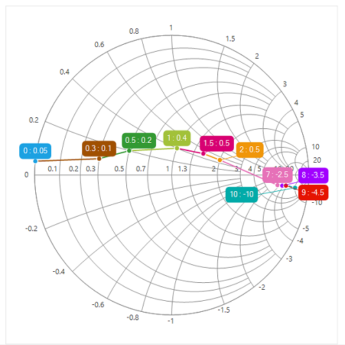

# Appearance

## Chart palette

The Smith chart displays different series in different colors by using the [`Palette`](https://help.syncfusion.com/cr/cref_files/windowsforms/sfsmithchart/Syncfusion.SfSmithChart.WinForms~Syncfusion.WinForms.SmithChart.ChartColorModel~Palette.html) property of ColorModel. By default, the Metro palette is applied to the chart.





sfSmithChart1.ColorModel.Palette = ChartColorPalette.Nature;





sfSmithChart1.ColorModel.Palette = ChartColorPalette.Nature





## Series palette

The palette color to each data points of specific series can be defined by using [`Palette`](https://help.syncfusion.com/cr/cref_files/windowsforms/sfsmithchart/Syncfusion.SfSmithChart.WinForms~Syncfusion.WinForms.SmithChart.ChartColorModel~Palette.html) property of ColorModel in the Series.





LineSeries series = new LineSeries();          

series.ColorModel.Palette = ChartColorPalette.Metro;

series.DataLabel.Visible = true;

sfSmithChart1.Series.Add(series);





Dim series As New LineSeries()

series.ColorModel.Palette = ChartColorPalette.Metro

series.DataLabel.Visible = True

sfSmithChart1.Series.Add(series)





## Chart area customization

Chart and chart area (circle plotting area) can be customized by using the [`BackColor`](https://help.syncfusion.com/cr/cref_files/windowsforms/sfsmithchart/Syncfusion.SfSmithChart.WinForms~Syncfusion.WinForms.SmithChart.ChartStyle~BackColor.html), [`ChartAreaBorderColor`](https://help.syncfusion.com/cr/cref_files/windowsforms/sfsmithchart/Syncfusion.SfSmithChart.WinForms~Syncfusion.WinForms.SmithChart.ChartStyle~ChartAreaBorderColor.html), [`ChartAreaBackColor`](https://help.syncfusion.com/cr/cref_files/windowsforms/sfsmithchart/Syncfusion.SfSmithChart.WinForms~Syncfusion.WinForms.SmithChart.ChartStyle~ChartAreaBackColor.html), [`ChartAreaBorderWidth`](https://help.syncfusion.com/cr/cref_files/windowsforms/sfsmithchart/Syncfusion.SfSmithChart.WinForms~Syncfusion.WinForms.SmithChart.ChartStyle~ChartAreaBorderWidth.html) properties in Smith chart.





sfSmithChart1.BackColor = Color.LightSteelBlue;

sfSmithChart1.Style.ChartAreaBorderColor = Color.SkyBlue;           

sfSmithChart1.Style.ChartAreaBackColor = Color.AliceBlue;

sfSmithChart1.Style.ChartAreaBorderWidth = 2;





sfSmithChart1.BackColor = Color.LightSteelBlue

sfSmithChart1.Style.ChartAreaBorderColor = Color.SkyBlue

sfSmithChart1.Style.ChartAreaBackColor = Color.AliceBlue

sfSmithChart1.Style.ChartAreaBorderWidth = 2





## Circle radius

To change the diameter of the Smith chart’s circle with respect to the plot area, use the [`Radius`](https://help.syncfusion.com/cr/cref_files/windowsforms/sfsmithchart/Syncfusion.SfSmithChart.WinForms~Syncfusion.WinForms.SmithChart.SfSmithChart~Radius.html) property. It ranges from 0.1 to 1, and the default value is 0.95.





sfSmithChart1.Radius = 0.6f;





sfSmithChart1.Radius = 0.6f





