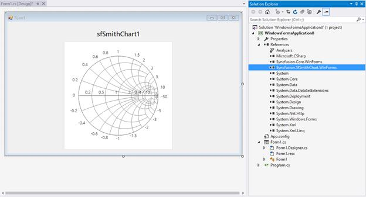
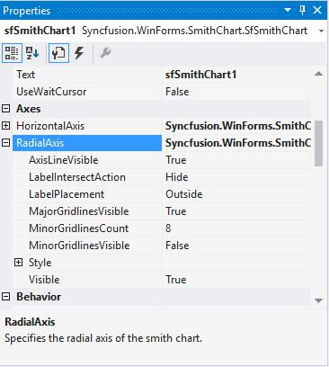
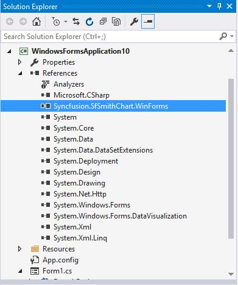
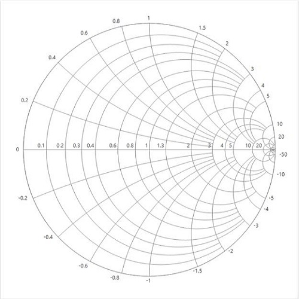
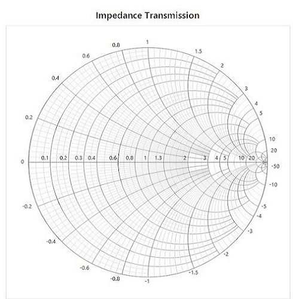
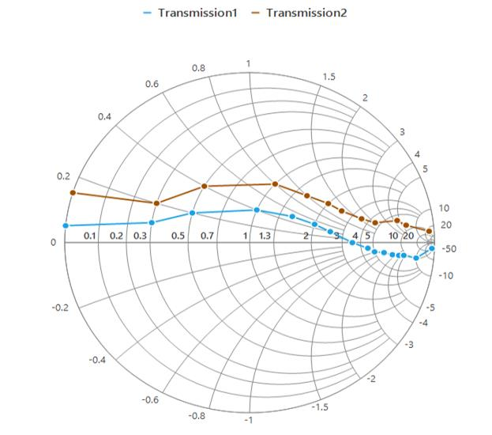

# Configuring a smith chart control

This section explains the steps required to build an application with Smith chart.

## Creating a simple smith chart through the designer

Smith chart control can be added through designer by following the below steps.

* Create a new **Windows** **Form** **Application****.**
* Drag and drop the smith chart control from the toolbox into the designer.

* Once you drop the control into the designer page, smith chart control will be added successfully along with the required assemblies. The below mentioned assemblies will be added automatically into the application.

1. Syncfusion.SfSmithChart.WinForms
2. Syncfusion.Core.WinForms.

Appearance and behavior related aspects of the smith chart can be controlled by setting the appropriate properties through the properties grid.

For example, in the below image [MinorGridlinesVisible](http://172.16.0.145:8124/Syncfusion.SfSmithChart.WinForms/api/Syncfusion.WinForms.SmithChart.ChartAxis.html#Syncfusion_WinForms_SmithChart_ChartAxis_MinorGridlinesVisible) property of radial axis  is modified via property grid.

## Creating a simple smith chart through code

Smith chart control can be added through code behind by following the below steps.

* Create a new Windows Form Application.
* Add the below **Syncfusion****.****SfSmithChart****.****WinForms** assembly into the project file.

* Initialize the smith chart and add it to the application using below snippet.



 

SfSmithChart chart = new SfSmithChart();

chart.Dock = DockStyle.Fill;

this.Controls.Add(chart);





Dim chart As New SfSmithChart()

chart.Dock = DockStyle.Fill

Me.Controls.Add(chart)





As a result of above steps the following output will be reproduced.

## Populating data

The data for the smith chart can be added through code. To add data, switch to code view, and add the data's as shown in the following code snippet.





public class TransmissionData
    {
        public double Resistance { get; set; }

        public double Reactance { get; set; }
    }

    public class SmithChartModel
    {
        public SmithChartModel()
        {
            Trace1 = new ObservableCollection<TransmissionData>();

            Trace1.Add(new TransmissionData() { Resistance = 0, Reactance = 0.05 });
            Trace1.Add(new TransmissionData() { Resistance = 0.3, Reactance = 0.1 });
            Trace1.Add(new TransmissionData() { Resistance = 0.5, Reactance = 0.2 });
            Trace1.Add(new TransmissionData() { Resistance = 1.0, Reactance = 0.4 });
            Trace1.Add(new TransmissionData() { Resistance = 1.5, Reactance = 0.5 });
            Trace1.Add(new TransmissionData() { Resistance = 2.0, Reactance = 0.5 });
            Trace1.Add(new TransmissionData() { Resistance = 2.5, Reactance = 0.4 });
            Trace1.Add(new TransmissionData() { Resistance = 3.5, Reactance = 0.0 });
            Trace1.Add(new TransmissionData() { Resistance = 4.5, Reactance = -0.5 });
            Trace1.Add(new TransmissionData() { Resistance = 5, Reactance = -1.0 });
            Trace1.Add(new TransmissionData() { Resistance = 6, Reactance = -1.5 });
            Trace1.Add(new TransmissionData() { Resistance = 7, Reactance = -2.5 });
            Trace1.Add(new TransmissionData() { Resistance = 8, Reactance = -3.5 });
            Trace1.Add(new TransmissionData() { Resistance = 9, Reactance = -4.5 });
            Trace1.Add(new TransmissionData() { Resistance = 10, Reactance = -10 });
            Trace1.Add(new TransmissionData() { Resistance = 20, Reactance = -50 });

            Trace2 = new ObservableCollection<TransmissionData>();

            Trace2.Add(new TransmissionData() { Resistance = 0, Reactance = 0.15 });
            Trace2.Add(new TransmissionData() { Resistance = 0.3, Reactance = 0.2 });
            Trace2.Add(new TransmissionData() { Resistance = 0.5, Reactance = 0.4 });
            Trace2.Add(new TransmissionData() { Resistance = 1.0, Reactance = 0.8 });
            Trace2.Add(new TransmissionData() { Resistance = 1.5, Reactance = 1.0 });
            Trace2.Add(new TransmissionData() { Resistance = 2.0, Reactance = 1.2 });
            Trace2.Add(new TransmissionData() { Resistance = 2.5, Reactance = 1.3 });
            Trace2.Add(new TransmissionData() { Resistance = 3.5, Reactance = 1.6 });
            Trace2.Add(new TransmissionData() { Resistance = 4.5, Reactance = 2.0 });
            Trace2.Add(new TransmissionData() { Resistance = 6, Reactance = 4.5 });
            Trace2.Add(new TransmissionData() { Resistance = 8, Reactance = 6 });
            Trace2.Add(new TransmissionData() { Resistance = 10, Reactance = 25 });
        }

        public ObservableCollection<TransmissionData> Trace1 { get; set; }
        public ObservableCollection<TransmissionData> Trace2 { get; set; }
    }
	
	



Public Class TransmissionData
		Private privateResistance As Double
		Public Property Resistance() As Double
			Get
				Return privateResistance
			End Get
			Set(ByVal value As Double)
				privateResistance = value
			End Set
		End Property

		Private privateReactance As Double
		Public Property Reactance() As Double
			Get
				Return privateReactance
			End Get
			Set(ByVal value As Double)
				privateReactance = value
			End Set
		End Property
End Class

	Public Class SmithChartModel
		Public Sub New()
			Trace1 = New ObservableCollection(Of TransmissionData)()

			Trace1.Add(New TransmissionData() With {.Resistance = 0, .Reactance = 0.05})
			Trace1.Add(New TransmissionData() With {.Resistance = 0.3, .Reactance = 0.1})
			Trace1.Add(New TransmissionData() With {.Resistance = 0.5, .Reactance = 0.2})
			Trace1.Add(New TransmissionData() With {.Resistance = 1.0, .Reactance = 0.4})
			Trace1.Add(New TransmissionData() With {.Resistance = 1.5, .Reactance = 0.5})
			Trace1.Add(New TransmissionData() With {.Resistance = 2.0, .Reactance = 0.5})
			Trace1.Add(New TransmissionData() With {.Resistance = 2.5, .Reactance = 0.4})
			Trace1.Add(New TransmissionData() With {.Resistance = 3.5, .Reactance = 0.0})
			Trace1.Add(New TransmissionData() With {.Resistance = 4.5, .Reactance = -0.5})
			Trace1.Add(New TransmissionData() With {.Resistance = 5, .Reactance = -1.0})
			Trace1.Add(New TransmissionData() With {.Resistance = 6, .Reactance = -1.5})
			Trace1.Add(New TransmissionData() With {.Resistance = 7, .Reactance = -2.5})
			Trace1.Add(New TransmissionData() With {.Resistance = 8, .Reactance = -3.5})
			Trace1.Add(New TransmissionData() With {.Resistance = 9, .Reactance = -4.5})
			Trace1.Add(New TransmissionData() With {.Resistance = 10, .Reactance = -10})
			Trace1.Add(New TransmissionData() With {.Resistance = 20, .Reactance = -50})

			Trace2 = New ObservableCollection(Of TransmissionData)()

			Trace2.Add(New TransmissionData() With {.Resistance = 0, .Reactance = 0.15})
			Trace2.Add(New TransmissionData() With {.Resistance = 0.3, .Reactance = 0.2})
			Trace2.Add(New TransmissionData() With {.Resistance = 0.5, .Reactance = 0.4})
			Trace2.Add(New TransmissionData() With {.Resistance = 1.0, .Reactance = 0.8})
			Trace2.Add(New TransmissionData() With {.Resistance = 1.5, .Reactance = 1.0})
			Trace2.Add(New TransmissionData() With {.Resistance = 2.0, .Reactance = 1.2})
			Trace2.Add(New TransmissionData() With {.Resistance = 2.5, .Reactance = 1.3})
			Trace2.Add(New TransmissionData() With {.Resistance = 3.5, .Reactance = 1.6})
			Trace2.Add(New TransmissionData() With {.Resistance = 4.5, .Reactance = 2.0})
			Trace2.Add(New TransmissionData() With {.Resistance = 6, .Reactance = 4.5})
			Trace2.Add(New TransmissionData() With {.Resistance = 8, .Reactance = 6})
			Trace2.Add(New TransmissionData() With {.Resistance = 10, .Reactance = 25})
		End Sub

		Private privateTrace1 As ObservableCollection(Of TransmissionData)
		Public Property Trace1() As ObservableCollection(Of TransmissionData)
			Get
				Return privateTrace1
			End Get
			Set(ByVal value As ObservableCollection(Of TransmissionData))
				privateTrace1 = value
			End Set
		End Property
		Private privateTrace2 As ObservableCollection(Of TransmissionData)
		Public Property Trace2() As ObservableCollection(Of TransmissionData)
			Get
				Return privateTrace2
			End Get
			Set(ByVal value As ObservableCollection(Of TransmissionData))
				privateTrace2 = value
			End Set
		End Property
	End Class
	
	
	
	

### Adding header and axis customization to smith chart





chart.Text = "Impedance Transmission";

chart.BackColor = Color.White;

chart.HorizontalAxis.MinorGridlinesVisible = true;

chart.RadialAxis.MinorGridlinesVisible = true;





chart.Text = "Impedance Transmission"

chart.BackColor = Color.White

chart.HorizontalAxis.MinorGridlinesVisible = True

chart.RadialAxis.MinorGridlinesVisible = True





### Adding series

You can plot a line on the smith chart by adding line series.

Initialize the series for representing the data.





LineSeries series = new LineSeries();





Dim series As New LineSeries()





Also, add the DataSource, ResistanceMember, and ReactanceMember properties to populate the data in smith chart.





LineSeries series = new LineSeries();

series.MarkerVisible = true;

series.LegendText = "Transmission1";

series.DataSource = model.Trace1;

series.ResistanceMember = "Resistance";

series.ReactanceMember = "Reactance";

series.TooltipVisible = true;

chart.Series.Add(series);





Dim series As New LineSeries()

series.MarkerVisible = True

series.LegendText = "Transmission1"

series.DataSource = model.Trace1

series.ResistanceMember = "Resistance"

series.ReactanceMember = "Reactance"

series.TooltipVisible = True

chart.Series.Add(series)





* [DataSource](http://172.16.0.145:8124/Syncfusion.SfSmithChart.WinForms/api/Syncfusion.WinForms.SmithChart.ChartSeries.html#Syncfusion_WinForms_SmithChart_ChartSeries_DataSource)—Used to hold the data source. The data source or data collection can be bound with DataSource.
* [ResistanceMember](http://172.16.0.145:8124/Syncfusion.SfSmithChart.WinForms/api/Syncfusion.WinForms.SmithChart.ChartSeries.html#Syncfusion_WinForms_SmithChart_ChartSeries_ResistanceMember)—It is a string property that needs to be bound with resistance axis (or HorizontalAxis). 
* [ReactanceMember](http://172.16.0.145:8124/Syncfusion.SfSmithChart.WinForms/api/Syncfusion.WinForms.SmithChart.ChartSeries.html#Syncfusion_WinForms_SmithChart_ChartSeries_ReactanceMember) - It is a string property that needs to be bound with reactance axis (Or RadialAxis).
* [LegendText](http://172.16.0.145:8124/Syncfusion.SfSmithChart.WinForms/api/Syncfusion.WinForms.SmithChart.ChartSeries.html#Syncfusion_WinForms_SmithChart_ChartSeries_LegendText)—This property is mapped to the legend label.

### Adding legends to the chart

Legends can be made visible by using the following code.





chart.Legend.Visible = true;





chart.Legend.Visible = True





The following code example demonstrates the complete code for creating a smith chart.





SfSmithChart chart = new SfSmithChart();

chart.Text = "Impedance Transmission";

chart.BackColor = Color.White;

chart.HorizontalAxis.MinorGridlinesVisible = true;

chart.RadialAxis.MinorGridlinesVisible = true;

LineSeries series = new LineSeries();

series.MarkerVisible = true;

series.LegendText = "Transmission1";

series.DataSource = model.Trace1;

series.ResistanceMember = "Resistance";

series.ReactanceMember = "Reactance";

series.TooltipVisible = true;

chart.Series.Add(series);

LineSeries series1 = new LineSeries();

series1.MarkerVisible = true;

series1.LegendText = "Transmission2";

series1.DataSource = model.Trace2;

series1.ResistanceMember = "Resistance";

series1.ReactanceMember = "Reactance";

series1.TooltipVisible = true;

chart.Series.Add(series1);        

chart.Legend.Visible = true;

chart.Dock = DockStyle.Fill;

this.Controls.Add(chart);





Dim chart As New SfSmithChart()

chart.Text = "Impedance Transmission"

chart.BackColor = Color.White

chart.HorizontalAxis.MinorGridlinesVisible = True

chart.RadialAxis.MinorGridlinesVisible = True

Dim series As New LineSeries()

series.MarkerVisible = True

series.LegendText = "Transmission1"

series.DataSource = model.Trace1

series.ResistanceMember = "Resistance"

series.ReactanceMember = "Reactance"

series.TooltipVisible = True

chart.Series.Add(series)

Dim series1 As New LineSeries()

series1.MarkerVisible = True

series1.LegendText = "Transmission2"

series1.DataSource = model.Trace2

series1.ResistanceMember = "Resistance"

series1.ReactanceMember = "Reactance"

series1.TooltipVisible = True

chart.Series.Add(series1)

chart.Legend.Visible = True

chart.Dock = DockStyle.Fill

Me.Controls.Add(chart)





Now, run the application to produce the following output.

