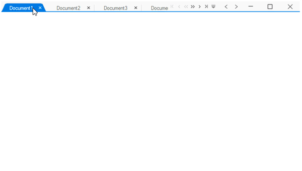

# Drag and drop tabs

SfTabbedForm allow drag and drop the tabs within the form by setting `tabbedFormControl.AllowDraggingTabs` property as true.



tabbedFormControl.AllowDraggingTabs = true;	


tabbedFormControl.AllowDraggingTabs = True



