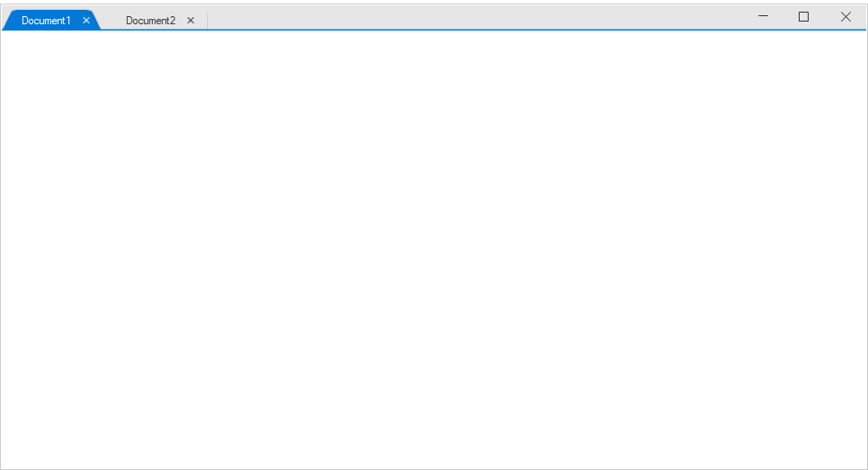
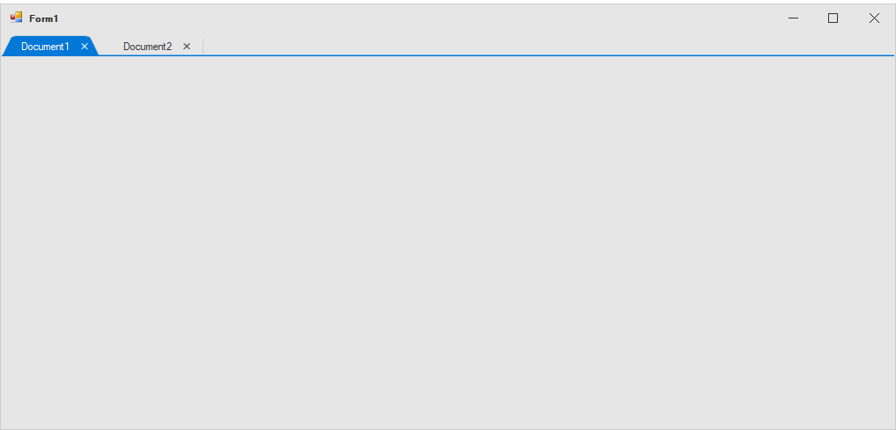

# Getting Started

## Assembly Deployment

Refer [control dependencies](https://help.syncfusion.com/windowsforms/control-dependencies#sftabbedform) section to get the list of assemblies or NuGet package needs to be added as reference to use the control in any application. 

## Converting Standard Form into SfTabbedForm

The default form can be changed into SfTabbedForm by the following steps:

1) Create a new Windows Forms Application in Visual Studio and refer to the `Syncfusion.Tools.WinForms` assembly.

2) Include the following namespace to the directives list.



using Syncfusion.Windows.Forms.Tools;


Imports Syncfusion.Windows.Forms.Tools



3) Change the base class of your form from `System.Windows.Forms.Form` to `SfTabbedForm`.



public partial class Form1 : SfTabbedForm
{
    public Form1()
    {
        InitializeComponent();
    }
}


Partial Public Class Form1
	Inherits SfTabbedForm
	Public Sub New()
		InitializeComponent()
	End Sub
End Class



## Loading TabbedFormControl to TabbedForm

 TabbedFormControl represents the form's header which consist of the tabs.The control can be loaded form using the following code.



SfTabbedFormControl tabbedFormControl = new SfTabbedFormControl();
this.Controls.Add(tabbedFormControl);
this.TabbedFormControl = tabbedFormControl;


Dim tabbedFormControl As New SfTabbedFormControl()
Me.Controls.Add(tabbedFormControl)
Me.TabbedFormControl = tabbedFormControl



## Adding Tabs to TabbedForm

To add Tabs to the form create an instance of TabPageAdv, and add it to the Tabs collection of the TabbedFormControl.



TabPageAdv tabPageAdv1 = new TabPageAdv();
TabPageAdv tabPageAdv2 = new TabPageAdv();
this.tabPageAdv1.Text = "Document1";
this.tabPageAdv2.Text = "Document2";
tabbedFormControl.Tabs.Add(tabPageAdv1);
tabbedFormControl.Tabs.Add(tabPageAdv2);


Dim tabPageAdv1 As New TabPageAdv()
Dim tabPageAdv2 As New TabPageAdv()
Me.tabPageAdv1.Text = "Document1"
Me.tabPageAdv2.Text = "Document2"
tabbedFormControl.Tabs.Add(tabPageAdv1)
tabbedFormControl.Tabs.Add(tabPageAdv2)



## Extend Tabs to TitleBar of the Form 

ExtendTabsToTitleBar property specifies whether the tabs should extend to the title bar of the form.By default ExtendTabsToTitleBar property is set to true.



this.ExtendTabsToTitleBar = false;


Me.ExtendTabsToTitleBar = False



