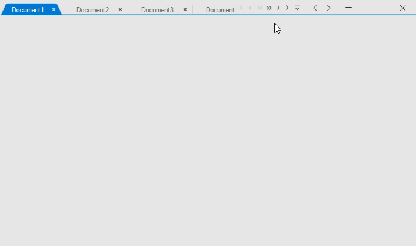

# Tab Navigation

Tabbed Form consists of a set of built-in controls such as first tab, last tab, and drop-down, which are used to navigate through the [TabPages](https://help.syncfusion.com/cr/windowsforms/Syncfusion.Tools.Windows~Syncfusion.Windows.Forms.Tools.TabControlAdv~TabPages.html). The navigation controls can be added to the tabbed form using the [TabbedFormControl.TabPrimitiveMode](https://help.syncfusion.com/cr/windowsforms/Syncfusion.Tools.Windows~Syncfusion.Windows.Forms.Tools.TabPrimitiveMode.html) property.



tabbedFormControl.TabPrimitiveMode = TabPrimitiveMode.DropDown | TabPrimitiveMode.FirstTab | TabPrimitiveMode.LastTab | TabPrimitiveMode.NextTab | TabPrimitiveMode.PreviousTab;


tabbedFormControl.TabPrimitiveMode = TabPrimitiveMode.DropDown Or TabPrimitiveMode.FirstTab Or TabPrimitiveMode.LastTab Or TabPrimitiveMode.NextTab Or TabPrimitiveMode.PreviousTab

  

## TabPrimitiveClick event

The [TabPrimitiveClick](https://help.syncfusion.com/cr/windowsforms/Syncfusion.Tools.Windows~Syncfusion.Windows.Forms.Tools.SfTabbedFormControl~TabPrimitiveClick_EV.html) event occurs when clicking the navigation button. The [TabPrimitiveClickEventArgs](https://help.syncfusion.com/cr/windowsforms/Syncfusion.Tools.Windows~Syncfusion.Windows.Forms.Tools.TabPrimitiveClickEventArgs_properties.html) properties provide information specific to this event.




this.tabbedFormControl.TabPrimitiveClick += TabbedFormControl_TabPrimitiveClick;

private void TabbedFormControl_TabPrimitiveClick(object sender, TabPrimitiveClickEventArgs e)
{
    Console.WriteLine("TabPrimitive Type:" + e.TabPrimitive.TabPrimitiveType);
}




Private Me.tabbedFormControl.TabPrimitiveClick += AddressOf TabbedFormControl_TabPrimitiveClick

Private Sub TabbedFormControl_TabPrimitiveClick(ByVal sender As Object, ByVal e As TabPrimitiveClickEventArgs)
	Console.WriteLine("TabPrimitive Type:" & e.TabPrimitive.TabPrimitiveType)
End Sub




