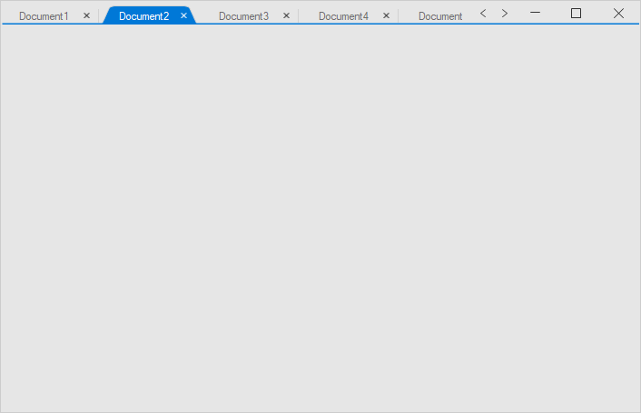

# Tab Selection

Tab selection can be done programmatically using the [TabbedFormControl.SelectedIndex](https://help.syncfusion.com/cr/windowsforms/Syncfusion.Tools.Windows~Syncfusion.Windows.Forms.Tools.SfTabbedFormControl~SelectedIndex.html) and [TabbedFormControl.SelectedTab](https://help.syncfusion.com/cr/windowsforms/Syncfusion.Tools.Windows~Syncfusion.Windows.Forms.Tools.SfTabbedFormControl~SelectedTab.html) properties.




this.tabbedFormControl.SelectedIndex = 1;

or

this.tabbedFormControl.SelectedTab = tabPageAdv2;




Me.tabbedFormControl.SelectedIndex = 1

or

Me.tabbedFormControl.SelectedTab = tabPageAdv2




## Events

### SelectedIndexChanging event 

The [SelectedIndexChanging](https://help.syncfusion.com/cr/windowsforms/Syncfusion.Tools.Windows~Syncfusion.Windows.Forms.Tools.SfTabbedFormControl~SelectedIndexChanging_EV.html) event occurs when changing the [SelectedIndex](https://help.syncfusion.com/cr/windowsforms/Syncfusion.Tools.Windows~Syncfusion.Windows.Forms.Tools.SfTabbedFormControl~SelectedIndex.html) or [SelectedTab](https://help.syncfusion.com/cr/windowsforms/Syncfusion.Tools.Windows~Syncfusion.Windows.Forms.Tools.SfTabbedFormControl~SelectedTab.html) of the [TabbedFormControl](https://help.syncfusion.com/cr/cref_files/windowsforms/Syncfusion.Tools.Windows~Syncfusion.Windows.Forms.Tools.SfTabbedForm~TabbedFormControl.html). The [SelectedIndexChangingEventArgs](https://help.syncfusion.com/cr/windowsforms/Syncfusion.Tools.Windows~Syncfusion.Windows.Forms.Tools.SelectedIndexChangingEventArgs_properties.html) properties provide information specific to this event. Tab selection can be restricted by setting args.Cancel to `true`.




this.tabbedFormControl.SelectedIndexChanging += TabbedFormControl_SelectedIndexChanging;

private void TabbedFormControl_SelectedIndexChanging(object sender, SelectedIndexChangingEventArgs args)
{
    if (this.tabbedFormControl.SelectedIndex == 2)
    {
        args.Cancel = true;
    }
}




Private Me.tabbedFormControl.SelectedIndexChanging += AddressOf TabbedFormControl_SelectedIndexChanging

Private Sub TabbedFormControl_SelectedIndexChanging(ByVal sender As Object, ByVal args As SelectedIndexChangingEventArgs)
	If Me.tabbedFormControl.SelectedIndex = 2 Then
		args.Cancel = True
	End If
End Sub




### SelectedIndexChanged event 

The [SelectedIndexChanged](https://help.syncfusion.com/cr/windowsforms/Syncfusion.Tools.Windows~Syncfusion.Windows.Forms.Tools.SfTabbedFormControl~SelectedIndexChanged_EV.html) event occurs when the [SelectedIndex](https://help.syncfusion.com/cr/windowsforms/Syncfusion.Tools.Windows~Syncfusion.Windows.Forms.Tools.SfTabbedFormControl~SelectedIndex.html) or [SelectedTab](https://help.syncfusion.com/cr/windowsforms/Syncfusion.Tools.Windows~Syncfusion.Windows.Forms.Tools.SfTabbedFormControl~SelectedTab.html) of the [TabbedFormControl](https://help.syncfusion.com/cr/cref_files/windowsforms/Syncfusion.Tools.Windows~Syncfusion.Windows.Forms.Tools.SfTabbedForm~TabbedFormControl.html) is changed. 




this.tabbedFormControl.SelectedIndexChanged += TabbedFormControl_SelectedIndexChanged;

private void TabbedFormControl_SelectedIndexChanged(object sender, EventArgs e)
{
    var tabs = tabbedFormControl.Tabs.OfType<TabPageAdv>();
    foreach (var tab in tabs)
    {
        if (this.tabbedFormControl.SelectedTab == tab)
            Console.WriteLine("Selected Tab:" + tab.Text);
    }
}




Private Me.tabbedFormControl.SelectedIndexChanged += AddressOf TabbedFormControl_SelectedIndexChanged

Private Sub TabbedFormControl_SelectedIndexChanged(ByVal sender As Object, ByVal e As EventArgs)
	Dim tabs = tabbedFormControl.Tabs.OfType(Of TabPageAdv)()
	For Each tab In tabs
		If Me.tabbedFormControl.SelectedTab Is tab Then
			Console.WriteLine("Selected Tab:" & tab.Text)
		End If
	Next tab
End Sub



