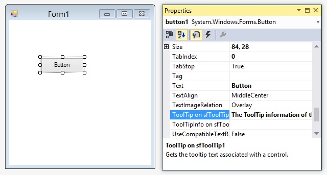
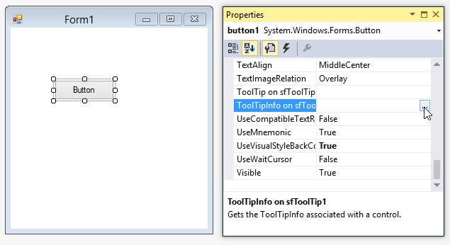
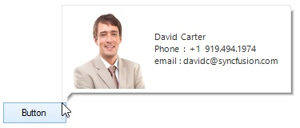
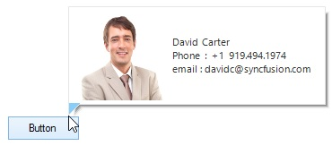

# Getting Started

## Assembly deployment

The following list of assemblies needs to be added as reference to use `SfToolTip` component in any application,

<table>
<tr>
<td>
**Required** **Assemblies******  </td><td>
**Description******  </td></tr>
<tr>
<td>
Syncfusion.Core.WinForms  </td><td>
Syncfusion.Core.WinForms assembly contains the theme related classes for the Syncfusion controls and basic components like SfScrollFrame, SfButton, SfForm and SfSkinManager.  </td></tr>
</table>
## Setting the SfToolTip to a control

This section describes how to add the `SfToolTip` to a Control.

### Through designer

#### Setting using Text

1) Drag and drop the `SfToolTip` to the form.
2) When the `SfToolTip` component is added to a form, an extended property will be added to the properties of the controls in the form.
3) Provide the ToolTip text in the extended property for Text. (ToolTip on SfToolTip1)

**Designer** **generated** **code******


SfToolTip sfToolTip1 = new SfToolTip(this.components);

Button button1 = new System.Windows.Forms.Button();

// 

// button1

// 

this.button1.Location = new System.Drawing.Point(62, 74);

this.button1.Name = "button1";

this.button1.Size = new System.Drawing.Size(84, 28);

this.button1.TabIndex = 0;

this.button1.Text = "Button";

this.sfToolTip1.SetToolTip(this.button1, "The ToolTip information of the Button control.");

this.button1.UseVisualStyleBackColor = true;



The provided ToolTip text will be configured for the control and will be shown when the user pauses the mouse cursor on the control.

#### Setting using ToolTipInfo

1) Drag and drop the `SfToolTip` to the form.
2) When the `SfToolTip` component is added to a form, an extended property will be added to the properties of the controls in the form. Clicking the … Ellipse button in the [ToolTipInfo](http://172.16.0.145:8080/Syncfusion.Core.WinForms/api/Syncfusion.WinForms.ToolTip.ToolTipInfo.html# "") on sfToolTip1 extended property will show the `SfToolTip` Editor dialog box. 

3) The `SfToolTip` editor lets you customize the `ToolTipInfo` for the control.
4) Click the … Ellipse button in the Items property and you can view the [ToolTipItem](http://172.16.0.145:8080/Syncfusion.Core.WinForms/api/Syncfusion.WinForms.ToolTip.ToolTipItem.html# "") collection editor.

5) Add one or more `ToolTipItem` to the collection and customize the `ToolTipItem` if needed. 

**Designer** **generated** **code******


ToolTipInfo toolTipInfo1 = new ToolTipInfo();

ToolTipItem toolTipItem1 = new ToolTipItem();

ToolTipItem toolTipItem2 = new ToolTipItem();

SfToolTip sfToolTip1 = new SfToolTip(this.components);

Button button1 = new System.Windows.Forms.Button();

// 

// button1

// 

this.button1.Location = new System.Drawing.Point(62, 74);

this.button1.Name = "button1";

this.button1.Size = new System.Drawing.Size(84, 28);

this.button1.TabIndex = 0;

this.button1.Text = "Button";

toolTipItem1.Text = "ToolTipItem1 Text";

toolTipItem2.Text = "ToolTipItem2 Text";

toolTipInfo1.Items.AddRange(new ToolTipItem[] {

toolTipItem1,

toolTipItem2});

this.sfToolTip1.SetToolTipInfo(this.button1, toolTipInfo1);

this.button1.UseVisualStyleBackColor = true;



The provided `ToolTipInfo` will be configured for the control and will be shown when the user pauses the mouse cursor on the control.

### Through code

#### Setting using Text

The `SfToolTip` can be set to the control with tooltip text by using the [SetToolTip](http://172.16.0.145:8080/Syncfusion.Core.WinForms/api/Syncfusion.WinForms.ToolTip.SfToolTip.html#Syncfusion_WinForms_ToolTip_SfToolTip_SetToolTip_System_Windows_Forms_Control_System_String_ "") method. 


SfToolTip sfToolTip1 = new SfToolTip();

sfToolTip1.SetToolTip(this.button1, " The ToolTip information of the Button control.");



#### Setting using ToolTipInfo

The `SfToolTip` can be set to the control with set of tooltip information by using the [SetToolTipInfo](http://172.16.0.145:8080/Syncfusion.Core.WinForms/api/Syncfusion.WinForms.ToolTip.SfToolTip.html#Syncfusion_WinForms_ToolTip_SfToolTip_SetToolTipInfo_System_Windows_Forms_Control_Syncfusion_WinForms_ToolTip_ToolTipInfo_ "") method.


SfToolTip sfToolTip1 = new SfToolTip();

ToolTipInfo toolTipInfo1 = new ToolTipInfo();

ToolTipItem toolTipItem1 = new ToolTipItem();

toolTipItem1.Text = "ToolTipItem 1 Text";

ToolTipItem toolTipItem2 = new ToolTipItem();

toolTipItem2.Text = "ToolTipItem 2 Text";

toolTipInfo1.Items.AddRange(new ToolTipItem[] { toolTipItem1, toolTipItem2 });

sfToolTip1.SetToolTipInfo(this.button1, toolTipInfo1);



## Displaying the SfToolTip programmatically

### Show tooltip

The SfToolTip can be shown programmatically using the [Show](http://172.16.0.145:8080/Syncfusion.Core.WinForms/api/Syncfusion.WinForms.ToolTip.SfToolTip.html#Syncfusion_WinForms_ToolTip_SfToolTip_Show_System_String_ "") method. The various overloads provided to show tooltip are documented in [Show](http://172.16.0.145:8080/Syncfusion.Core.WinForms/api/Syncfusion.WinForms.ToolTip.SfToolTip.html#Syncfusion_WinForms_ToolTip_SfToolTip_Show_System_String_ "").

**Note******

If the position in which the tooltip to be shown is not mentioned, then the tooltip will be shown in mouse cursor position.


Button button1 = new Button();

this.Controls.Add(button1);

button1.Click += Button1_Click;

Button button2 = new Button();

this.Controls.Add(button2);

button2.Click += Button2_Click;

Button button3 = new Button();

this.Controls.Add(button3);

button3.Click += Button3_Click;

private void Button1_Click(object sender, EventArgs e)

{

// Shows the text in the cursor position.

this.sfToolTip1.Show("Programmatically showing the tooltip text");

}

private void Button2_Click(object sender, EventArgs e)

{

// Shows the text in the specified position.

this.sfToolTip1.Show("Programmatically showing the tooltip in specified position", new Point(300, 300));

}

private void Button3_Click(object sender, EventArgs e)

{

ToolTipInfo toolTipInfo = new ToolTipInfo();

ToolTipItem toolTipItem = new ToolTipItem();

toolTipItem.Text = "ToolTipItem text";

toolTipInfo.Items.Add(toolTipItem);

// Shows the ToolTipInfo in  cursor position.

this.sfToolTip1.Show(toolTipInfo);

}



### Hide tooltip

The `SfToolTip` can be hidden using the [Hide](http://172.16.0.145:8080/Syncfusion.Core.WinForms/api/Syncfusion.WinForms.ToolTip.SfToolTip.html#Syncfusion_WinForms_ToolTip_SfToolTip_Hide "") method. 


this.sfToolTip1.Hide();



## Setting the ToolTip delay

The below properties can be used to set the ToolTip delay time.

* InitialDelay
* AutoPopDelay.
### InitialDelay

The [InitialDelay](http://172.16.0.145:8080/Syncfusion.Core.WinForms/api/Syncfusion.WinForms.ToolTip.SfToolTip.html#Syncfusion_WinForms_ToolTip_SfToolTip_InitialDelay "") property enables you to shorten or lengthen the time that the `SfToolTip` waits before displaying a ToolTip. Default value is 0.


SfToolTip sfToolTip1 = new SfToolTip();

sfToolTip1.InitialDelay = 1000;



### AutoPopDelay

The [AutoPopDelay](http://172.16.0.145:8080/Syncfusion.Core.WinForms/api/Syncfusion.WinForms.ToolTip.SfToolTip.html#Syncfusion_WinForms_ToolTip_SfToolTip_AutoPopDelay "") property enables you to shorten or lengthen the time duration that the tooltip is displayed when the mouse pointer is on a control. Default value is 5000.


SfToolTip sfToolTip1 = new SfToolTip();

sfToolTip1.AutoPopDelay = 10000;



## Showing ToolTip with Beak

The `SfToolTip` can be shown with the beak by using the [ToolTipStyle](http://172.16.0.145:8080/Syncfusion.Core.WinForms/api/Syncfusion.WinForms.ToolTip.ToolTipStyle.html# "") property.


ToolTipInfo toolTipInfo1 = new ToolTipInfo();

toolTipInfo1.ToolTipStyle = ToolTipStyle.Balloon;

ToolTipItem toolTipItem1 = new ToolTipItem();

toolTipItem1.Text = "David Carter\r\nPhone : +1 919.494.1974\r\nEmail : david@syncfusion.com";

toolTipItem1.Style.TextAlignment = ContentAlignment.MiddleLeft;

toolTipItem1.Image = global::GettingStarted.Properties.Resources.MORGK;

toolTipItem1.Style.ImageSize = new Size(100, 100);

toolTipInfo1.Items.AddRange(new ToolTipItem[] { toolTipItem1 });

sfToolTip1.SetToolTipInfo(this.button2, toolTipInfo1);



### Setting the beak back color

The back color of the balloon beak can be set using the [BeakBackColor](http://172.16.0.145:8080/Syncfusion.Core.WinForms/api/Syncfusion.WinForms.ToolTip.ToolTipInfo.html#Syncfusion_WinForms_ToolTip_ToolTipInfo_BeakBackColor "") property of the `ToolTipInfo`.


ToolTipInfo toolTipInfo1 = new ToolTipInfo();

toolTipInfo1.ToolTipStyle = ToolTipStyle.Balloon;

toolTipInfo1.BeakBackColor = Color.LightSkyBlue;

ToolTipItem toolTipItem1 = new ToolTipItem();

toolTipItem1.Text = "David Carter\r\nPhone : +1 919.494.1974\r\nEmail : david@syncfusion.com";

toolTipItem1.Style.TextAlignment = ContentAlignment.MiddleLeft;

toolTipItem1.Image = global::GettingStarted.Properties.Resources.MORGK;

toolTipItem1.Style.ImageSize = new Size(100, 100);

toolTipInfo1.Items.AddRange(new ToolTipItem[] { toolTipItem1 });

sfToolTip1.SetToolTipInfo(this.button2, toolTipInfo1);



