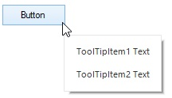

# ToolTip content

## Setting ToolTipItem

[ToolTipItem](http://172.16.0.145:8080/Syncfusion.Core.WinForms/api/Syncfusion.WinForms.ToolTip.ToolTipItem.html# "") can be set to the SfToolTip by adding the `ToolTipItem` to the [Items](http://172.16.0.145:8080/Syncfusion.Core.WinForms/api/Syncfusion.WinForms.ToolTip.ToolTipInfo.html#Syncfusion_WinForms_ToolTip_ToolTipInfo_Items "") collection through [Add](http://172.16.0.145:8080/Syncfusion.Core.WinForms/api/Syncfusion.WinForms.ToolTip.ToolTipItemCollection.html#Syncfusion_WinForms_ToolTip_ToolTipItemCollection_Add_Syncfusion_WinForms_ToolTip_ToolTipItem_ "") method.


ToolTipItem toolTipItem1 = new ToolTipItem();

toolTipItem1.Text = "The ToolTip information of the Button control.";

toolTipInfo1.Items.Add(toolTipItem1 );

sfToolTip1.SetToolTipInfo(this.button2, toolTipInfo1);



## Adding Multiple Items into a ToolTip

Multiple `ToolTipItem` also can be added to the `SfToolTip` by adding the multiple items to the Items collection using either `Add` method or [AddRange](http://172.16.0.145:8080/Syncfusion.Core.WinForms/api/Syncfusion.WinForms.ToolTip.ToolTipItemCollection.html#Syncfusion_WinForms_ToolTip_ToolTipItemCollection_AddRange_Syncfusion_WinForms_ToolTip_ToolTipItem___ "") method.


ToolTipItem toolTipItem1 = new ToolTipItem();

toolTipItem1.Text = "The ToolTip information of the Button control.";

ToolTipItem toolTipItem2 = new ToolTipItem();

toolTipItem2.Text = "The ToolTip information of the Button control.";

toolTipInfo1.Items.AddRange(new ToolTipItem[] { toolTipItem1, toolTipItem2 } );

sfToolTip1.SetToolTipInfo(this.button2, toolTipInfo1);



### Spacing between items

The spacing or padding of the `ToolTipItem` can be changed by using the [Padding](http://172.16.0.145:8080/Syncfusion.Core.WinForms/api/Syncfusion.WinForms.ToolTip.ToolTipItem.html#Syncfusion_WinForms_ToolTip_ToolTipItem_Padding "") property of the ToolTip item.


ToolTipItem toolTipItem1 = new ToolTipItem();

toolTipItem1.Text = "ToolTipItem1 Text";

toolTipItem1.Padding = new Padding(12);

ToolTipItem toolTipItem2 = new ToolTipItem();

toolTipItem2.Text = "ToolTipItem2 Text";

toolTipItem2.Padding = new Padding(12);

toolTipInfo1.Items.AddRange(new ToolTipItem[] { toolTipItem1, toolTipItem2 });

sfToolTip1.SetToolTipInfo(this.button2, toolTipInfo1);



## Adding Image into a ToolTip

The tooltip image of the `ToolTipItem` can be initialized using the [Image](http://172.16.0.145:8080/Syncfusion.Core.WinForms/api/Syncfusion.WinForms.ToolTip.ToolTipItem.html#Syncfusion_WinForms_ToolTip_ToolTipItem_Image "") or the [ImageList](http://172.16.0.145:8080/Syncfusion.Core.WinForms/api/Syncfusion.WinForms.ToolTip.ToolTipItem.html#Syncfusion_WinForms_ToolTip_ToolTipItem_ImageList "") property.


ToolTipItem toolTipItem1 = new ToolTipItem();

toolTipItem1.Text = "This image is initialized with Image property.";

toolTipItem1.Image = global::GettingStarted.Properties.Resources.Image1;

toolTipItem1.Style.ImageSize = new Size(100, 100);

ImageList imageList = new ImageList();

imageList.Images.Add(global::GettingStarted.Properties.Resources.Image1);

imageList.Images.Add(global::GettingStarted.Properties.Resources.image2);

ToolTipItem toolTipItem2 = new ToolTipItem();

toolTipItem2.Text = "This image is initialized with ImageList property.";

toolTipItem2.ImageList = imageList;

toolTipItem2.ImageIndex = 1;

toolTipItem2.ImageList.ImageSize = new Size(100, 100);

toolTipInfo1.Items.AddRange(new ToolTipItem[] { toolTipItem1, toolTipItem2 });

sfToolTip1.SetToolTipInfo(this.button1, toolTipInfo1);



**Note**: `Image` property is considered as high priority, if both `Image` and `ImageList` are initialized. 

### Changing ImageAlignment of the ToolTipItem

The image alignment of the `ToolTipItem` can be changed by using the [ImageAlignment](http://172.16.0.145:8080/Syncfusion.Core.WinForms/api/Syncfusion.WinForms.ToolTip.ToolTipStyleInfo.html#Syncfusion_WinForms_ToolTip_ToolTipStyleInfo_ImageAlignment "") property. 


ToolTipItem toolTipItem1 = new ToolTipItem();

toolTipItem1.Text = "David Carter\r\nPhone : +1 919.494.1974\r\nEmail : [david@syncfusion.com](mailto:david@syncfusion.com# "")";

toolTipItem1.Image= global::GettingStarted.Properties.Resources.Image1;

toolTipItem1.Style.ImageAlignment = ToolTipImageAlignment.Left;



### Setting ImageSize of the ToolTipItem

The image size of the `ToolTipItem` can be changed by using the [ImageSize](http://172.16.0.145:8080/Syncfusion.Core.WinForms/api/Syncfusion.WinForms.ToolTip.ToolTipStyleInfo.html#Syncfusion_WinForms_ToolTip_ToolTipStyleInfo_ImageSize "") property.


ToolTipItem toolTipItem1 = new ToolTipItem();

toolTipItem1.Text = "David Carter\r\nPhone : +1 919.494.1974\r\nEmail : [david@syncfusion.com](mailto:david@syncfusion.com# "")";

toolTipItem1.Image= global::GettingStarted.Properties.Resources.Image1;

toolTipItem1.Style.ImageSize = new Size(100, 100);



**Note****:** If `ImageSize` property is initialized rather than its default value of Size (32, 32), then it will be taken as the image size for the image and won’t consider the Image.Size and ImageList.Size for image size.

### Setting spacing between Image and Text

The distance between the [Text](http://172.16.0.145:8080/Syncfusion.Core.WinForms/api/Syncfusion.WinForms.ToolTip.ToolTipItem.html#Syncfusion_WinForms_ToolTip_ToolTipItem_Text "") and `Image` of the `ToolTipItem` can be changed by using the [ImageToTextOffset](http://172.16.0.145:8080/Syncfusion.Core.WinForms/api/Syncfusion.WinForms.ToolTip.ToolTipStyleInfo.html#Syncfusion_WinForms_ToolTip_ToolTipStyleInfo_ImageToTextOffset "").


ToolTipItem toolTipItem1 = new ToolTipItem();

toolTipItem1.Text = "David Carter\r\nPhone : +1 919.494.1974\r\nEmail : david@syncfusion.com";

toolTipItem1.Style.TextAlignment = ContentAlignment.MiddleLeft;

toolTipItem1.Image = global::GettingStarted.Properties.Resources.MORGK;

toolTipItem1.Style.ImageSize = new Size(100, 100);

toolTipItem1.Style.ImageToTextOffset = 20;

toolTipInfo1.Items.AddRange(new ToolTipItem[] { toolTipItem1 });

sfToolTip1.SetToolTipInfo(this.button2, toolTipInfo1);



## Adding custom user control into a ToolTip

Controls can be added to the `ToolTipItem` using the [Control](http://172.16.0.145:8080/Syncfusion.Core.WinForms/api/Syncfusion.WinForms.ToolTip.ToolTipItem.html#Syncfusion_WinForms_ToolTip_ToolTipItem_Control "") property.


PictureBox pictureBox1 = new PictureBox();

pictureBox1.Image = Image.FromFile(@"../../Resources/cube.gif");

pictureBox1.SizeMode = PictureBoxSizeMode.CenterImage;

pictureBox1.Size = new Size(200, 100);

pictureBox1.BorderStyle = BorderStyle.FixedSingle;

ToolTipItem toolTipItem1 = new ToolTipItem();

toolTipItem1.Control = pictureBox1;

toolTipInfo1.Items.AddRange(new ToolTipItem[] { toolTipItem1 });

sfToolTip1.SetToolTipInfo(this.button1, toolTipInfo1);



