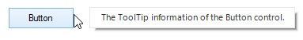

# Working with SfToolTip

## Getting the ToolTip text of a control

The tooltip text of a control can be retrieved by using the [GetToolTip](http://172.16.0.145:8080/Syncfusion.Core.WinForms/api/Syncfusion.WinForms.ToolTip.SfToolTip.html#Syncfusion_WinForms_ToolTip_SfToolTip_GetToolTip_System_Windows_Forms_Control_ "") method. 


string toolTipText = this.sfToolTip1.GetToolTip(this.button1);



## Setting the ToolTip text of a control

The tooltip text for a control can be initialized by using the [SetToolTip](http://172.16.0.145:8080/Syncfusion.Core.WinForms/api/Syncfusion.WinForms.ToolTip.SfToolTip.html#Syncfusion_WinForms_ToolTip_SfToolTip_SetToolTip_System_Windows_Forms_Control_System_String_ "") method.


this.sfToolTip1.SetToolTip(this.button1, "Button1 ToolTip Text");



## Getting the ToolTipInfo of a control

The `ToolTipInfo` of a control can be retrieved by using the [GetToolTipInfo](http://172.16.0.145:8080/Syncfusion.Core.WinForms/api/Syncfusion.WinForms.ToolTip.SfToolTip.html#Syncfusion_WinForms_ToolTip_SfToolTip_GetToolTipInfo_System_Windows_Forms_Control_ "") method.


ToolTipInfo toolTipInfo = this.sfToolTip1.GetToolTipInfo(this.button1);



## Setting the ToolTipInfo of a control

The `ToolTipInfo` for a control can be initialized by using the [SetToolTipInfo](http://172.16.0.145:8080/Syncfusion.Core.WinForms/api/Syncfusion.WinForms.ToolTip.SfToolTip.html#Syncfusion_WinForms_ToolTip_SfToolTip_SetToolTipInfo_System_Windows_Forms_Control_Syncfusion_WinForms_ToolTip_ToolTipInfo_ "") method.


this.sfToolTip1.SetToolTipInfo(this.button1, toolTipInfo);



## Disabling tooltip from showing

The [ToolTipShowing](http://172.16.0.145:8080/Syncfusion.Core.WinForms/api/Syncfusion.WinForms.ToolTip.SfToolTip.html#Syncfusion_WinForms_ToolTip_SfToolTip_ToolTipShowing "") event can be used to avoid displaying the tooltip window by setting the `e.Cancel` to `true`.


this.sfToolTip1.ToolTipShowing += SfToolTip1_ToolTipShowing;

private void SfToolTip1_ToolTipShowing(object sender, ToolTipShowingEventArgs e)

{

if (e.Control.Name == "cancelButton")

e.Cancel = true;

}



## Changing location of the ToolTip

The location of the tooltip to be shown can be customized in `ToolTipShowing` event using the [e.Location](http://172.16.0.145:8080/Syncfusion.Core.WinForms/api/Syncfusion.WinForms.ToolTip.ToolTipShowingEventArgs.html#Syncfusion_WinForms_ToolTip_ToolTipShowingEventArgs_Location "") property.


this.sfToolTip1.ToolTipShowing += SfToolTip1_ToolTipShowing;

private void SfToolTip1_ToolTipShowing(object sender, ToolTipShowingEventsArgs e)

{

e.Location = new Point(e.Location.X + 20, e.Location.Y - 25);

}



## Setting Minimum and Maximum width

The minimum width and the maximum width of the tooltip can be changed using the [MinWidth](http://172.16.0.145:8080/Syncfusion.Core.WinForms/api/Syncfusion.WinForms.ToolTip.ToolTipInfo.html#Syncfusion_WinForms_ToolTip_ToolTipInfo_MinWidth "") and [MaxWidth](http://172.16.0.145:8080/Syncfusion.Core.WinForms/api/Syncfusion.WinForms.ToolTip.ToolTipInfo.html#Syncfusion_WinForms_ToolTip_ToolTipInfo_MaxWidth "") properties. 


ToolTipInfo toolTipInfo1 = new ToolTipInfo();

toolTipInfo1.MinWidth = 100;

toolTipInfo1.MaxWidth = 500;



**Note****:** The width of the tooltip will be initialized to `MinWidth`, if the width is lesser than `MinWidth`. The width of the tooltip will be initialized to `MaxWidth`, if the width exceeds the `MaxWidth`.

## Custom drawing of ToolTip

[DrawToolTipItem](http://172.16.0.145:8080/Syncfusion.Core.WinForms/api/Syncfusion.WinForms.ToolTip.SfToolTip.html#Syncfusion_WinForms_ToolTip_SfToolTip_DrawToolTipItem "") event can be used to handle the drawing of the `ToolTipItem` appearance. To cancel the default drawing of the `ToolTipItem`, `e.Cancel` property can be used.


this.sfToolTip1.DrawToolTipItem += SfToolTip1_DrawToolTipItem;

private void SfToolTip1_DrawToolTipItem(object sender, DrawToolTipItemEventArgs e)

{

// To cancel the drawing of ToolTipItem.

e.Cancel = true;

LinearGradientBrush gradientBrush = new LinearGradientBrush(e.ToolTipItemRectangle, Color.LightSkyBlue, Color.LightGreen, LinearGradientMode.Horizontal);

e.Graphics.FillRectangle(gradientBrush, e.ToolTipItemRectangle);

Pen pen = new Pen(Color.Black);

Rectangle borderRectangle = e.ToolTipItemRectangle;

borderRectangle.Width -= 1;

borderRectangle.Height -= 1;

e.Graphics.DrawRectangle(pen, borderRectangle);

SolidBrush solidBrush = new SolidBrush(Color.Black);

StringFormat stringFormat = new StringFormat();

stringFormat.Alignment = StringAlignment.Center;

stringFormat.LineAlignment = StringAlignment.Center;

e.Graphics.DrawString(e.ToolTipItem.Text, e.ToolTipItem.Style.Font, solidBrush, e.ToolTipItemRectangle, stringFormat);

}



