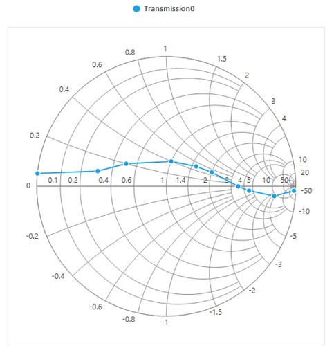
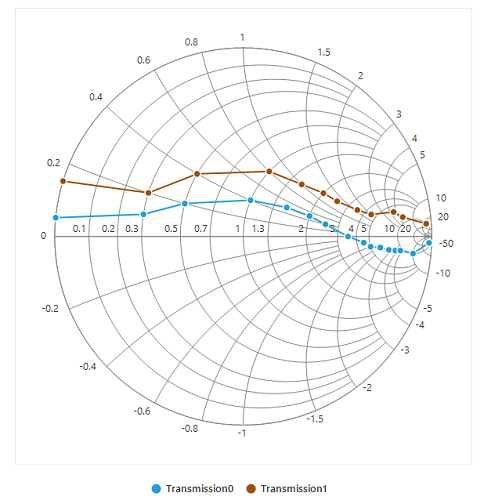
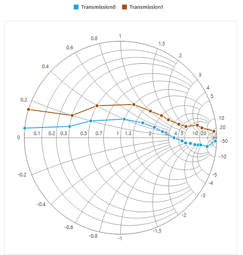
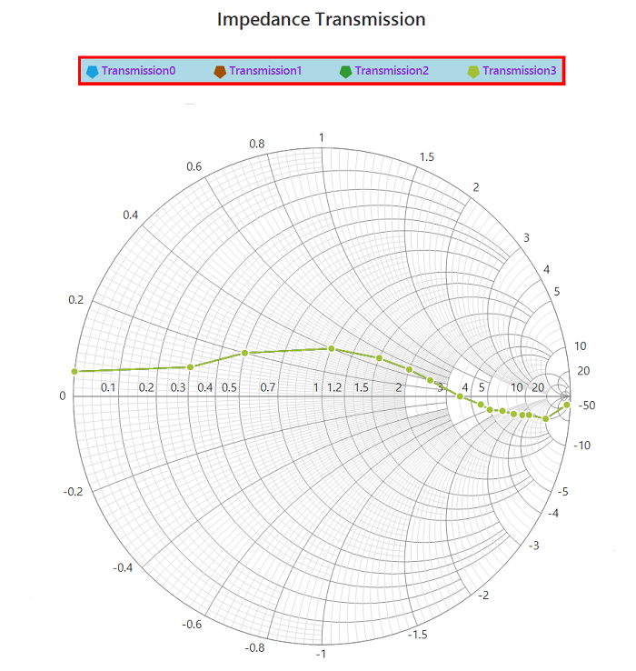
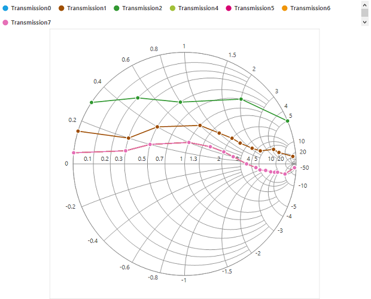

# Legend in Windows Forms Smith Chart (SfSmithChart)

Legend contains a list of chart series that appears in Smith chart. It can be defined by using the following code example.

To enable the legend for the Smith chart, set the [`Visible`](https://help.syncfusion.com/cr/windowsforms/Syncfusion.WinForms.SmithChart.ChartLegend.html#Syncfusion_WinForms_SmithChart_ChartLegend_Visible) property of legend to true.





chart.Legend.Visible = true;





chart.Legend.Visible = True





Add name to the [`LegendText`](https://help.syncfusion.com/cr/windowsforms/Syncfusion.WinForms.SmithChart.ChartSeries.html#Syncfusion_WinForms_SmithChart_ChartSeries_LegendText) property of series, which in turn mapped to the legend.





series.LegendText = "Transmission1";





series.LegendText = "Transmission1"





## Positioning the legend

Legends can be docked at the left, right, and top or bottom around the chart area by using the [`DockPosition`](https://help.syncfusion.com/cr/windowsforms/Syncfusion.WinForms.SmithChart.ChartLegend.html#Syncfusion_WinForms_SmithChart_ChartLegend_DockPosition) property.

By default, the Smith chart’s legend is docked at the top of the chart. To display the legend at the bottom, set the [`DockPosition`](https://help.syncfusion.com/cr/windowsforms/Syncfusion.WinForms.SmithChart.ChartLegend.html#Syncfusion_WinForms_SmithChart_ChartLegend_DockPosition) property to Bottom as shown in the following code snippet.

## Legend icon

Represents the symbol associated with each legend item. By default, the legend icon is circle.

Legend icon can be customized by using the [`IconType`](https://help.syncfusion.com/cr/windowsforms/Syncfusion.WinForms.SmithChart.ChartLegend.html#Syncfusion_WinForms_SmithChart_ChartLegend_IconType) property in Smith chart’s legend as shown in the following code snippet.





sfSmithChart1.Legend.IconType = SmithChartLegendIconType.Rectangle;





sfSmithChart1.Legend.IconType = SmithChartLegendIconType.Rectangle





## Legend alignment

The alignment of a legend can be changed to near, far, or center using the [`Alignment`](https://help.syncfusion.com/cr/windowsforms/Syncfusion.WinForms.SmithChart.ChartLegend.html#Syncfusion_WinForms_SmithChart_ChartLegend_Alignment) property.

By default, the legend is aligned to the center.

## Customizing legend

Legend can be customized by using below properties.

[`IconType`](https://help.syncfusion.com/cr/windowsforms/Syncfusion.WinForms.SmithChart.ChartLegend.html#Syncfusion_WinForms_SmithChart_ChartLegend_IconType)- This property used to set the different icon to the legend icon. 
[`IconHeight`](https://help.syncfusion.com/cr/windowsforms/Syncfusion.WinForms.SmithChart.ChartLegend.html#Syncfusion_WinForms_SmithChart_ChartLegend_IconHeight)- This property used to set the height for legend icon. 
[`IconWidth`](https://help.syncfusion.com/cr/windowsforms/Syncfusion.WinForms.SmithChart.ChartLegend.html#Syncfusion_WinForms_SmithChart_ChartLegend_IconWidth)- This property used to set the width for legend icon. 
[`ForeColor`](https://help.syncfusion.com/cr/windowsforms/Syncfusion.WinForms.SmithChart.LegendStyle.html#Syncfusion_WinForms_SmithChart_LegendStyle_ForeColor)- This property is used to customize the legend foreground color.
`BackColor`- This property is used to change the legend back color.
`BorderColor`- This property is used to customize the legend border color.
`BorderWidth`-  This property is used to customize the legend border width.
`Spacing`- This property is used to provide spacing between legend border and its items.
`ItemSpacing`- This property is used to provide spacing for the legend items.
`BorderVisible`- This property is used to enable or disable the legend border visibility.

The following code example illustrates the customization of legend.





            sfSmithChart1.Legend.Style.BorderColor = Color.Red;
            sfSmithChart1.Legend.Style.BorderWidth = 7;
            sfSmithChart1.Legend.Style.BackColor = Color.LightBlue;
            sfSmithChart1.Legend.ItemSpacing = 50;
            sfSmithChart1.Legend.Spacing = 5;
            sfSmithChart1.Legend.BorderVisible = true;
            sfSmithChart1.Legend.IconType = SmithChartLegendIconType.Pentagon;
            sfSmithChart1.Legend.IconHeight = 13;
            sfSmithChart1.Legend.IconWidth = 13;
            sfSmithChart1.Legend.Style.ForeColor = Color.BlueViolet;





    sfSmithChart1.Legend.Style.BorderColor = Color.Red
    sfSmithChart1.Legend.Style.BorderWidth = 7
    sfSmithChart1.Legend.Style.BackColor = Color.LightBlue
    sfSmithChart1.Legend.ItemSpacing = 50
    sfSmithChart1.Legend.Spacing = 5
    sfSmithChart1.Legend.BorderVisible = True
    sfSmithChart1.Legend.IconType = SmithChartLegendIconType.Pentagon
    sfSmithChart1.Legend.IconHeight = 13
    sfSmithChart1.Legend.IconWidth = 13
    sfSmithChart1.Legend.Style.ForeColor = Color.BlueViolet





## Toggle series visibility

Visibility of the series can be controlled by clicking the legend item. This can be done using the [`ToggleSeriesVisible`](https://help.syncfusion.com/cr/windowsforms/Syncfusion.WinForms.SmithChart.ChartLegend.html#Syncfusion_WinForms_SmithChart_ChartLegend_ToggleSeriesVisible) property.





sfSmithChart1.Legend.ToggleSeriesVisible = true;





sfSmithChart1.Legend.ToggleSeriesVisible = True





## Smart view

### Scrollbar

Any number of series can be used in Smith chart. For each series, legend item will be displayed to indicate that series. If the chart area does not have enough space to accommodate all the legend items, then the scrollbar will be enabled automatically for visualizing all the legend items.

In the  following screenshot, around 7 series are added, and some of the series are defined with the same data points. Here, the specified dimension of chart can’t hold all the legend items in the view. Hence, the scroll bar is enabled for better visualization of legend items.

### Wrap items

Legend items can also be wrapped one by one as shown in the following screenshot by setting the [`WrapItems`](https://help.syncfusion.com/cr/windowsforms/Syncfusion.WinForms.SmithChart.ChartLegend.html#Syncfusion_WinForms_SmithChart_ChartLegend_WrapItems) property to true. Nearly, 20% of chart area is used for legend. If the items go beyond the view, the vertical scroll bar will be enabled. Based on the dock position, the vertical or horizontal scroll bar will be enabled.

