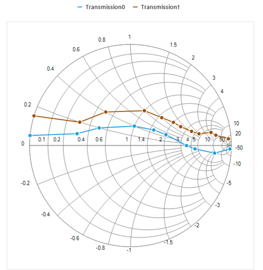

# Windows Forms Smith Chart (SfSmithChart) Overview

The Smith chart is one of the most useful data visualization tools for high-frequency circuit applications. It contains two sets of circles to plot the parameters of transmission lines.

The Smith chart provides a perfect way to visualize the data with a high level of user interactivity that focuses on development, productivity, and ease of use.

## Key features

* Visualization of the impedance and admittance of transmission lines.
* Representation of data with line series and various types of markers.
* Data label support for better readability.
* Interactive tooltip support.
* Interactive legend.
* Customizable colors.

