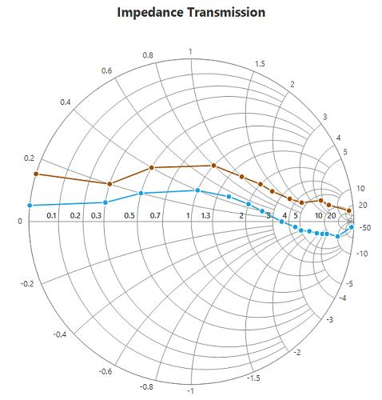
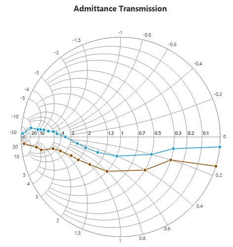

# Rendering Mode in Windows Forms Smith Chart (SfSmithChart)

Smith chart provides options for plotting both impedance and admittance by using the [`RenderingMode`](https://help.syncfusion.com/cr/windowsforms/Syncfusion.WinForms.SmithChart.SfSmithChart.html#Syncfusion_WinForms_SmithChart_SfSmithChart_RenderingMode) property.

By using the rendering mode, you can change the type of the Smith chart. The default mode of Smith chart is impedance.

## Impedance Smith chart	

Impedance Smith chart is composed of two families of circles, normalized resistance circles, and normalized reactance curves.

Positive values of reactance lie on the upper region whereas negative values lie on the lower region of Smith chart.





SfSmithChart chart = new SfSmithChart();

chart.RenderingMode = RenderingMode.Impedance;





Dim chart As New SfSmithChart()

chart.RenderingMode = RenderingMode.Impedance





## Admittance Smith chart

Admittance Smith chart is composed of two families of circles, normalized conductance circles, and normalized susceptance curves.

Positive values of susceptance lie on the lower region whereas negative values lie on the upper region of Smith chart.





SfSmithChart chart = new SfSmithChart();

chart.RenderingMode = RenderingMode.Admittance;





Dim chart As New SfSmithChart()

chart.RenderingMode = RenderingMode.Admittance





