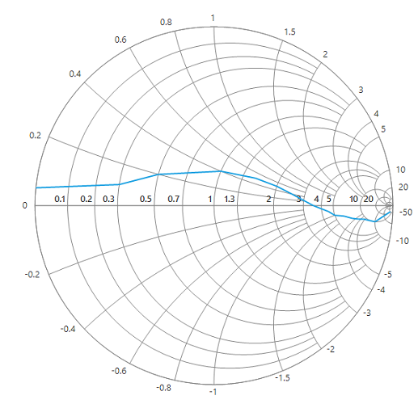
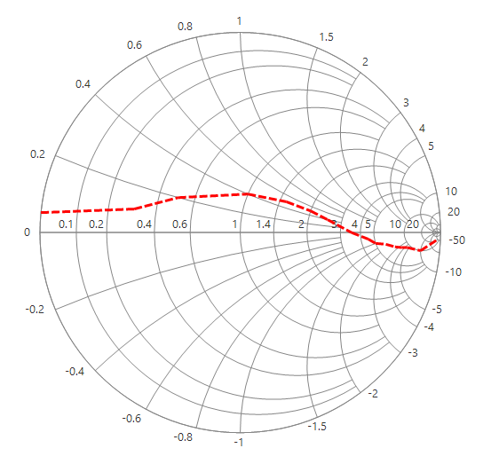
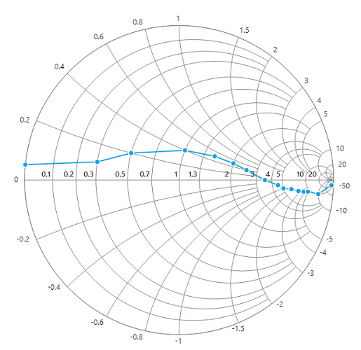
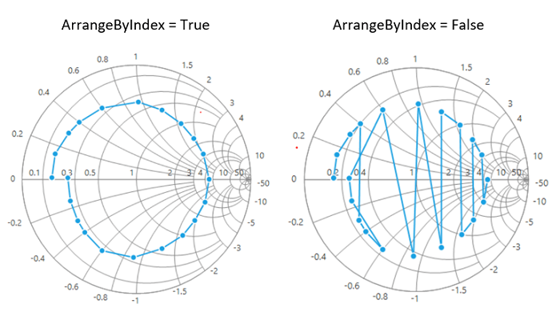

# Series in Windows Forms Smith Chart (SfSmithChart)

Chart series is the visual representation of given data. The following APIs are used for generating the series.

`DataSource` : Data collection that is to be given to plot the data.

[`ResistanceMember`](https://help.syncfusion.com/cr/windowsforms/Syncfusion.WinForms.SmithChart.ChartSeries.html#Syncfusion_WinForms_SmithChart_ChartSeries_ResistanceMember) : A string property that represents the resistance values in impedance Smith chart and conductance values in admittance Smith chart.

[`ReactanceMember`](https://help.syncfusion.com/cr/windowsforms/Syncfusion.WinForms.SmithChart.ChartSeries.html#Syncfusion_WinForms_SmithChart_ChartSeries_ReactanceMember) : A string property that represents the reactance values in impedance Smith chart and susceptance values in admittance Smith chart.





LineSeries series = new LineSeries();

series.DataSource = model.Trace1;

series.ResistanceMember = "Resistance";

series.ReactanceMember = "Reactance";

sfSmithChart1.Series.Add(series);





Dim series As New LineSeries()

series.DataSource = model.Trace1

series.ResistanceMember = "Resistance"

series.ReactanceMember = "Reactance"

sfSmithChart1.Series.Add(series)





## Customizing the line series

The line stroke and width can be customized by using the [`Interior`](https://help.syncfusion.com/cr/windowsforms/Syncfusion.WinForms.SmithChart.ChartSeries.html#Syncfusion_WinForms_SmithChart_ChartSeries_Interior), [`StrokeWidth`](https://help.syncfusion.com/cr/windowsforms/Syncfusion.WinForms.SmithChart.LineSeries.html#Syncfusion_WinForms_SmithChart_LineSeries_StrokeWidth) and *DashStyle* properties of line series.





series.Interior = Color.Red;

series.StrokeWidth = 3;

series.DashStyle = DashStyle.Dash;





series.Interior = Color.Red

series.StrokeWidth = 3

series.DashStyle = DashStyle.Dash;





## Series visibility

To hide the series programmatically, set the [`Visible`](https://help.syncfusion.com/cr/windowsforms/Syncfusion.WinForms.SmithChart.ChartSeries.html#Syncfusion_WinForms_SmithChart_ChartSeries_Visible) property to false for the specific series.





LineSeries series = new LineSeries();          

series.MarkerVisible = true;            

series.DataSource = model.Trace1;

series.ResistanceMember = "Resistance";

series.ReactanceMember = "Reactance";

sfSmithChart1.Series.Add(series);

LineSeries series1 = new LineSeries();

series1.MarkerVisible = true;

series1.DataSource = model.Trace2;

series1.ResistanceMember = "Resistance";

series1.ReactanceMember = "Reactance";           

series1.Visible = false;

sfSmithChart1.Series.Add(series1);





Dim series As New LineSeries()

series.MarkerVisible = True

series.DataSource = model.Trace1

series.ResistanceMember = "Resistance"

series.ReactanceMember = "Reactance"

sfSmithChart1.Series.Add(series)

Dim series1 As New LineSeries()

series1.MarkerVisible = True

series1.DataSource = model.Trace2

series1.ResistanceMember = "Resistance"

series1.ReactanceMember = "Reactance"

series1.Visible = False

sfSmithChart1.Series.Add(series1)





## Data plotting customization

By default, the data points are plotted by sorting them based on the resistance values and it can be plotted based on their index value as it is by setting the [`ArrangeByIndex`]() property as true.





LineSeries series = new LineSeries();
series.ArrangeByIndex = true; 
sfSmithChart1.Series.Add(series);





Dim series As New LineSeries() 
series.ArrangeByIndex = True
sfSmithChart1.Series.Add(series)





