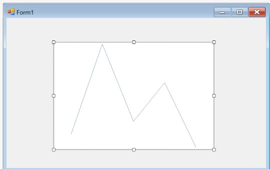
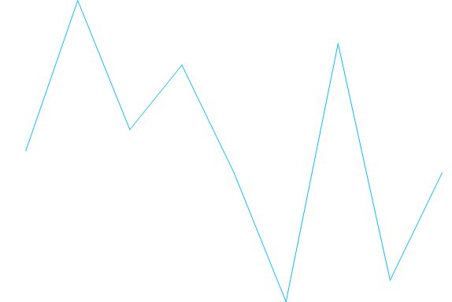
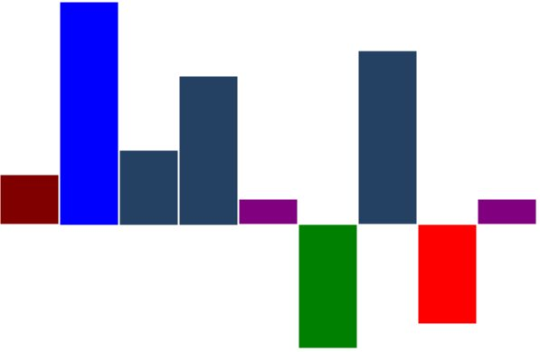

# Getting Started

This section provides the details that you will need to know about getting started with our Sparkline control. 

## Adding sparkline to form

To add sparkline to your form, follow the given steps:

1.Open your form in the designer. Add the Syncfusion controls to your VS.NET toolbox if you have not done it already (the install would have automatically done this unless you selected not to complete toolbox integration during installation).

2.Drag the sparkline control from toolbox and drop into the form. The default appearance of sparkline will be rendered.

## Customizing sparkline appearance

The appearance of the sparkline can be customized by using the [Style](https://help.syncfusion.com/cr/cref_files/windowsforms/chart/Syncfusion.Chart.Windows~Syncfusion.Windows.Forms.Chart.SparkLine~LineStyle.html) property.





this.sparkLine1.LineStyle.LineColor = System.Drawing.Color.Maroon;





Me.sparkLine1.LineStyle.LineColor = System.Drawing.Color.Maroon





## Adding marker to sparkline

The markers are visual indicators; they are used to represent the location of data points in the sparkline graph. This customization is applicable for all sparklines. 





this.sparkLine1.Markers.ShowMarker = true;





Me.sparkLine1.Markers.ShowMarker = true





## Highlighting high/low values

The marker feature supports [HighPoint](https://help.syncfusion.com/cr/cref_files/windowsforms/chart/Syncfusion.Chart.Base~Syncfusion.Windows.Forms.Chart.Markers~ShowHighPoint.html), [LowPoint](https://help.syncfusion.com/cr/cref_files/windowsforms/chart/Syncfusion.Chart.Base~Syncfusion.Windows.Forms.Chart.Markers~ShowLowPoint.html), [StartPoint](https://help.syncfusion.com/cr/cref_files/windowsforms/chart/Syncfusion.Chart.Base~Syncfusion.Windows.Forms.Chart.Markers~ShowStartPoint.html), [EndPoint](https://help.syncfusion.com/cr/cref_files/windowsforms/chart/Syncfusion.Chart.Base~Syncfusion.Windows.Forms.Chart.Markers~ShowEndPoint.html) and [NegativePoint](https://help.syncfusion.com/cr/cref_files/windowsforms/chart/Syncfusion.Chart.Base~Syncfusion.Windows.Forms.Chart.Markers~ShowNegativePoint.html) of Sparkline.





this.sparkLine1.Markers.ShowHighPoint = true;

this.sparkLine1.Markers.ShowLowPoint = true;

this.sparkLine1.Markers.ShowStartPoint = true;

this.sparkLine1.Markers.ShowEndPoint = true;

this.sparkLine1.Markers.ShowNegativePoint = true;

this.sparkLine1.Markers.HighPointColor = new BrushInfo(Color.Blue);

this.sparkLine1.Markers.LowPointColor = new BrushInfo(Color.Green);

this.sparkLine1.Markers.StartPointColor = new BrushInfo(Color.Maroon);

this.sparkLine1.Markers.EndPointColor = new BrushInfo(Color.Purple);

this.sparkLine1.Markers.NegativePointColor = new BrushInfo(Color.Red);





Me.sparkLine1.Markers.ShowHighPoint = true

Me.sparkLine1.Markers.ShowLowPoint = true

Me.sparkLine1.Markers.ShowStartPoint = true

Me.sparkLine1.Markers.ShowEndPoint = true

Me.sparkLine1.Markers.ShowNegativePoint = true

Me.sparkLine1.Markers.HighPointColor = New BrushInfo(Color.Blue)

Me.sparkLine1.Markers.LowPointColor = New BrushInfo(Color.Green)

Me.sparkLine1.Markers.StartPointColor = New BrushInfo(Color.Maroon)

Me.sparkLine1.Markers.EndPointColor = New BrushInfo(Color.Purple)

Me.sparkLine1.Markers.NegativePointColor = New BrushInfo(Color.Red)





You can find the complete getting started sample from this [link](http://www.syncfusion.com/downloads/support/directtrac/general/ze/SparklineGettingStarted-1907776967).

