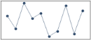

# Marker Customization in Windows Forms Sparkline

The markers are visual indicators to represent the location of data points in the Sparkline graph by using the [Markers](https://help.syncfusion.com/cr/windowsforms/Syncfusion.Windows.Forms.Chart.SparkLine.html#Syncfusion_Windows_Forms_Chart_SparkLine_Markers) property. The markers can support three types of sparklines.

**Properties**

<table>
<tr>
<th>
Marker Property</th><th>
Description</th></tr>
<tr>
<td>
<a href="https://help.syncfusion.com/cr/windowsforms/Syncfusion.Windows.Forms.Chart.Markers.html#Syncfusion_Windows_Forms_Chart_Markers_ShowMarker">ShowMarker</a></td><td>
Indicates whether the marker should be displayed at every data point location in a line sparkline. By default, it is set to False.</td></tr>
<tr>
<td>
<a href="https://help.syncfusion.com/cr/windowsforms/Syncfusion.Windows.Forms.Chart.Markers.html#Syncfusion_Windows_Forms_Chart_Markers_ShowHighPoint">ShowHighPoint</a></td><td>
Enables markers to show the highest values in all types of sparklines. By default, it is set to False.</td></tr>
<tr>
<td>
<a href="https://help.syncfusion.com/cr/windowsforms/Syncfusion.Windows.Forms.Chart.Markers.html#Syncfusion_Windows_Forms_Chart_Markers_ShowLowPoint">ShowLowPoint</a></td><td>
Enables markers to show the lowest values in all types of sparklines. By default, it is set to False.</td></tr>
<tr>
<td>
<a href="https://help.syncfusion.com/cr/windowsforms/Syncfusion.Windows.Forms.Chart.Markers.html#Syncfusion_Windows_Forms_Chart_Markers_ShowStartPoint">ShowStartPoint</a></td><td>
Enables markers to show start values in all types of sparklines. By default, it is set to False.</td></tr>
<tr>
<td>
<a href="https://help.syncfusion.com/cr/windowsforms/Syncfusion.Windows.Forms.Chart.Markers.html#Syncfusion_Windows_Forms_Chart_Markers_ShowEndPoint">ShowEndPoint</a></td><td>
Enables markers to show end values in all types of sparklines. By default, it is set to False.</td></tr>
<tr>
<td>
<a href="https://help.syncfusion.com/cr/windowsforms/Syncfusion.Windows.Forms.Chart.Markers.html#Syncfusion_Windows_Forms_Chart_Markers_ShowNegativePoint">ShowNegativePoint</a></td><td>
Enables markers to show negative values in all types of sparklines. By default, it is set to False.</td></tr>
<tr>
<td>
<a href="https://help.syncfusion.com/cr/windowsforms/Syncfusion.Windows.Forms.Chart.Markers.html#Syncfusion_Windows_Forms_Chart_Markers_MarkerColor">MarkerColor</a></td><td>
Gets or sets the marker color for the line type sparkline. This property color is set to the sparkline marker when enabling the ShowMarker property.</td></tr>
<tr>
<td>
<a href="https://help.syncfusion.com/cr/windowsforms/Syncfusion.Windows.Forms.Chart.Markers.html#Syncfusion_Windows_Forms_Chart_Markers_HighPointColor">HighPointColor</a></td><td>
Gets or sets the high point color for the line type sparkline. This property color is set to the sparkline marker when enabling the ShowHighPoint property.</td></tr>
<tr>
<td>
<a href="https://help.syncfusion.com/cr/windowsforms/Syncfusion.Windows.Forms.Chart.Markers.html#Syncfusion_Windows_Forms_Chart_Markers_LowPointColor">LowPointColor</a></td><td>
Gets or sets the low point color for the line type sparkline. This property color is set to the sparkline marker when enabling the ShowLowPoint property.</td></tr>
<tr>
<td>
<a href="https://help.syncfusion.com/cr/windowsforms/Syncfusion.Windows.Forms.Chart.Markers.html#Syncfusion_Windows_Forms_Chart_Markers_StartPointColor">StartPointColor</a></td><td>
Gets or sets the start point color for the line type sparkline. This property color is set to the sparkline marker when enabling the ShowStartPoint property.</td></tr>
<tr>
<td>
<a href="https://help.syncfusion.com/cr/windowsforms/Syncfusion.Windows.Forms.Chart.Markers.html#Syncfusion_Windows_Forms_Chart_Markers_EndPointColor">EndPointColor</a></td><td>
Gets or sets the end point color for the line type sparkline. This property color is set to the sparkline marker when enabling the ShowEndPoint property.</td></tr>
<tr>
<td>
<a href="https://help.syncfusion.com/cr/windowsforms/Syncfusion.Windows.Forms.Chart.Markers.html#Syncfusion_Windows_Forms_Chart_Markers_NegativePointColor">NegativePointColor</a></td><td>
Gets or sets the negative point color for the line type sparkline. This property color is set to the sparkline marker when enabling the ShowNegativePoint property.</td></tr>
</table>

## Markers Support for Line

This marker feature supports data points of the line sparkline. You can choose the marker color for the data points.

Refer to the following code snippets to enable the marker in the line sparkline.





//To enable marker to sparkline for all data points
this.sparkLine1.Markers.ShowMarker = true;





'To enable marker to sparkline for all data points
Me.sparkLine1.Markers.ShowMarker = True





## Markers Support for Column

This marker feature supports High Points, Low Points, Start Point, End Point, and Negative Point of the column sparkline. You can choose the marker color for the data points.

Refer to the following code sample to enable the marker in the column sparkline.





//To enable marker to sparkline high, low, start, end, negative data points
this.sparkLine1.Markers.ShowHighPoint = true;
this.sparkLine1.Markers.ShowLowPoint = true;
this.sparkLine1.Markers.ShowStartPoint = true;
this.sparkLine1.Markers.ShowEndPoint = true;
this.sparkLine1.Markers.ShowNegativePoint = true;

//To customize the marker color for low points
this.sparkLine1.Markers.LowPointColor = new BrushInfo(GradientStyle.BackwardDiagonal, Color.Blue, Color.Wheat);





'To enable marker to sparkline high, low, start, end, negative data points
Me.sparkLine1.Markers.ShowHighPoint = True
Me.sparkLine1.Markers.ShowLowPoint = True
Me.sparkLine1.Markers.ShowStartPoint = True
Me.sparkLine1.Markers.ShowEndPoint = True
Me.sparkLine1.Markers.ShowNegativePoint = True

'To customize the marker color for low points
Me.sparkLine1.Markers.LowPointColor = New BrushInfo(GradientStyle.BackwardDiagonal, Color.Blue, Color.Wheat)





## Markers Support for WinLoss

This marker feature supports High Points, Low Points, Start Point, End Point, and Negative Point of the WinLoss sparkline. The markers feature of WinLoss is the same as Column markers. You can choose the marker color for the data points.

Refer to the following code snippets to enable the marker in the WinLoss sparkline.





//To enable marker to sparkline high, low, start, end, negative data points
this.sparkLine1.Markers.ShowHighPoint = true;
this.sparkLine1.Markers.ShowLowPoint = true;
this.sparkLine1.Markers.ShowStartPoint = true;
this.sparkLine1.Markers.ShowEndPoint = true;
this.sparkLine1.Markers.ShowNegativePoint = true;

//To customize the marker color for low points
this.sparkLine1.Markers.LowPointColor = new BrushInfo(GradientStyle.BackwardDiagonal, Color.Blue, Color.Wheat);





'To enable marker to sparkline high, low, start, end, negative data points
Me.sparkLine1.Markers.ShowHighPoint = True
Me.sparkLine1.Markers.ShowLowPoint = True
Me.sparkLine1.Markers.ShowStartPoint = True
Me.sparkLine1.Markers.ShowEndPoint = True
Me.sparkLine1.Markers.ShowNegativePoint = True

'To customize the marker color for low points
Me.sparkLine1.Markers.LowPointColor = New BrushInfo(GradientStyle.BackwardDiagonal, Color.Blue, Color.Wheat)





