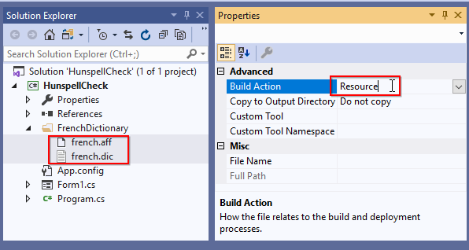
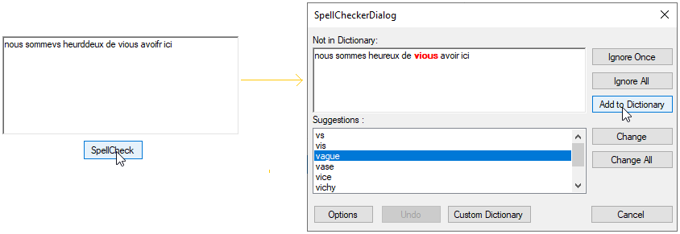
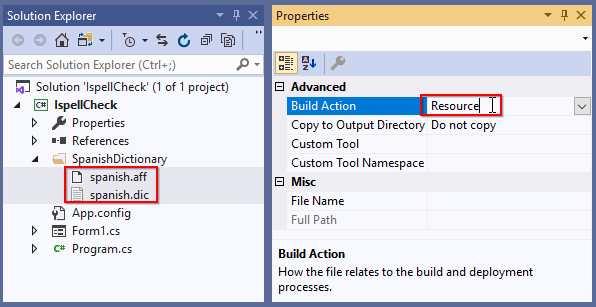
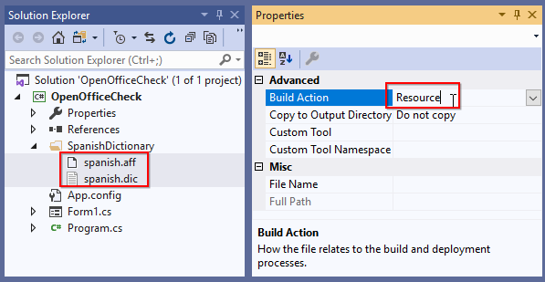
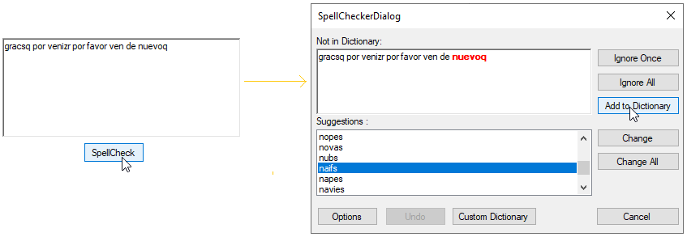
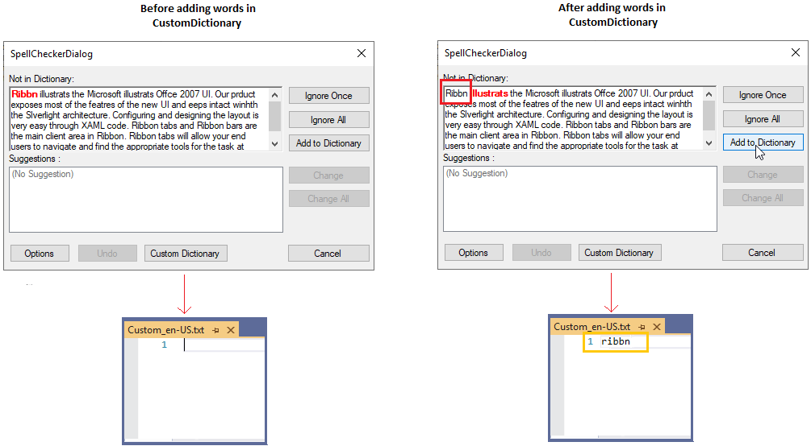

# Custom Dictionary in Windows Forms Spell Checker (SpellCheckerAdv)

You can use a default and custom dictionaries to spell check the document based on your need. You can also spell check for any culture and languages using various dictionaries.

## Default SpellCheck Dictionary

[Spell CheckerAdv](https://help.syncfusion.com/cr/windowsforms/Syncfusion.Windows.Forms.Tools.SpellCheckerAdv.html) provides built-in dictionary for `English` language and it provides  suitable suggestion of the error words.

## Load your own dictionaries for any language

You can add your own dictionary to [Spell CheckerAdv.Dictionaries](https://help.syncfusion.com/cr/windowsforms/Syncfusion.Windows.Forms.Tools.SpellCheckerAdv.html#Syncfusion_Windows_Forms_Tools_SpellCheckerAdv_Dictionaries) collection. `Spell CheckerAdv` support 3 standard dictionary file format:

* Hunspell
* Ispell
* OpenOffice
 
## SpellCheck using Hunspell dictionary

You can check spelling mistakes using `Hunspell` dictionary format. This format contains files as follows,

* Affix file with grammar rules- `*.aff`, 
* Basic Words file - `*.dic` file.

### Adding Hunspell Dictionary

1.Add your [HunspellDictionary](https://help.syncfusion.com/cr/windowsforms/Syncfusion.Windows.Forms.Tools.HunspellDictionary.html)'s required culture `*.aff` and `*.dic` files and add them as `Resource` into the application.

2.Create a `HunspellDictionary` instance and add the basic word & grammar file path to the [HunspellDictionary.DictionaryPath](https://help.syncfusion.com/cr/windowsforms/Syncfusion.Windows.Forms.Tools.HunspellDictionary.html#Syncfusion_Windows_Forms_Tools_HunspellDictionary_DictionaryPath) & [HunspellDictionary.GrammarPath](https://help.syncfusion.com/cr/windowsforms/Syncfusion.Windows.Forms.Tools.HunspellDictionary.html#Syncfusion_Windows_Forms_Tools_HunspellDictionary_GrammarPath) properties and add the culture to the [HunspellDictionary.Culture](https://help.syncfusion.com/cr/windowsforms/Syncfusion.Windows.Forms.Tools.HunspellDictionary.html) property.

3.Add the  `HunspellDictionary` into the [Spell CheckerAdv.Dictionaries](https://help.syncfusion.com/cr/windowsforms/Syncfusion.Windows.Forms.Tools.SpellCheckerAdv.html#Syncfusion_Windows_Forms_Tools_SpellCheckerAdv_Culture) collection

4.Setting the required culture to the `Spell CheckerAdv.Culture` property.

N> The following code snippets shows how to add Hunspell dictionary to the `Spell Checker`. Please refer [Adding SpellCheckerAdv to RichTextBox control](https://help.syncfusion.com/windowsforms/spell-checker/getting-started#configuring-spellcheckeradv-into-richtextbox-control) to know how to configure SpellCheckerAdv.




//Creating a culture instance
CultureInfo culture = new CultureInfo("fr-FR");

SpellCheckerAdv SpellChecker = new SpellCheckerAdv();

// Adding Hunspell dictonaries in Dictionaries collection
SpellChecker.Dictionaries = new DictionaryCollection();

//Add French culture Hunspell dictionary
SpellChecker.Dictionaries.Add(
    new HunspellDictionary()
    {
        Culture = culture,
        GrammarPath = @"FrenchDictionary\french.aff",
        DictionaryPath = @"FrenchDictionary\french.dic"
    }
);

//Setting a French culture for SpellChecker
SpellChecker.Culture = culture;




N> You can add multiple `HunspellDictionary` with various culture files into the `Spell CheckerAdv.Dictionaries` collection. Based on the `Spell CheckerAdv.Culture` respective `HunspellDictionary` is used for spell check.

## SpellCheck using Ispell dictionary

You can check spelling mistakes using `Ispell` dictionary format. This format contains files as follows,

`Ispell` dictionary contains two files as follows,

* Affix file with grammar rules- `*.aff`, 
* Basic Words file - `*.xlg` or `*.dic` file.

### Adding Ispell Dictionary

1.Add your [IspellDictionary](https://help.syncfusion.com/cr/windowsforms/Syncfusion.Windows.Forms.Tools.IspellDictionary.html)'s required culture `*.aff` and `*.dic` files and add them as `Resource` into the application.

2.Create a `IspellDictionary` instance and add the basic word & grammar file path to the [IspellDictionary.DictionaryPath](https://help.syncfusion.com/cr/windowsforms/Syncfusion.Windows.Forms.Tools.IspellDictionary.html#Syncfusion_Windows_Forms_Tools_IspellDictionary_DictionaryPath) & [IspellDictionary.GrammarPath](https://help.syncfusion.com/cr/windowsforms/Syncfusion.Windows.Forms.Tools.IspellDictionary.html#Syncfusion_Windows_Forms_Tools_IspellDictionary_GrammarPath) properties and add the culture to the [IspellDictionary.Culture](https://help.syncfusion.com/cr/windowsforms/Syncfusion.Windows.Forms.Tools.IspellDictionary.html) property.

3.Add the  `IspellDictionary` into the `Spell CheckerAdv.Dictionaries` collection

4.Setting the required culture to the `Spell CheckerAdv.Culture` property.

N> The following code snippets only explain the insertion of the Ispell dictionary to the `Spell Checker`. You can get code snippets to add a `Spell Checker`, from [Adding Spell CheckerAdv to RichTextBox control](https://help.syncfusion.com/windowsforms/spell-checker/getting-started#configuring-spellcheckeradv-into-richtextbox-control) topic.




//Creating a culture instance
CultureInfo culture = new CultureInfo("es-ES");

SpellCheckerAdv SpellChecker = new SpellCheckerAdv();

// Adding Ispell dictonaries in Dictionaries collection
SpellChecker.Dictionaries = new DictionaryCollection();

//Add Spanish culture Ispell dictionary
SpellChecker.Dictionaries.Add(
    new IspellDictionary()
    {
        Culture = culture,
        GrammarPath = @"SpanishDictionary\spanish.aff",
        DictionaryPath = @"SpanishDictionary\spanish.dic"
    }
);

//Setting a Spanish culture for SpellChecker
SpellChecker.Culture = culture;




N> You can add multiple `IspellDictionary` with various culture files into the `Spell CheckerAdv.Dictionaries` collection. Based on the `Spell CheckerAdv.Culture` respective `IspellDictionary` is used for spell check.

## SpellCheck using OpenOffice dictionary

You can check spelling mistakes using `OpenOffice` dictionary format. This format contains files as follows,

`OpenOffice` dictionary contains two files as follows,

* Affix file with grammar rules- `*.aff`, 
* Basic Words file - `*.dic` file.

### Adding OpenOffice Dictionary

1.Add your [OpenOfficeDictionary](https://help.syncfusion.com/cr/windowsforms/Syncfusion.Windows.Forms.Tools.OpenOfficeDictionary.html)'s required culture `*.aff` and `*.dic` files and add them as `Resource` into the application.

2.Create a `OpenOfficeDictionary` instance and add the basic word & grammar file path to the [OpenOfficeDictionary.DictionaryPath](https://help.syncfusion.com/cr/windowsforms/Syncfusion.Windows.Forms.Tools.OpenOfficeDictionary.html) & [OpenOfficeDictionary.GrammarPath](https://help.syncfusion.com/cr/windowsforms/Syncfusion.Windows.Forms.Tools.OpenOfficeDictionary.html) properties and add the culture to the [OpenOfficeDictionary.Culture](https://help.syncfusion.com/cr/windowsforms/Syncfusion.Windows.Forms.Tools.OpenOfficeDictionary.html) property.

3.Add the  `OpenOfficeDictionary` into the `Spell CheckerAdv.Dictionaries` collection

4.Setting the required culture to the `Spell CheckerAdv.Culture` property.

N> The following code snippets only explain the insertion of the OpenOffice dictionary to the `Spell Checker`. You can get code snippets to add a `Spell Checker`, from [Adding Spell CheckerAdv to RichTextBox control](https://help.syncfusion.com/windowsforms/spell-checker/getting-started#configuring-spellcheckeradv-into-richtextbox-control) topic.




//Creating a Spanish culture instance
CultureInfo culture = new CultureInfo("es-ES");

SpellCheckerAdv SpellChecker = new SpellCheckerAdv();

// Adding OpenOffice dictonaries in Dictionaries collection
SpellChecker.Dictionaries = new DictionaryCollection();

//Add Spanish culture OpenOffice dictionary
SpellChecker.Dictionaries.Add(
    new OpenOfficeDictionary()
    {
        Culture = culture,
        GrammarPath = @"SpanishDictionary\spanish.aff",
        DictionaryPath = @"SpanishDictionary\spanish.dic"
    }
);

//Setting a spanish culture for SpellChecker
SpellChecker.Culture = culture;




N> You can add multiple `OpenOfficeDictionary` with various culture files into the `Spell CheckerAdv.Dictionaries` collection. Based on the `Spell CheckerAdv.Culture` respective `OpenOfficeDictionary` is used for spell check.

## Add custom words to dictionary

If you want to add words that is not available in dictionary, you can add it using [CustomDictionary](https://help.syncfusion.com/cr/windowsforms/Syncfusion.Windows.Forms.Tools.CustomDictionary.html). This dictionary does not has a grammar file, it accepts only dictionary file that contains a list of words. Users can also add words to this custom dictionary by clicking `Add to Dictionary` button available in dialog or context menu. 

### Adding Custom Dictionary

1.Create a custom dictionary text file as `Resource` into the application

2.Create a `CustomDictionary` instance and add the custom word file path to the [CustomDictionary.DictionaryPath](https://help.syncfusion.com/cr/windowsforms/Syncfusion.Windows.Forms.Tools.CustomDictionary.html#Syncfusion_Windows_Forms_Tools_CustomDictionary_DictionaryPath) property and add the culture to the [CustomDictionary.Culture](https://help.syncfusion.com/cr/windowsforms/Syncfusion.Windows.Forms.Tools.CustomDictionary.html) property.

3.Add the  `CustomDictionary` into the `Spell CheckerAdv.Dictionaries` collection

4.Setting the required culture to the `Spell CheckerAdv.Culture` property.

N> The following code snippets only explain the insertion of the custom dictionary to the `Spell Checker`. You can get code snippets to add a `Spell Checker`, from [Adding Spell CheckerAdv to RichTextBox control](https://help.syncfusion.com/windowsforms/spell-checker/getting-started#configuring-spellcheckeradv-into-richtextbox-control) topic.




//Creating a culture instance
CultureInfo culture = new CultureInfo("en-US");

SpellCheckerAdv SpellChecker = new SpellCheckerAdv();

//Add Custom dictionary for US culture
SpellChecker.Dictionaries.Add(
    new CustomDictionary()
    {
        Culture = culture,
        DictionaryPath = @"\English\Custom_en-US.txt"
    }
);

//Add US culture OpenOffice dictionary
SpellChecker.Dictionaries.Add(
    new OpenOfficeDictionary()
    {
        Culture = culture,
        GrammarPath = @"USDictionary\en-US.aff",
        DictionaryPath = @"USDictionary\en-US.dic"
    }
);

//Setting a US culture for SpellChecker
SpellChecker.Culture = culture;




N> If you only use the custom dictionary, all words that are not included in the dictionary will be shown as error words.

N> You can add multiple `CustomDictionary` with various culture word files into the `Spell CheckerAdv.Dictionaries` collection. Based on the `Spell CheckerAdv.Culture` respective `CustomDictionary` is used for spell check.

## Switch language(Culture) at runtime

You can add `Hunspell`, `Ispell`, or `OpenOffice` dictionaries one or more times with various culture into the `Spell CheckerAdv.Dictionaries` collection. You can change the spell check culture at runtime by changing the `Spell CheckerAdv.Culture` property. Based on the current `Spell CheckerAdv.Culture` respective dictionary is used to spell check.




//Creating a culture instance
CultureInfo culture = new CultureInfo("fr-FR");

SpellCheckerAdv SpellChecker = new SpellCheckerAdv();

// Adding Hunspell dictonaries in Dictionaries collection
SpellChecker.Dictionaries = new DictionaryCollection();

//Add French culture Hunspell dictionary
SpellChecker.Dictionaries.Add(
    new HunspellDictionary()
    {
        Culture = culture,
        GrammarPath = @"FrenchDictionary\fr-FR.aff",
        DictionaryPath = @"FrenchDictionary\fr-FR.dic"
    }
);

//Add Spanish culture Hunspell dictionary
SpellChecker.Dictionaries.Add(
    new HunspellDictionary()
    {
        Culture = new CultureInfo("es-ES"),
        GrammarPath = @"SpanishDictionary\es-ES.aff",
        DictionaryPath = @"SpanishDictionary\es-ES.dic"
    }
);

//Add US culture Hunspell dictionary
SpellChecker.Dictionaries.Add(
    new HunspellDictionary()
    {
        Culture = new CultureInfo("en-US"),
        GrammarPath =  @"USDictionary\en-US.aff",
        DictionaryPath =  @"USDictionary\/en-US.dic"
    }
);

//Setting a French culture for SpellChecker
SpellChecker.Culture = culture;




Here, `Spell Checker.Culture` is `fr-FR` culture. So, `fr-FR` cultured `Hunspell` dictionary is used as speck check dictionary.

