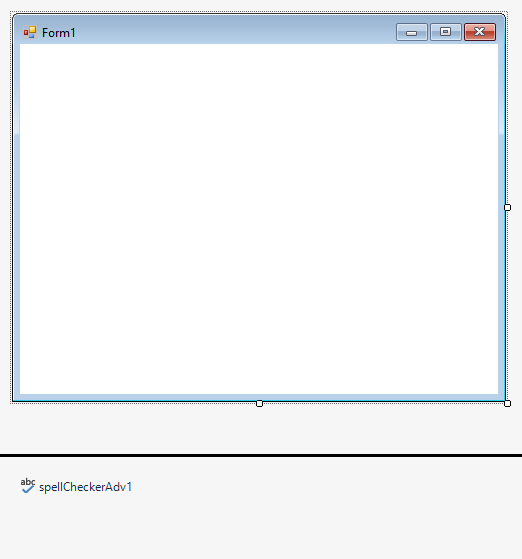

# Getting Started with Windows Forms Spell Checker (SpellCheckerAdv)

This section describes how to add a [SpellCheckerAdv](https://help.syncfusion.com/cr/windowsforms/Syncfusion.Windows.Forms.Tools.SpellCheckerAdv.html) control in a Windows Forms application and overview of its basic functionalities.

## Assembly deployment

Refer [control dependencies](https://help.syncfusion.com/windowsforms/control-dependencies#spellchecker) section to get the list of assemblies or NuGet package needs to be added as reference to use the control in any application.
 
Please find more details regarding how to install the nuget packages in windows form application in the below link:
 
[How to install nuget packages](https://help.syncfusion.com/windowsforms/installation/install-nuget-packages)

## Creating simple application with SpellCheckerAdv

You can create the Windows Forms application with SpellCheckerAdv control as follows:

1. [Creating project](#creating-the-project)
2. [Add control via designer](#add-control-via-designer)
3. [Add control manually using Code](#add-control-manually-using-code)
4. [Configuring SpellCheckerAdv into RichTextBox control](#configuring-spellCheckerAdv-into-RichTextBox-control)
5. [Applying Dictionary](#applying-dictionary)
6. [Applying Custom Dictionary](#applying-custom-dictionary)
7. [Configuring VisualStyle](#configuring-VisualStyle)

### Creating the project

Create a new Windows Forms project in the Visual Studio to display the SpellCheckerAdv with basic information.

## Add control via designer

SpellCheckerAdv control can be added to the application by dragging it from the toolbox and dropping it in a designer view. The following required assembly references will be added automatically:

* Syncfusion.Grid.Base.dll
* Syncfusion.Grid.Windows.dll
* Syncfusion.Shared.Base.dll
* Syncfusion.Shared.Windows.dll
* Syncfusion.SpellChecker.Base.dll
* Syncfusion.Tools.Base.dll
* Syncfusion.Tools.Windows.dll

## Add control manually using Code

To add control manually in C#, follow the given steps:

Step 1. Add the following required assembly references to the project:

        * Syncfusion.Tools.Base.dll
        * Syncfusion.Tools.Windows.dll
        * Syncfusion.Shared.Base.dll
        * Syncfusion.Shared.Windows.dll
        * Syncfusion.SpellChecker.Base.dll
        * Syncfusion.Grid.Base.dll
        * Syncfusion.Grid.Windows.dll

Step 2. Include the namespaces **Syncfusion.Windows.Forms.Tools**.






using Syncfusion.Windows.Forms.Tools;





Imports Syncfusion.Windows.Forms.Tools





{{ codesnippet1 | OrderList_Indent_Level_1 }}

Step 3. Create `SpellCheckerAdv` control instance.






SpellCheckerAdv spellCheckerAdv1 = new SpellCheckerAdv();





Dim spellCheckerAdv1 As SpellCheckerAdv = New SpellCheckerAdv





{{ codesnippet2 | OrderList_Indent_Level_1 }}

## Configuring SpellCheckerAdv into RichTextBox control

Step 1. Create a class implementing [ISpellCheckerAdvEditorTools](https://help.syncfusion.com/cr/windowsforms/Syncfusion.Windows.Forms.Tools.ISpellCheckerAdvEditorTools.html) interface as shown below.






  class TextBoxSpellEditor : ISpellCheckerAdvEditorTools
    {
        /// 

        /// Initializes the TextBoxBase control.
        /// 

        private TextBoxBase textBox;
        /// 

        /// Initializes the new instance of the TextBoxSpellEditor class.
        /// 

        /// <param name="control"></param>
        public TextBoxSpellEditor(Control control)
        {
            Control = control;
        }
        /// 

        /// Gets or sets the Control whose Text is to be spell checked.
        /// 

        public Control Control
        {
            get
            {
                return textBox;
            }
            set
            {
                textBox = value as TextBoxBase;
            }
        }
        /// 

        /// Gets or sets the current misspelled word.
        /// 

        
	public string CurrentWord { get; set; }
		
        /// 

        /// Gets or sets the Text to be spell checked by the <see cref="SpellCheckerAdv"/>
        /// 

        public string Text
        {
            get
            {
                return textBox.Text;
            }
            set
            {
                textBox.Text = value;
            }
        }
        /// 

        /// Gets or sets the Control whose Text is to be spell checked.
        /// 

        public Control ControlToCheck
        {
            get
            {
                return textBox;
            }
            set
            {
                textBox = value as TextBoxBase;
            }
        }
        /// 

        ///  Selects the word specified by the index.
        /// 

        /// <param name="selectionStart">Zero based index of the word on the Text.</param>
        /// <param name="selectionLength">length of the word to be selected.</param>
        public void SelectText(int selectionStart, int selectionLength)
        {
            textBox.Select(selectionStart, selectionLength);
        }
    }





class TextBoxSpellEditor
           Implements ISpellCheckerAdvEditorTools
        ''' 

        ''' Initializes the TextBoxBase control.
        ''' 

        Private textBox As TextBoxBase;
        ''' 

        ''' Initializes the new instance of the TextBoxSpellEditor class.
        ''' 

        ''' <param name="control"></param>
       Public Sub New(control__1 As Control)
		Control = control__1
	End Sub
    ''' 

	''' Gets or sets the Control whose Text is to be spell checked.
	''' 

	Public Property Control() As Control
		Get
			Return textBox
		End Get
		Set
			textBox = TryCast(value, TextBoxBase)
		End Set
	End Property
	''' 

	''' Gets or sets the current misspelled word.
	''' 

	Public Property CurrentWord() As String
		Get
			Return textBox.Text
		End Get
		Set
			textBox.Text = value
		End Set
	End Property
        ''' 

	''' Gets or sets the Control whose Text is to be spell checked.
	''' 

	Public Property ControlToCheck() As Control
		Get
			Return textBox
		End Get
		Set
			textBox = value as TextBoxBase
		End Set
	End Property
	''' 

	''' Gets or sets the Text to be spell checked by the <see cref="SpellCheckerAdv"/>
	''' 

	Public Property Text() As String
		Get
			Return textBox.Text
		End Get
		Set
			textBox.Text = value
		End Set
	End Property
	''' 

	'''  Selects the word specified by the index.
	''' 

	''' <param name="selectionStart">Zero based index of the word on the Text.</param>
	''' <param name="selectionLength">length of the word to be selected.</param>
	Public Sub SelectText(selectionStart As Integer, selectionLength As Integer)
		textBox.[Select](selectionStart, selectionLength)
	End Sub
End Class





{{ codesnippet3 | OrderList_Indent_Level_1 }}

Step 2. Create instances `RichTextBox` (Editor Control to be spell checked) and `Button` and add it to the form.

​




RichTextBox richTextBox1 = new RichTextBox();
Button button1 = new Button();

this.richTextBox1.Text = resources.GetString("richTextBox1.Text");
this.button1.Text="Spell Check";

this.Controls.Add(this.button1);
this.Controls.Add(this.richTextBox1);





Dim richTextBox1 As RichTextBox = New RichTextBox
Dim button1 As Button = New Button

Me.richTextBox1.Text = resources.GetString("richTextBox1.Text")
Me.button1.Text="Spell Check"

Me.Controls.Add(Me.button1)
Me.Controls.Add(Me.richTextBox1)





{{ codesnippet4 | OrderList_Indent_Level_1 }}

Step 3. Create an instance of the `TextBoxSpellEditor` class by having `RichTextBox` as its Control and it to `SpellCheckerAdv` using [PerformSpellCheckForControl](https://help.syncfusion.com/cr/windowsforms/Syncfusion.Windows.Forms.Tools.SpellCheckerAdv.html#Syncfusion_Windows_Forms_Tools_SpellCheckerAdv_PerformSpellCheckForControl_Syncfusion_Windows_Forms_Tools_ISpellCheckerAdvEditorTools_) method.

​




TextBoxSpellEditor TextEditor = new TextBoxSpellEditor(this.richTextBox1);

this.spellCheckerAdv1.PerformSpellCheckForControl(TextEditor);





Dim TextEditor As New TextBoxSpellEditor(Me.richTextBox1)

Me.spellCheckerAdv1.PerformSpellCheckForControl(TextEditor)





{{ codesnippet5 | OrderList_Indent_Level_1 }}

Step 4. Finally trigger `SpellCheckerAdv` through an event such as `Click` of the button as given below.

​




private void buttonAdv1_Click(object sender, EventArgs e)
{
  this.spellCheckerAdv1.SpellCheck(new SpellCheckerAdvEditorWrapper(this.richTextBox1));
}





Private Sub buttonAdv1_Click(sender As Object, e As EventArgs)
	Me.spellCheckerAdv1.SpellCheck(New SpellCheckerAdvEditorWrapper(Me.richTextBox1))
End Sub





{{ codesnippet6 | OrderList_Indent_Level_1 }}

## Applying dictionary

SpellCheckerAdv provide built-in dictionary whose Path can be set using [DictionaryPath](https://help.syncfusion.com/cr/windowsforms/Syncfusion.Windows.Forms.Tools.SpellCheckerAdv.html#Syncfusion_Windows_Forms_Tools_SpellCheckerAdv_DictionaryPath) property in SpellCheckerAdv.





this.spellCheckerAdv1.DictionaryPath = "Syncfusion_en_us.dic";





Me.spellCheckerAdv1.DictionaryPath = "Syncfusion_en_us.dic"





## SpellCheck for any language(culture) 

You can spell check any language(culture) by adding the respective culture to the [SpellCheckerAdv.Culture](https://help.syncfusion.com/cr/windowsforms/Syncfusion.Windows.Forms.Tools.SpellCheckerAdv.html#Syncfusion_Windows_Forms_Tools_SpellCheckerAdv_Culture) property and add the dictionaries which contains the basic word file and grammar file to the [SpellCheckerAdv.Dictionaries](https://help.syncfusion.com/cr/windowsforms/Syncfusion.Windows.Forms.Tools.SpellCheckerAdv.html#Syncfusion_Windows_Forms_Tools_SpellCheckerAdv_Dictionaries) collection.

The following dictionary types are used for spell-checking,

 * Hunspell
 * Ispell
 * OpenOffice

 N> Refer the [Load your own dictionaries for any language]
(https://help.syncfusion.com/windowsforms/spell-checker/custom-dictionary#load-your-own-dictionaries-for-any-language) page to know more about how to add and use the Dictionary for any culture to an application.

## Add custom words to dictionary

If you want to add words that is not available in existing dictionary, you can add it using `CustomDictionary`. This dictionary does not has a grammar file, it accepts only dictionary file that contains a list of words. Users can also add words to this custom dictionary by clicking `Add to Dictionary` button available in dialog or context menu.

N> Refer the [Adding Custom Dictionary](https://help.syncfusion.com/wpf/spellchecker/custom-dictionary-support#adding-custom-dictionary) page to know more about how to add and use the custom dictionary to an application.

## Configuring VisualStyle

Look and feel of the SpellCheckerAdv can be customize using [VisualStyle](https://help.syncfusion.com/cr/windowsforms/Syncfusion.Windows.Forms.Tools.SpellCheckerAdv.html#Syncfusion_Windows_Forms_Tools_SpellCheckerAdv_VisualStyle) property.





this.spellCheckerAdv1.VisualStyle = SpellCheckerAdvStyle.Office2016Colorful;





Me.spellCheckerAdv1.VisualStyle = SpellCheckerAdvStyle.Office2016Colorful





