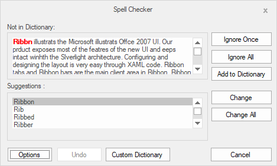

# Overview

SpellCheckerAdv control offers Microsoft Office style spell checking capabilities to your Windows Application. This component is completely customizable and can be attached to any text-editing controls. End users can also use it together with the standard Microsoft text-editing controls.

## Features

* **Ignore and Replace** - Provides options to Ignore and replace words one by one as well as all words at once.

* **Dictionary Settings** - Provides built-in dictionary for English Language and also helps to configure based on your own language, using its Custom Dictionary option. 

* **Ignores Special expressions** - Provides options to Ignore Email, URL, numbers, Mixed case words and much more.

* **VisualStyle** - Provide rich set of VisualStyle to customize the look and feel of SpellCheckerAdv.
 

