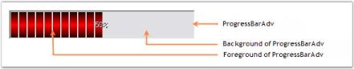
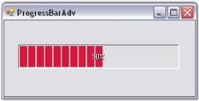

# Getting Started with Windows Forms SplashPanel

* [Assembly deployment](#assembly-deployment)
* [Adding SplashPanel through the designer](#adding-splashpanel-through-the-designer)
* [Adding SplashPanel through code](#adding-splashpanel-through-code)

## Assembly deployment

Refer to the [control dependencies](https://help.syncfusion.com/windowsforms/control-dependencies#splashpanel) section to get the list of assemblies or NuGet packages that need to be added as references to use the control in any application.

You can find more details about installing the NuGet packages in a Windows Forms application at the following link:

[How to install NuGet packages](https://help.syncfusion.com/windowsforms/installation/install-nuget-packages)

To install via the NuGet Package Manager Console, run:

```powershell
Install-Package Syncfusion.Tools.Windows
```

## Adding SplashPanel through the designer

The `SplashPanel` control provides full support for the Windows Forms designer. Dragging the control from the toolbox onto the form automatically adds the following required assembly references to the project:

* Syncfusion.Grid.Base.dll
* Syncfusion.Grid.Windows.dll
* Syncfusion.Shared.Base.dll
* Syncfusion.Shared.Windows.dll
* Syncfusion.Tools.Base.dll
* Syncfusion.Tools.Windows.dll

1. Drag and drop the `SplashPanel` control from the toolbox onto the form.

    

2. Set the properties for the `SplashPanel` control and, optionally, drag and drop any child controls you want to add to the panel. Set the `TimerInterval` property (in milliseconds) to specify the period of time the `SplashPanel` needs to be visible.
3. Specify the startup location of the `SplashPanel` using the `DesktopAlignment` property.
4. Launch the `SplashPanel` by calling the `ShowSplash()` method from a handler such as the form's `Load` event or the click event of a button on the form.
5. Cancel the `SplashPanel` by calling `splashPanel1.HideSplash()`, for example from a button click or the form's `Closing` event.

    

## Adding SplashPanel through code

To create a `SplashPanel` programmatically with controls in it, follow the steps below.

1. Create a new Visual C# or VB.NET application in Visual Studio.
2. Add the following required assembly references to the project:

    * Syncfusion.Grid.Base.dll
    * Syncfusion.Grid.Windows.dll
    * Syncfusion.Shared.Base.dll
    * Syncfusion.Shared.Windows.dll
    * Syncfusion.Tools.Base.dll
    * Syncfusion.Tools.Windows.dll

3. Add the namespaces shown below to your form.





using Syncfusion.Windows.Forms.Tools;
using Syncfusion.Drawing;
using System.Reflection;




Imports Syncfusion.Windows.Forms.Tools
Imports Syncfusion.Drawing
Imports System.Reflection




{{ codesnippet1 | OrderList_Indent_Level_1 }}

4. Declare the `SplashPanel` and `Button` controls.





private Syncfusion.Windows.Forms.Tools.SplashPanel splashPanel1;
private System.Windows.Forms.Button button1;




Friend WithEvents splashPanel1 As Syncfusion.Windows.Forms.Tools.SplashPanel
Friend WithEvents button1 As System.Windows.Forms.Button




{{ codesnippet2 | OrderList_Indent_Level_1 }}

5. Initialize the controls.





this.splashPanel1 = new Syncfusion.Windows.Forms.Tools.SplashPanel();
this.button1 = new System.Windows.Forms.Button();
this.splashPanel1.SuspendLayout();
((System.ComponentModel.ISupportInitialize)(this.splashPanel1)).BeginInit();
this.SuspendLayout();




Me.splashPanel1 = New Syncfusion.Windows.Forms.Tools.SplashPanel
Me.button1 = New System.Windows.Forms.Button
Me.splashPanel1.SuspendLayout()
CType(Me.splashPanel1, System.ComponentModel.ISupportInitialize).BeginInit()
Me.SuspendLayout()




{{ codesnippet3 | OrderList_Indent_Level_1 }}

6. Set the properties for the `SplashPanel` and `Button` controls.





// Set the properties for SplashPanel.
this.splashPanel1.AnimationSpeed = 10;
this.splashPanel1.BackgroundColor = new Syncfusion.Drawing.BrushInfo(Syncfusion.Drawing.GradientStyle.Vertical, System.Drawing.SystemColors.Highlight, System.Drawing.SystemColors.HighlightText);
this.splashPanel1.Controls.Add(this.button1);
this.splashPanel1.DesktopAlignment = Syncfusion.Windows.Forms.Tools.SplashAlignment.Center;
this.splashPanel1.DiscreetLocation = new System.Drawing.Point(0, 0);
this.splashPanel1.Font = new System.Drawing.Font("Comic Sans MS", 9.75F, System.Drawing.FontStyle.Bold, System.Drawing.GraphicsUnit.Point, ((byte)(0)));
this.splashPanel1.ForeColor = System.Drawing.Color.Pink;
this.splashPanel1.Location = new System.Drawing.Point(16, 16);
this.splashPanel1.Name = "splashPanel1";
this.splashPanel1.ShowAnimation = true;
this.splashPanel1.SuspendAutoCloseWhenMouseOver = false;
this.splashPanel1.TabIndex = 0;
this.splashPanel1.TimerInterval = 5000;

// Set the properties for Button control.
this.button1.BackColor = System.Drawing.Color.DimGray;
this.button1.Location = new System.Drawing.Point(56, 40);
this.button1.Name = "button1";
this.button1.Size = new System.Drawing.Size(96, 23);
this.button1.TabIndex = 0;
this.button1.Text = "SplashPanel";

// Add the SplashPanel to the Form.
this.Controls.Add(this.splashPanel1);





' Set the properties for SplashPanel.
Me.splashPanel1.AnimationSpeed = 10
Me.splashPanel1.BackgroundColor = New Syncfusion.Drawing.BrushInfo(Syncfusion.Drawing.GradientStyle.Vertical, System.Drawing.SystemColors.Highlight, System.Drawing.SystemColors.HighlightText)
Me.splashPanel1.Controls.Add(Me.button1)
Me.splashPanel1.DesktopAlignment = Syncfusion.Windows.Forms.Tools.SplashAlignment.Center
Me.splashPanel1.DiscreetLocation = New System.Drawing.Point(0, 0)
Me.splashPanel1.Font = New System.Drawing.Font("Comic Sans MS", 9.75F, System.Drawing.FontStyle.Bold, System.Drawing.GraphicsUnit.Point, (CByte(0)))
Me.splashPanel1.ForeColor = System.Drawing.Color.Pink
Me.splashPanel1.Location = New System.Drawing.Point(16, 16)
Me.splashPanel1.Name = "splashPanel1"
Me.splashPanel1.ShowAnimation = True
Me.splashPanel1.SuspendAutoCloseWhenMouseOver = False
Me.splashPanel1.TabIndex = 0
Me.splashPanel1.TimerInterval = 5000

' Set the properties for Button control.
Me.button1.BackColor = System.Drawing.Color.DimGray
Me.button1.Location = New System.Drawing.Point(56, 40)
Me.button1.Name = "button1"
Me.button1.Size = New System.Drawing.Size(96, 23)
Me.button1.TabIndex = 0
Me.button1.Text = "SplashPanel"

' Add the SplashPanel to the Form.
Me.Controls.Add(Me.splashPanel1)




{{ codesnippet4 | OrderList_Indent_Level_1 }}

7. Call and define the `ShowSplash()` method.





this.ShowSplash(false);




Me.ShowSplash(False)




{{ codesnippet5_call | OrderList_Indent_Level_1 }}





private void ShowSplash(bool isModal)
{
    Point pt = Point.Empty;
    SplashPanel currentPanel = this.splashPanel1;
    int interval = 5000;
    currentPanel.TimerInterval = interval;

    if (currentPanel.DesktopAlignment == SplashAlignment.Custom)
    {
        pt = Control.MousePosition;
    }
    currentPanel.ShowSplash(pt, this, isModal);
}




Private Sub ShowSplash(ByVal isModal As Boolean)
    Dim pt As Point = Point.Empty
    Dim currentPanel As SplashPanel = Me.splashPanel1
    Dim interval As Integer = 5000
    currentPanel.TimerInterval = interval

    If currentPanel.DesktopAlignment = SplashAlignment.Custom Then
        pt = Control.MousePosition
    End If
    currentPanel.ShowSplash(pt, Me, isModal)
End Sub




{{ codesnippet5_def | OrderList_Indent_Level_1 }}

8. Finally, resume the layout that was suspended in Step 5:





((System.ComponentModel.ISupportInitialize)(this.splashPanel1)).EndInit();
this.splashPanel1.ResumeLayout(false);
this.ResumeLayout(false);




CType(Me.splashPanel1, System.ComponentModel.ISupportInitialize).EndInit()
Me.splashPanel1.ResumeLayout(False)
Me.ResumeLayout(False)




{{ codesnippet6 | OrderList_Indent_Level_1 }}

9. Run the application.

    
