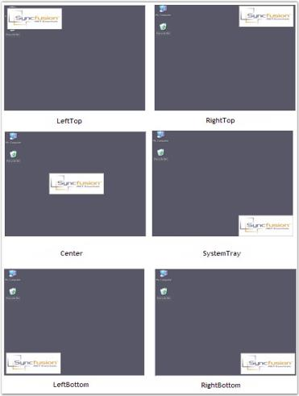

# Alignment Settings in Windows Forms Splash Screen

This section discusses the alignment settings available in Splash Screen.

Splash Screen provides options to customize the alignment of the splash image in the desktop. The property that is related to this feature is given below.

Property Table

<table>
<tr>
<th>
SplashControl Property</th><th>
Description</th></tr>
<tr>
<td>
DesktopAlignment</td><td>
Specifies the desktop alignment of the splash image. It includes the following options.SystemTray,Center,LeftTop,LeftBottom,RightTop,RightBottom andCustom.</td></tr>
</table>

This can be done through code using the code snippet below.




this.splashControl1.DesktopAlignment = Syncfusion.Windows.Forms.Tools.SplashAlignment.SystemTray;





Me.SplashControl1.DesktopAlignment = Syncfusion.Windows.Forms.Tools.SplashAlignment.SystemTray




 

