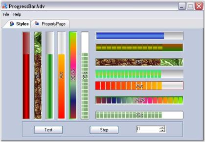
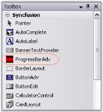
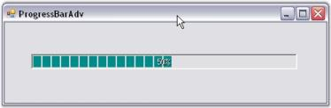

# Getting Started with Windows Forms Splash Screen (Splash)

* [Assembly deployment](#assembly-deployment)
* [Adding SplashControl through the designer](#adding-splashcontrol-through-the-designer)
* [Adding SplashControl through code](#adding-splashcontrol-through-code)

This section explains how to add the `SplashControl` to a Windows Forms application and provides an overview of its basic functionalities.

## Assembly deployment

Refer to the [control dependencies](https://help.syncfusion.com/windowsforms/control-dependencies#splashcontrol) section to get the list of assemblies or NuGet packages that need to be added as references to use the control in any application.

You can find more details about installing the NuGet packages in a Windows Forms application at the following link:

[How to install NuGet packages](https://help.syncfusion.com/windowsforms/installation/install-nuget-packages)

To install via the NuGet Package Manager Console, run:

```powershell
Install-Package Syncfusion.Tools.Windows
```

## Adding SplashControl through the designer

The `SplashControl` control provides full support for the Windows Forms designer. Dragging the control from the toolbox onto the form automatically adds the following required assembly references to the project:

* Syncfusion.Grid.Base.dll
* Syncfusion.Grid.Windows.dll
* Syncfusion.Shared.Base.dll
* Syncfusion.Shared.Windows.dll
* Syncfusion.Tools.Base.dll
* Syncfusion.Tools.Windows.dll

1. Drag and drop the `SplashControl` from the toolbox onto the form. The `SplashControl` will be created in the components area of the form.

    

2. Set the `SplashImage` and `TimerInterval` properties through the property grid.
3. Set the `AutoMode` property. This property controls how the `SplashControl` is invoked. When `AutoMode` is set to `true`, the `SplashControl` automatically launches itself during the parent form's `Load` event. When `AutoMode` is set to `false`, the splash screen must be invoked explicitly by calling the `ShowSplash()` method.
4. Preview the splash at design time using the **Preview Splash** option on the smart tag.

    

5. Run the application to display the splash screen.

    

6. Handle the `SplashClosed` event to run code after the splash screen closes.
7. Dismiss the splash while it is displaying by calling the `HideSplash()` method.

## Adding SplashControl through code

To create a `SplashControl` programmatically, follow the steps below.

1. Create a new Visual C# or VB.NET application in Visual Studio.
2. Add the following required assembly references to the project:

    * Syncfusion.Grid.Base.dll
    * Syncfusion.Grid.Windows.dll
    * Syncfusion.Shared.Base.dll
    * Syncfusion.Shared.Windows.dll
    * Syncfusion.Tools.Base.dll
    * Syncfusion.Tools.Windows.dll

3. Add the namespace shown below to your form.





using Syncfusion.Windows.Forms.Tools;




Imports Syncfusion.Windows.Forms.Tools




{{ codesnippet1 | OrderList_Indent_Level_1 }}

4. Declare the `SplashControl`.

​



private Syncfusion.Windows.Forms.Tools.SplashControl splashControl1;





Friend WithEvents SplashControl1 As Syncfusion.Windows.Forms.Tools.SplashControl




{{ codesnippet2 | OrderList_Indent_Level_1 }}

5. Initialize the control.

​



this.splashControl1 = new Syncfusion.Windows.Forms.Tools.SplashControl();
this.SuspendLayout();





Me.SplashControl1 = New Syncfusion.Windows.Forms.Tools.SplashControl()
Me.SuspendLayout()




{{ codesnippet3 | OrderList_Indent_Level_1 }}

6. Set the properties for the `SplashControl`.





this.splashControl1.CustomSplashPanel = null;
this.splashControl1.HostForm = this;
this.splashControl1.HostFormWindowState = System.Windows.Forms.FormWindowState.Normal;
this.splashControl1.TimerInterval = 3000;





Me.SplashControl1.CustomSplashPanel = Nothing
Me.SplashControl1.HostForm = Me
Me.SplashControl1.HostFormWindowState = System.Windows.Forms.FormWindowState.Normal
Me.SplashControl1.TimerInterval = 3000




{{ codesnippet4 | OrderList_Indent_Level_1 }}

7. Run the application to display the splash screen.

     
