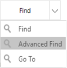
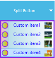

# Appearance Customization in Windows Forms Split Button

## Visual style

[SplitButton](https://help.syncfusion.com/cr/windowsforms/Syncfusion.Tools.Windows~Syncfusion.Windows.Forms.Tools.SplitButton.html) supports visual style such as Office2016White, Office2016Black, Office2016DarkGray, Office2016Colorful, Default and Metro

This style can be set using Style property




this.splitButton1.Style = Syncfusion.Windows.Forms.Tools.SplitButtonVisualStyle.Office2016Colorful;





Me.splitButton1.Style = Syncfusion.Windows.Forms.Tools.SplitButtonVisualStyle.Office2016Colorful




## Customization of SplitButton

You can customize appearance of the [SplitButton](https://help.syncfusion.com/cr/windowsforms/Syncfusion.Tools.Windows~Syncfusion.Windows.Forms.Tools.SplitButton.html) using the [ISplitButtonRenderer](https://help.syncfusion.com/cr/windowsforms/Syncfusion.Tools.Windows~Syncfusion.Windows.Forms.Tools.ISplitButtonRenderer.html). This interface provides few methods to controlling painting borders, arrow and so on. To customize the appearance, create new custom renderer class and implement each of the members declared in [ISplitButtonRenderer](https://help.syncfusion.com/cr/windowsforms/Syncfusion.Tools.Windows~Syncfusion.Windows.Forms.Tools.ISplitButtonRenderer.html). And assign instance of your custom renderer to the Renderer property of [SplitButton](https://help.syncfusion.com/cr/windowsforms/Syncfusion.Tools.Windows~Syncfusion.Windows.Forms.Tools.SplitButton.html). By default, [SplitButton](https://help.syncfusion.com/cr/windowsforms/Syncfusion.Tools.Windows~Syncfusion.Windows.Forms.Tools.SplitButton.html) will be painted using its default renderer.

The following code illustrates how to implement the [ISplitButtonRenderer](https://help.syncfusion.com/cr/windowsforms/Syncfusion.Tools.Windows~Syncfusion.Windows.Forms.Tools.ISplitButtonRenderer.html) interface:




public class CustomRenderer : ISplitButtonRenderer
{
    private SplitButton splitButton;

    #region ISplitButtonRenderer Members
    public SplitButton SplitButton
    {
        get
        {
            return splitButton;
        }
        set
        {
            splitButton = value;
        }
    }

    public void DrawArrow(int left, int top, int width, int height, PaintEventArgs e, Color ArrowColor)
    {
        //Customize the arrow of the dropdown
        Image arrowImage = Image.FromFile(@"../../arrow4.png");
        Rectangle imageRect = new Rectangle(left + 4, top + 14, width - 9, height - 28);
        e.Graphics.DrawImage(arrowImage, imageRect);
    }

    public void DrawBorder(PaintEventArgs e, int width, int height, int splitwidth, Color outerColor, Color innerColor, Color arrowOuter, Color arrowInner, Color buttonInner)
    {
        //Customize the border color and BackColor of the SplitButton 
        Form1 frm = new Form1();
        Color color1 = frm.startcolor;
        Color color2 = frm.endcolor;
        Brush linearGradientBrush = new LinearGradientBrush(
        new Rectangle(0, 0, width, height), color1, color2, 90);
        e.Graphics.FillRectangle(linearGradientBrush, new Rectangle(0, 0, width, height));
        linearGradientBrush.Dispose();
        Pen outercolor = new Pen(Color.DarkGreen);
        Pen innercolor = new Pen(Color.LightGreen);
        Pen arrowinner = new Pen(Color.LightGreen);
        Pen arrowouter = new Pen(arrowOuter);
        Pen buttoninner = new Pen(buttonInner);
        e.Graphics.DrawLine(innercolor, new Point(1, 1), new Point(width - 2, 1));
        e.Graphics.DrawLine(innercolor, new Point(width - 2, 1), new Point(width - 2, height - 2));
        e.Graphics.DrawLine(innercolor, new Point(1, height - 2), new Point(width - 2, height - 2));
        e.Graphics.DrawLine(innercolor, new Point(1, 1), new Point(1, height - 2));
        e.Graphics.DrawLine(arrowouter, new Point(width - splitwidth, 0), new Point(width - splitwidth, height - 1));
        e.Graphics.DrawLine(buttoninner, new Point(width - splitwidth - 1, 2), new Point(width - splitwidth - 1, height - 3));
        e.Graphics.DrawRectangle(arrowinner, width - splitwidth + 1, 1, splitwidth - 3, height - 3);
        e.Graphics.DrawLine(outercolor, new Point(1, 0), new Point(width - 2, 0));
        e.Graphics.DrawLine(outercolor, new Point(width - 2, 0), new Point(width - 2, 1));
        e.Graphics.DrawLine(outercolor, new Point(width - 1, 1), new Point(width - 1, height - 2));
        e.Graphics.DrawLine(outercolor, new Point(width - 2, height - 2), new Point(width - 2, height - 1));
        e.Graphics.DrawLine(outercolor, new Point(1, height - 1), new Point(width - 2, height - 1));
        e.Graphics.DrawLine(outercolor, new Point(1, height - 1), new Point(1, height - 2));
        e.Graphics.DrawLine(outercolor, new Point(0, 1), new Point(0, height - 2));
        e.Graphics.DrawLine(outercolor, new Point(1, 0), new Point(1, 1));
        buttoninner.Dispose();
        innercolor.Dispose();
        arrowinner.Dispose();
        arrowinner.Dispose();
        outercolor.Dispose();
    }

    public void DrawText(PaintEventArgs e, string text, Font font, Color color, int totalwidth, int totalheight, int splitwidth)
    {
        SolidBrush brush = new SolidBrush(color);
        StringFormat format = new StringFormat();
        format.Trimming = StringTrimming.EllipsisCharacter;
        format.LineAlignment = StringAlignment.Center;
        format.Alignment = StringAlignment.Center;
        Rectangle textArea = new Rectangle(7, 1, totalwidth - splitwidth, totalheight);
        e.Graphics.DrawString(text, font, brush, textArea, format);
        Rectangle imageRect = new Rectangle(4, 11, 15, totalheight - 24);
        Image img = Image.FromFile(@"../../logo_16.ico");
        e.Graphics.DrawImage(img, imageRect);
        brush.Dispose();
    }
    #endregion
}





Public Class CustomRenderer
    Implements ISplitButtonRenderer
    Private splitButton_Renamed As SplitButton

#Region "ISplitButtonRenderer Members"
    Private Sub ISplitButtonRenderer_DrawText(e As PaintEventArgs, text As String, font As Font, color As Color, totalwidth As Integer, totalheight As Integer, splitwidth As Integer) Implements ISplitButtonRenderer.DrawText
        Dim brush As New SolidBrush(color)
        Dim format As New StringFormat()
        format.Trimming = StringTrimming.EllipsisCharacter
        format.LineAlignment = StringAlignment.Center
        format.Alignment = StringAlignment.Center
        Dim textArea As New Rectangle(7, 1, totalwidth - splitwidth, totalheight)
        e.Graphics.DrawString(text, font, brush, textArea, format)
        Dim imageRect As New Rectangle(4, 11, 15, totalheight - 24)
        Dim img As Image = Image.FromFile("../../logo_16.ico")
        e.Graphics.DrawImage(img, imageRect)
        brush.Dispose()
    End Sub

    Private Sub ISplitButtonRenderer_DrawBorder(e As PaintEventArgs, width As Integer, height As Integer, splitwidth As Integer, outerColor As Color, innerColor As Color, arrowOuter As Color, arrowInner As Color, buttonInner As Color) Implements ISplitButtonRenderer.DrawBorder
        ' Customize the Border Color And BackColor of the SplitButton 
        Dim frm As New Form1()
        Dim color1 As Color = frm.startcolor
        Dim color2 As Color = frm.endcolor
        Dim linearGradientBrush As Brush = New LinearGradientBrush(New Rectangle(0, 0, width, height), color1, color2, 90)
        e.Graphics.FillRectangle(linearGradientBrush, New Rectangle(0, 0, width, height))
        linearGradientBrush.Dispose()
        Dim outercolor_Renamed As New Pen(Color.DarkGreen)
        Dim innercolor_Renamed As New Pen(Color.LightGreen)
        Dim arrowinner_Renamed As New Pen(Color.LightGreen)
        Dim arrowouter_Renamed As New Pen(arrowOuter)
        Dim buttoninner_Renamed As New Pen(buttonInner)
        e.Graphics.DrawLine(innercolor_Renamed, New Point(1, 1), New Point(width - 2, 1))
        e.Graphics.DrawLine(innercolor_Renamed, New Point(width - 2, 1), New Point(width - 2, height - 2))
        e.Graphics.DrawLine(innercolor_Renamed, New Point(1, height - 2), New Point(width - 2, height - 2))
        e.Graphics.DrawLine(innercolor_Renamed, New Point(1, 1), New Point(1, height - 2))
        e.Graphics.DrawLine(arrowouter_Renamed, New Point(width - splitwidth, 0), New Point(width - splitwidth, height - 1))
        e.Graphics.DrawLine(buttoninner_Renamed, New Point(width - splitwidth - 1, 2), New Point(width - splitwidth - 1, height - 3))
        e.Graphics.DrawRectangle(arrowinner_Renamed, width - splitwidth + 1, 1, splitwidth - 3, height - 3)
        e.Graphics.DrawLine(outercolor_Renamed, New Point(1, 0), New Point(width - 2, 0))
        e.Graphics.DrawLine(outercolor_Renamed, New Point(width - 2, 0), New Point(width - 2, 1))
        e.Graphics.DrawLine(outercolor_Renamed, New Point(width - 1, 1), New Point(width - 1, height - 2))
        e.Graphics.DrawLine(outercolor_Renamed, New Point(width - 2, height - 2), New Point(width - 2, height - 1))
        e.Graphics.DrawLine(outercolor_Renamed, New Point(1, height - 1), New Point(width - 2, height - 1))
        e.Graphics.DrawLine(outercolor_Renamed, New Point(1, height - 1), New Point(1, height - 2))
        e.Graphics.DrawLine(outercolor_Renamed, New Point(0, 1), New Point(0, height - 2))
        e.Graphics.DrawLine(outercolor_Renamed, New Point(1, 0), New Point(1, 1))
        buttoninner_Renamed.Dispose()
        innercolor_Renamed.Dispose()
        arrowinner_Renamed.Dispose()
        arrowinner_Renamed.Dispose()
        outercolor_Renamed.Dispose()
    End Sub

    Private Sub ISplitButtonRenderer_DrawArrow(left As Integer, top As Integer, width As Integer, height As Integer, e As PaintEventArgs, ArrowColor As Color) Implements ISplitButtonRenderer.DrawArrow
        'Customize the arrow of the dropdown
        Dim arrowImage As Image = Image.FromFile("../../arrow4.png")
        Dim imageRect As New Rectangle(left + 4, top + 14, width - 9, height - 28)
        e.Graphics.DrawImage(arrowImage, imageRect)
    End Sub

    Private Property ISplitButtonRenderer_SplitButton As SplitButton Implements ISplitButtonRenderer.SplitButton
        Get
            Return splitButton_Renamed
        End Get
        Set(value As SplitButton)
            splitButton_Renamed = value
        End Set
    End Property
#End Region
End Class




## Customization of SplitButton DropDownItems

You can customize the appearance of the [SplitButton](https://help.syncfusion.com/cr/windowsforms/Syncfusion.Tools.Windows~Syncfusion.Windows.Forms.Tools.SplitButton.html) [DropDownItems](https://help.syncfusion.com/cr/windowsforms/Syncfusion.Tools.Windows~Syncfusion.Windows.Forms.Tools.SplitButton~DropDownItems.html) by using the [DropDownRenderer](https://help.syncfusion.com/cr/windowsforms/Syncfusion.Tools.Windows~Syncfusion.Windows.Forms.Tools.SplitButton~DropDownRenderer.html). By using this property, you can customize the appearance of the [DropDownItems](https://help.syncfusion.com/cr/windowsforms/Syncfusion.Tools.Windows~Syncfusion.Windows.Forms.Tools.SplitButton~DropDownItems.html).

The following code illustrates how to implement the `ToolStripProfessionalRenderer` interface:




//To assign custom renderer to DropDownRenderer of the SplitButton.
this.splitButton1.DropDownRenderer = new CustomRender();

public class CustomRender : ToolStripProfessionalRenderer
{
    Rectangle ItemBound = new Rectangle(0, 0, 1, 1);
    Rectangle selectedItemBound = new Rectangle(0, 0, 1, 1);

    //To draw the dropdown of the item
    protected override void OnRenderItemText(ToolStripItemTextRenderEventArgs e)
    {
        e.Item.ForeColor = Color.Blue;
        base.OnRenderItemText(e);
    }

    //To customize the appearance of the Image Margin for DropDown
    protected override void OnRenderImageMargin(ToolStripRenderEventArgs e)
    {
        base.OnRenderImageMargin(e);
        var LinearBrush = new LinearGradientBrush(e.AffectedBounds, Color.LightPink, Color.LightBlue, 0.0);
        e.Graphics.FillRectangle(LinearBrush, e.AffectedBounds);
    }

    //To customize the dropdown item image
    protected override void OnRenderItemImage(ToolStripItemImageRenderEventArgs e)
    {
        e.Graphics.SmoothingMode = SmoothingMode.AntiAlias;
        var LinearBrush = new LinearGradientBrush(e.ImageRectangle, Color.LightGreen, Color.Orange, 0.0);
        e.Graphics.FillEllipse(LinearBrush, e.ImageRectangle);
        e.Graphics.DrawEllipse(new Pen(Brushes.BlueViolet, 2), e.ImageRectangle);
        e.Graphics.DrawImage(e.Image, 122, e.ImageRectangle.Y, 20, 20);
    }

    //To customize the background of the Dropdown.
    protected override void OnRenderToolStripBackground(ToolStripRenderEventArgs e)
    {
        base.OnRenderToolStripBackground(e);
        ItemBound = e.AffectedBounds;
        LinearGradientBrush LinearBrush = new LinearGradientBrush(ItemBound, Color.LightBlue, Color.White, 0.0);
        e.Graphics.FillRectangle(LinearBrush, ItemBound);
        this.RoundedEdges = true;
    }

    //To draw the border of the DropDown
    protected override void OnRenderToolStripBorder(ToolStripRenderEventArgs e)
    {
        base.OnRenderToolStripBorder(e);
        e.Graphics.DrawRectangle(new Pen(Brushes.BlueViolet, 6f), 0, 0, e.AffectedBounds.Width, e.AffectedBounds.Height);
    }
}





'To assign custom renderer to DropDownRenderer of the SplitButton.
Me.splitButton1.DropDownRenderer = New CustomRender()
Public Class CustomRender
    Inherits ToolStripProfessionalRenderer
    Private ItemBound As New Rectangle(0, 0, 1, 1)
    Private selectedItemBound As New Rectangle(0, 0, 1, 1)

    'To draw the dropdown of the item
    Protected Overrides Sub OnRenderItemText(ByVal e As ToolStripItemTextRenderEventArgs)
        e.Item.ForeColor = Color.Blue
        MyBase.OnRenderItemText(e)
    End Sub

    'To customize the appearance of the Image Margin for DropDown
    Protected Overrides Sub OnRenderImageMargin(ByVal e As ToolStripRenderEventArgs)
        MyBase.OnRenderImageMargin(e)
        Dim LinearBrush As LinearGradientBrush = New LinearGradientBrush(e.AffectedBounds, Color.LightPink, Color.LightBlue, 0)
        e.Graphics.FillRectangle(LinearBrush, e.AffectedBounds)
    End Sub

    'To customize the dropdown item image
    Protected Overrides Sub OnRenderItemImage(ByVal e As ToolStripItemImageRenderEventArgs)
        e.Graphics.SmoothingMode = SmoothingMode.AntiAlias
        Dim LinearBrush As LinearGradientBrush = New LinearGradientBrush(e.ImageRectangle, Color.LightGreen, Color.Orange, 0)
        e.Graphics.FillEllipse(LinearBrush, e.ImageRectangle)
        e.Graphics.DrawEllipse(New Pen(Brushes.BlueViolet, 2), e.ImageRectangle)
        e.Graphics.DrawImage(e.Image, 122, e.ImageRectangle.Y, 20, 20)
    End Sub

    'To customize the background of the Dropdown.
    Protected Overrides Sub OnRenderToolStripBackground(ByVal e As ToolStripRenderEventArgs)
        MyBase.OnRenderToolStripBackground(e)
        ItemBound = e.AffectedBounds
        Dim LinearBrush As LinearGradientBrush = New LinearGradientBrush(ItemBound, Color.LightBlue, Color.White, 0)
        e.Graphics.FillRectangle(LinearBrush, ItemBound)
        Me.RoundedEdges = True
    End Sub

    'To draw the border of the DropDown
    Protected Overrides Sub OnRenderToolStripBorder(ByVal e As ToolStripRenderEventArgs)
        MyBase.OnRenderToolStripBorder(e)
        e.Graphics.DrawRectangle(New Pen(Brushes.BlueViolet, 6.0F), 0, 0, e.AffectedBounds.Width, e.AffectedBounds.Height)
    End Sub
End Class




N> The CustomRenderer class can be inherited from any type of System.Windows.Forms.ToolStripRenderer class.

## See Also

[How to add separator between the dropdown items in WinForms SplitButton?](https://www.syncfusion.com/forums/155347/sv-how-to-creat-seperator-between-2-areas)
