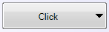
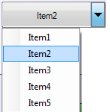

---
layout: post
title: Button Caption in Windows Forms Split Button | Syncfusion
description: Button Caption support allows setting custom button text and updating captions based on selected dropdown items.
platform: WindowsForms
control: SplitButton 
documentation: ug
---

# Button Caption in Windows Forms SplitButton

This feature enables you to name your SplitButton as needed. The `splitButton1` instance used in the examples below is assumed to be created as shown in the [Getting Started](https://help.syncfusion.com/windowsforms/split-button/getting-started) documentation.

## Adding caption to the SplitButton

You can add a static caption to the SplitButton, or set the selected dropdown item as the caption.

The following code illustrates how to add a static caption for the button:




splitButton1.Text = "Click";   





splitButton1.Text = "Click"







The following code illustrates how to set the selected item from the dropdown as the caption. Wire the handler to the SplitButton's `DropDownItemClicked` event (for example, in the form's constructor or `Load` event):

```csharp
// C#
this.splitButton1.DropDownItemClicked += new System.Windows.Forms.ToolStripItemClickedEventHandler(this.splitButton1_DropDownItemClicked);
```

```vb
' VB.NET
AddHandler Me.splitButton1.DropDownItemClicked, AddressOf splitButton1_DropDownItemClicked
```

Then implement the handler:




// C#
using System.Windows.Forms;

private void splitButton1_DropDownItemClicked(object sender, ToolStripItemClickedEventArgs e)
{
    splitButton1.Text = e.ClickedItem.Text;
}





' VB.NET
Imports System.Windows.Forms

Private Sub splitButton1_DropDownItemClicked(ByVal sender As Object, ByVal e As ToolStripItemClickedEventArgs)
    splitButton1.Text = e.ClickedItem.Text
End Sub





