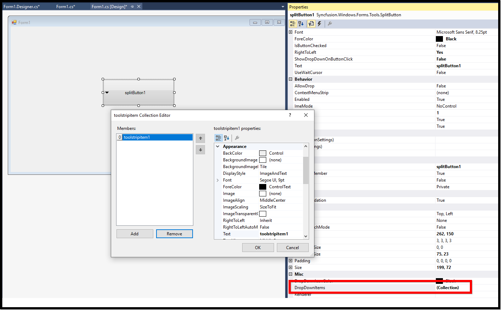
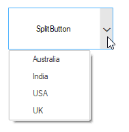

# Getting Started with Windows Forms Split Button

This section briefly describes how to create a new Windows Forms project in Visual Studio and add **"SplitButton"** with it's basic functionalities.

## Assembly deployment

Refer to the [control dependencies](https://help.syncfusion.com/windowsforms/control-dependencies#splitbutton) section to get the list of assemblies or NuGet package details which needs to be added as reference to use the control in any application.

[Check here](https://help.syncfusion.com/windowsforms/installation/install-nuget-packages) to find more details on how to install nuget packages in Windows Forms application. 

## Adding a SplitButton control through designer

**Step 1**: Create a new Windows Forms application in Visual Studio. Drag and drop the SplitButton from toolbox into form design view. The following dependent assemblies will be added automatically.

        * Syncfusion.Grid.Base
        * Syncfusion.Grid.Windows
        * Syncfusion.Shared.Base
        * Syncfusion.Shared.Windows
        * Syncfusion.Tools.Base
        * Syncfusion.Tools.Windows

**Step 2**: Set the desired properties for **"SplitButton"** control using the **"Properties"** dialog window. Similarly you can add the items for the SplitButton dropdown using **"DropDownItem"** property. Here, we have illustrated a simple example, in which we are adding countries names as dropdown items to the control.

**Step 3**: Run the application and the following output will be shown.

## Adding a SplitButton control through code

**Step 1**: Create a new Windows Forms application in Visual Studio. Add the following required assembly references and namespace to the project.  

        * Syncfusion.Grid.Base
        * Syncfusion.Grid.Windows
        * Syncfusion.Shared.Base
        * Syncfusion.Shared.Windows
        * Syncfusion.Tools.Base
        * Syncfusion.Tools.Windows






Using Syncfusion.Windows.Forms.Tools





Imports Syncfusion.Windows.Forms.Tools





{{ codesnippet1 | OrderList_Indent_Level_1 }}

**Step 2**: In Form1.cs, create an instance of **"SplitButton"** control and add in to the form. Also you can customize the SplitButton properties using the following code.






public Form1()
{
            
            InitializeComponent();
            SplitButton Splitbutton = new SplitButton();
            Splitbutton.Location = new System.Drawing.Point(236, 115);         
            Splitbutton.Name = "splitButton1";
            Splitbutton.Size = new System.Drawing.Size(154, 61);
            Splitbutton.Text = "SplitButton";
            Splitbutton.ThemeName = "Office2019Colorful";
            this.Controls.Add(Splitbutton);
}





Public Sub New()

    InitializeComponent()
    Dim Splitbutton As SplitButton = New SplitButton()
    Splitbutton.Location = New System.Drawing.Point(236, 115)
    Splitbutton.Name = "splitButton1"
    Splitbutton.Size = New System.Drawing.Size(154, 61)
    Splitbutton.Text = "SplitButton"
    Splitbutton.ThemeName = "Office2019Colorful"
    Me.Controls.Add(Splitbutton)

End Sub





{{ codesnippet2 | OrderList_Indent_Level_1 }}

**Step 3**: Run the application and the following output will be shown.

### Adding and removing item to dropdown list

In SplitButton, we can add or remove items using **Add** and **Remove** methods of the **DropDownItems** **SplitButtonItemsCollection** property. The following code illustrates how to add and remove items in SplitButton.





 public partial class Form1 : MetroForm
 {
        
        SplitButton Splitbutton;
        private Syncfusion.Windows.Forms.Tools.toolstripitem toolstripitem1;
        private Syncfusion.Windows.Forms.Tools.toolstripitem toolstripitem2;
        private Syncfusion.Windows.Forms.Tools.toolstripitem toolstripitem3;
        private Syncfusion.Windows.Forms.Tools.toolstripitem toolstripitem4;
        private Syncfusion.Windows.Forms.Tools.toolstripitem toolstripitem5;

        public Form1()
        {
            InitializeComponent();
            Splitbutton = new SplitButton();
            SplitButton Splitbutton = new SplitButton();
            Splitbutton.Click += Splitbutton_Click;
            Splitbutton.Location = new System.Drawing.Point(236, 115);         
            Splitbutton.Name = "splitButton1";
            Splitbutton.Size = new System.Drawing.Size(154, 61);
            Splitbutton.Text = "SplitButton";
            Splitbutton.ThemeName = "Office2019Colorful";

            //// 
            //// toolstripitem1
            //// 
            toolstripitem1 = new Syncfusion.Windows.Forms.Tools.toolstripitem();
            toolstripitem1.Name = "toolstripitem1";
            toolstripitem1.Size = new System.Drawing.Size(23, 23);
            toolstripitem1.Text = "Australia";

            //// 
            //// toolstripitem2
            //// 
            toolstripitem2 = new Syncfusion.Windows.Forms.Tools.toolstripitem();
            toolstripitem2.Name = "toolstripitem2";
            toolstripitem2.Size = new System.Drawing.Size(23, 23);
            toolstripitem2.Text = "Europe";

            //// 
            //// toolstripitem3
            //// 
            toolstripitem3 = new Syncfusion.Windows.Forms.Tools.toolstripitem();
            toolstripitem3.Name = "toolstripitem3";
            toolstripitem3.Size = new System.Drawing.Size(23, 23);
            toolstripitem3.Text = "India";

            //// 
            //// toolstripitem4
            //// 
            toolstripitem4 = new Syncfusion.Windows.Forms.Tools.toolstripitem();
            toolstripitem4.Name = "toolstripitem4";
            toolstripitem4.Size = new System.Drawing.Size(23, 23);
            toolstripitem4.Text = "USA";

            //// 
            //// toolstripitem5
            //// 
            toolstripitem5 = new Syncfusion.Windows.Forms.Tools.toolstripitem();
            toolstripitem5.Name = "toolstripitem5";
            toolstripitem5.Size = new System.Drawing.Size(23, 23);
            toolstripitem5.Text = "UK";

            //
            //Adding item to SplitButton DropDown
            //
            Splitbutton.DropDownItems.Add(toolstripitem1);
            Splitbutton.DropDownItems.Add(toolstripitem2);
            Splitbutton.DropDownItems.Add(toolstripitem3);
            Splitbutton.DropDownItems.Add(toolstripitem4);
            Splitbutton.DropDownItems.Add(toolstripitem5);
            this.Controls.Add(Splitbutton);
        }

        private void Splitbutton_Click1(object sender, EventArgs e)
        {
            // Removing item from SplitButton DropDown
            Splitbutton.DropDownItems.Remove(this.toolstripitem2);
        }   
}





Public Partial Class Form1
    Inherits MetroForm

    Private Splitbutton As SplitButton
    Private toolstripitem1 As Syncfusion.Windows.Forms.Tools.toolstripitem
    Private toolstripitem2 As Syncfusion.Windows.Forms.Tools.toolstripitem
    Private toolstripitem3 As Syncfusion.Windows.Forms.Tools.toolstripitem
    Private toolstripitem4 As Syncfusion.Windows.Forms.Tools.toolstripitem
    Private toolstripitem5 As Syncfusion.Windows.Forms.Tools.toolstripitem

    Public Sub New()
        InitializeComponent()
        Splitbutton = New SplitButton()
        Dim Splitbutton As SplitButton = New SplitButton()
        Splitbutton.Click += Splitbutton_Click
        Splitbutton.Location = New System.Drawing.Point(236, 115)
        Splitbutton.Name = "splitButton1"
        Splitbutton.Size = New System.Drawing.Size(154, 61)
        Splitbutton.Text = "SplitButton"
        Splitbutton.ThemeName = "Office2019Colorful"
           

        'toolstripitem1   

        toolstripitem1 = New Syncfusion.Windows.Forms.Tools.toolstripitem()
        toolstripitem1.Name = "toolstripitem1"
        toolstripitem1.Size = New System.Drawing.Size(23, 23)
        toolstripitem1.Text = "Australia"
 
        'toolstripitem2

        toolstripitem2 = New Syncfusion.Windows.Forms.Tools.toolstripitem()
        toolstripitem2.Name = "toolstripitem2"
        toolstripitem2.Size = New System.Drawing.Size(23, 23)
        toolstripitem2.Text = "Europe"

        'toolstripitem3

        toolstripitem3 = New Syncfusion.Windows.Forms.Tools.toolstripitem()
        toolstripitem3.Name = "toolstripitem3"
        toolstripitem3.Size = New System.Drawing.Size(23, 23)
        toolstripitem3.Text = "India"

        'toolstripitem4

        toolstripitem4 = New Syncfusion.Windows.Forms.Tools.toolstripitem()
        toolstripitem4.Name = "toolstripitem4"
        toolstripitem4.Size = New System.Drawing.Size(23, 23)
        toolstripitem4.Text = "USA"

        'toolstripitem5
        toolstripitem5 = New Syncfusion.Windows.Forms.Tools.toolstripitem()
        toolstripitem5.Name = "toolstripitem5"
        toolstripitem5.Size = New System.Drawing.Size(23, 23)
        toolstripitem5.Text = "UK"

         
        'Adding item to SplitButton DropDown
         
        Splitbutton.DropDownItems.Add(toolstripitem1)
        Splitbutton.DropDownItems.Add(toolstripitem2)
        Splitbutton.DropDownItems.Add(toolstripitem3)
        Splitbutton.DropDownItems.Add(toolstripitem4)
        Splitbutton.DropDownItems.Add(toolstripitem5)
        Me.Controls.Add(Splitbutton)
    End Sub

    Private Sub Splitbutton_Click1(ByVal sender As Object, ByVal e As EventArgs)
        'Removing item from SplitButton DropDown
        Splitbutton.DropDownItems.Remove(Me.toolstripitem2)
    End Sub
End Class





