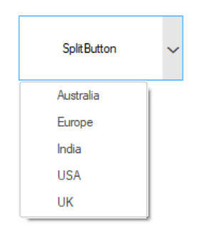

# Overview

The **"SplitButton"** control is like a combination of control that behaves like a Button and dropdown menu which provide access to create a dropdown button-like interface. Using this control, you can perform different operations with dropdown items as like menu hierarchy. 

## Features

**Button Mode** – Provides two types of mode: Normal and Toggle mode.

**DropDown Item** - Provides support to add new items SplitButton dropdown list.

**DropDown Position** - Provides support to change the dropdown list position.

**RightToLeft** - Provides support to align the content of button from right to left direction.