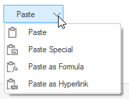

# About Syncfusion® Windows Forms SplitButton Control

The SplitButton control is a combination of a button and a dropdown menu that lets you create a dropdown button-like interface. Using this control, you can perform different operations with dropdown items as a menu hierarchy.

## Features

* **Button Mode** - Provides two types of modes: Normal and Toggle. For more details, refer to the [Button Mode](https://help.syncfusion.com/windowsforms/split-button/button-mode) documentation.

* **DropDown Item** - Provides support to add new items to the SplitButton dropdown list.

* **DropDown Position** - Provides support to change the dropdown list position.

* **RightToLeft** - Provides support to align the content of the button from right to left.

* **Appearance customization** - Provides options to customize the appearance using visual styles and a custom renderer. For more details, refer to the [Appearance Customization](https://help.syncfusion.com/windowsforms/split-button/appearance-customization) documentation.

* **Button caption** - Provides options to set custom button text and update the caption based on the selected dropdown item. For more details, refer to the [Button Caption](https://help.syncfusion.com/windowsforms/split-button/button-caption) documentation.

## See also

* [Getting Started](https://help.syncfusion.com/windowsforms/split-button/getting-started)
* [Appearance Customization](https://help.syncfusion.com/windowsforms/split-button/appearance-customization)
* [Button Mode](https://help.syncfusion.com/windowsforms/split-button/button-mode)
* [Button Caption](https://help.syncfusion.com/windowsforms/split-button/button-caption)