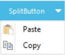
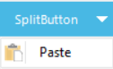

# Adding Item to Drop-down

This feature enables you to add items to the SplitButton drop-down list. 

You can add item using the _DropDownItems_ property. The following code illustrates how to add items to the drop-down list:



	this.splitButton1.DropDownItems.Add("Item 1");

	this.splitButton1.DropDownItems.Add("Item 2");





Me.splitButton1.DropDownItems.Add("Item 1")

Me.splitButton1.DropDownItems.Add("Item 2")



Removing Item from Drop-Down List

You can also remove the added items if required. The following code illustrates how to remove items form drop-down list:



this.splitButton1.DropDownItems.RemoveAt(1);





Me.splitButton1.DropDownItems.RemoveAt(1);



