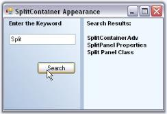
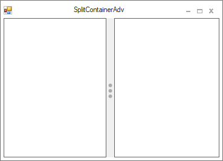

# Customization in Windows Forms SplitContainer (SplitContainerAdv)

The below image illustrates the components of a [Windows Forms SplitContainer](https://www.syncfusion.com/winforms-ui-controls/splitcontainer) (SplitContainerAdv) control. It has two panels separated by a splitter, which has arrows and a grip for the splitter.

 

A sample which demonstrates the Windows Forms SplitContainer (SplitContainerAdv) control is available in the below sample installation location.

..\My Documents\Syncfusion\EssentialStudio\Version Number\Windows\Tools.Windows\Samples\2.0\Editors Package\Container controls\SplitContainerAdv

## Panel settings

This section discusses about various properties available for the SplitContainerAdv to control the behavior of the panels. The panels has properties and events similar to Window's Panel control, to change its appearance.

### Panel orientation

The SplitContainerAdv Panels can be oriented horizontally or vertically using the [Orientation](https://help.syncfusion.com/cr/windowsforms/Syncfusion.Windows.Forms.Tools.SplitContainerAdv.html#Syncfusion_Windows_Forms_Tools_SplitContainerAdv_Orientation) property. Default value is horizontal.





this.splitContainerAdv1.Orientation = System.Windows.Forms.Orientation.Vertical;




Me.splitContainerAdv1.Orientation = System.Windows.Forms.Orientation.Vertical




  

### Resizing the panels

While resizing the control at design time or at run time, we can make one panel as fixed and resize the other panel alone. Select the panel which needs to be fixed, in [FixedPanel](https://help.syncfusion.com/cr/windowsforms/Syncfusion.Windows.Forms.Tools.SplitContainerAdv.html#Syncfusion_Windows_Forms_Tools_SplitContainerAdv_FixedPanel) property.





this.SplitContainerAdv1.FixedPanel = Syncfusion.Windows.Forms.Tools.Enums.FixedPanel.Panel1




Me.SplitContainerAdv1.FixedPanel = Syncfusion.Windows.Forms.Tools.Enums.FixedPanel.Panel1




### Collapsing a panel

We can make any of the panels to be collapsed at run time. The below properties helps you to do that.

* [Panel1](https://help.syncfusion.com/cr/windowsforms/Syncfusion.Windows.Forms.Tools.SplitContainerAdv.html#Syncfusion_Windows_Forms_Tools_SplitContainerAdv_Panel1)
* [Panel1Collapsed](https://help.syncfusion.com/cr/windowsforms/Syncfusion.Windows.Forms.Tools.SplitContainerAdv.html#Syncfusion_Windows_Forms_Tools_SplitContainerAdv_Panel1Collapsed)
* [Panel2](https://help.syncfusion.com/cr/windowsforms/Syncfusion.Windows.Forms.Tools.SplitContainerAdv.html#Syncfusion_Windows_Forms_Tools_SplitContainerAdv_Panel2)
* [Panel2Collapsed](https://help.syncfusion.com/cr/windowsforms/Syncfusion.Windows.Forms.Tools.SplitContainerAdv.html#Syncfusion_Windows_Forms_Tools_SplitContainerAdv_Panel2Collapsed)
* [PanelToBeCollapsed](https://help.syncfusion.com/cr/windowsforms/Syncfusion.Windows.Forms.Tools.SplitContainerAdv.html#Syncfusion_Windows_Forms_Tools_SplitContainerAdv_PanelToBeCollapsed)
* [TogglePanelOn](https://help.syncfusion.com/cr/windowsforms/Syncfusion.Windows.Forms.Tools.SplitContainerAdv.html#Syncfusion_Windows_Forms_Tools_SplitContainerAdv_TogglePanelOn)





this.splitContainerAdv1.Panel1Collapsed = true;

this.splitContainerAdv1.Panel2Collapsed = false;

this.splitContainerAdv1.PanelToBeCollapsed = Syncfusion.Windows.Forms.Tools.CollapsedPanel.Panel1;

this.splitContainerAdv1.TogglePanelOn = Syncfusion.Windows.Forms.Tools.TogglePanelOn.DoubleClick;





Me.SplitContainerAdv1.Panel1Collapsed = True

Me.SplitContainerAdv1.Panel2Collapsed = False

Me.splitContainerAdv1.PanelToBeCollapsed = Syncfusion.Windows.Forms.Tools.CollapsedPanel.Panel1

Me.splitContainerAdv1.TogglePanelOn = Syncfusion.Windows.Forms.Tools.TogglePanelOn.DoubleClick




### Panel size

We can specify the minimum size for the Panel1 and Panel2 in [Panel1MinSize](https://help.syncfusion.com/cr/windowsforms/Syncfusion.Windows.Forms.Tools.SplitContainerAdv.html#Syncfusion_Windows_Forms_Tools_SplitContainerAdv_Panel1MinSize) and [Panel2MinSize](https://help.syncfusion.com/cr/windowsforms/Syncfusion.Windows.Forms.Tools.SplitContainerAdv.html#Syncfusion_Windows_Forms_Tools_SplitContainerAdv_Panel2MinSize) properties. Default value for both the properties is 25.





this.splitContainerAdv1.Panel1MinSize = 50;

this.splitContainerAdv1.Panel2MinSize = 50;





Me.splitContainerAdv1.Panel1MinSize = 50

Me.splitContainerAdv1.Panel2MinSize = 50




## Splitter settings

The properties which changes the behavior of the Splitter in a SplitContainerAdv control are discussed in this section.

### Splitter settings

The below table describes the properties to control the behavior of the splitter.

* [IsSplitterFixed](https://help.syncfusion.com/cr/windowsforms/Syncfusion.Windows.Forms.Tools.SplitContainerAdv.html#Syncfusion_Windows_Forms_Tools_SplitContainerAdv_IsSplitterFixed)
* [SplitterDistance](https://help.syncfusion.com/cr/windowsforms/Syncfusion.Windows.Forms.Tools.SplitContainerAdv.html#Syncfusion_Windows_Forms_Tools_SplitContainerAdv_SplitterDistance)
* [SplitterIncrement](https://help.syncfusion.com/cr/windowsforms/Syncfusion.Windows.Forms.Tools.SplitContainerAdv.html#Syncfusion_Windows_Forms_Tools_SplitContainerAdv_SplitterIncrement)
* [SplitterWidth](https://help.syncfusion.com/cr/windowsforms/Syncfusion.Windows.Forms.Tools.SplitContainerAdv.html#Syncfusion_Windows_Forms_Tools_SplitContainerAdv_SplitterWidth)





this.SplitContainerAdv1.IsSplitterFixed = true;

this.splitContainerAdv1.SplitterDistance = 25

this.splitContainerAdv1.SplitterIncrement = 5

this.splitContainerAdv1.SplitterWidth = 20




Me.SplitContainerAdv1.IsSplitterFixed = True

Me.splitContainerAdv1.SplitterDistance = 25

Me.splitContainerAdv1.SplitterIncrement = 5

Me.splitContainerAdv1.SplitterWidth = 20





  
 
 
### Thumbnail arrow and grip settings

SplitContainerAdv control supports various appearance settings for the ThumbnailArrow in the control which are discussed in detail below. The properties which control the appearance of the splitter components are as follows.

* [ExpandFill](https://help.syncfusion.com/cr/windowsforms/Syncfusion.Windows.Forms.Tools.SplitContainerAdv.html#Syncfusion_Windows_Forms_Tools_SplitContainerAdv_ExpandFill)
* [ExpandLine](https://help.syncfusion.com/cr/windowsforms/Syncfusion.Windows.Forms.Tools.SplitContainerAdv.html#Syncfusion_Windows_Forms_Tools_SplitContainerAdv_ExpandLine)
* [GripDark](https://help.syncfusion.com/cr/windowsforms/Syncfusion.Windows.Forms.Tools.SplitContainerAdv.html#Syncfusion_Windows_Forms_Tools_SplitContainerAdv_GripDark)
* [GridLight](https://help.syncfusion.com/cr/windowsforms/Syncfusion.Windows.Forms.Tools.SplitContainerAdv.html#Syncfusion_Windows_Forms_Tools_SplitContainerAdv_GripLight)





this.splitContainerAdv2.ExpandFill = new Syncfusion.Drawing.BrushInfo(System.Drawing.Color.AliceBlue);

this.splitContainerAdv2.ExpandLine = System.Drawing.Color.Red;

this.splitContainerAdv2.GripDark = new Syncfusion.Drawing.BrushInfo(System.Drawing.Color.Wheat);

this.splitContainerAdv2.GripLight = new Syncfusion.Drawing.BrushInfo(System.Drawing.Color.Crimson);




Me.splitContainerAdv2.ExpandFill = New Syncfusion.Drawing.BrushInfo(System.Drawing.Color.AliceBlue)

Me.splitContainerAdv2.ExpandLine = System.Drawing.Color.Red

Me.splitContainerAdv2.GripDark = New Syncfusion.Drawing.BrushInfo(System.Drawing.Color.Wheat)

Me.splitContainerAdv2.GripLight = New Syncfusion.Drawing.BrushInfo(System.Drawing.Color.Crimson)




 

#### RunTime appearance

The properties to control the appearance of the thumbnail arrows, and grip, while mouse hovering at runtime, are as follows.

* [BackgroundColor](https://help.syncfusion.com/cr/windowsforms/Syncfusion.Windows.Forms.Tools.SplitContainerAdv.html#Syncfusion_Windows_Forms_Tools_SplitContainerAdv_BackgroundColor)
* [HotExpandFill](https://help.syncfusion.com/cr/windowsforms/Syncfusion.Windows.Forms.Tools.SplitContainerAdv.html#Syncfusion_Windows_Forms_Tools_SplitContainerAdv_ExpandFill)
* [HotExpandLine](https://help.syncfusion.com/cr/windowsforms/Syncfusion.Windows.Forms.Tools.SplitContainerAdv.html#Syncfusion_Windows_Forms_Tools_SplitContainerAdv_ExpandLine)
* [HotGripDark](https://help.syncfusion.com/cr/windowsforms/Syncfusion.Windows.Forms.Tools.SplitContainerAdv.html#Syncfusion_Windows_Forms_Tools_SplitContainerAdv_HotGripDark)
* [HotGridLight](https://help.syncfusion.com/cr/windowsforms/Syncfusion.Windows.Forms.Tools.SplitContainerAdv.html#Syncfusion_Windows_Forms_Tools_SplitContainerAdv_HotGripLight)





this.splitContainerAdv2.HotBackgroundColor = new Syncfusion.Drawing.BrushInfo(Syncfusion.Drawing.GradientStyle.Horizontal, System.Drawing.Color.SandyBrown, System.Drawing.Color.AntiqueWhite);

this.splitContainerAdv2.HotExpandFill = new Syncfusion.Drawing.BrushInfo(System.Drawing.Color.Red);

this.splitContainerAdv2.HotExpandLine = System.Drawing.Color.DeepPink;

this.splitContainerAdv2.HotGripDark = new Syncfusion.Drawing.BrushInfo(System.Drawing.Color.MistyRose);

this.splitContainerAdv2.HotGripLight = new Syncfusion.Drawing.BrushInfo(System.Drawing.Color.Purple);





Me.splitContainerAdv2.HotBackgroundColor = New Syncfusion.Drawing.BrushInfo(Syncfusion.Drawing.GradientStyle.Horizontal, System.Drawing.Color.SandyBrown, System.Drawing.Color.AntiqueWhite) 

Me.splitContainerAdv2.HotExpandFill = New Syncfusion.Drawing.BrushInfo(System.Drawing.Color.Red) 

Me.splitContainerAdv2.HotExpandLine = System.Drawing.Color.DeepPink 

Me.splitContainerAdv2.HotGripDark = New Syncfusion.Drawing.BrushInfo(System.Drawing.Color.MistyRose) 

Me.splitContainerAdv2.HotGripLight = New Syncfusion.Drawing.BrushInfo(System.Drawing.Color.Purple)




 

## Appearance settings

This section discusses the properties which controls the appearance of the SplitContainerAdv control.

### Background settings

The below properties describes the background settings.

* [BackgroundImage](https://learn.microsoft.com/en-us/dotnet/api/system.windows.forms.control.backgroundimage?redirectedfrom=MSDN&view=netframework-4.7.2#System_Windows_Forms_Control_BackgroundImage)
* [BackgroundImageLayout](https://learn.microsoft.com/en-us/dotnet/api/system.windows.forms.control.backgroundimagelayout?redirectedfrom=MSDN&view=netframework-4.7.2#System_Windows_Forms_Control_BackgroundImageLayout)
* [BackColor](https://learn.microsoft.com/en-us/dotnet/api/system.windows.forms.control.backcolor?redirectedfrom=MSDN&view=netframework-4.7.2#System_Windows_Forms_Control_BackColor)
* [BackgroundColor](https://help.syncfusion.com/cr/windowsforms/Syncfusion.Windows.Forms.Tools.SplitContainerAdv.html#Syncfusion_Windows_Forms_Tools_SplitContainerAdv_BackgroundColor)

> Note: The above properties can be overridden by SplitContainerAdv.Panel properties.





this.splitContainerAdv1.BackColor = System.Drawing.Color.LightSteelBlue;

this.splitContainerAdv1.Panel1.BackgroundColor = new Syncfusion.Drawing.BrushInfo(Syncfusion.Drawing.GradientStyle.BackwardDiagonal, System.Drawing.Color.AliceBlue, System.Drawing.Color.LightSteelBlue);

this.splitContainerAdv1.Panel2.BackColor = System.Drawing.Color.AliceBlue;





Me.splitContainerAdv1.BackColor = System.Drawing.Color.LightSteelBlue 

Me.splitContainerAdv1.Panel1.BackgroundColor = New Syncfusion.Drawing.BrushInfo(Syncfusion.Drawing.GradientStyle.BackwardDiagonal, System.Drawing.Color.AliceBlue, System.Drawing.Color.LightSteelBlue) 

Me.splitContainerAdv1.Panel2.BackColor = System.Drawing.Color.AliceBlue




### Foreground settings

The below properties describes the foreground settings.

* [Font](https://learn.microsoft.com/en-us/dotnet/api/system.windows.forms.control.font?redirectedfrom=MSDN&view=netframework-4.7.2#System_Windows_Forms_Control_Font)
* [ForeColor](https://learn.microsoft.com/en-us/dotnet/api/system.windows.forms.control.forecolor?redirectedfrom=MSDN&view=netframework-4.7.2#System_Windows_Forms_Control_ForeColor)





this.splitContainerAdv1.Panel2.Font = new System.Drawing.Font("Arial", 8.25F, System.Drawing.FontStyle.Bold);

this.splitContainerAdv1.Panel1.ForeColor = System.Drawing.Color.Black;





Me.splitContainerAdv1.Panel2.Font = New System.Drawing.Font("Arial", 8.25F, System.Drawing.FontStyle.Bold) 

Me.splitContainerAdv1.Panel1.ForeColor = System.Drawing.Color.Black





  

## Border settings

[BorderStyle](https://help.syncfusion.com/cr/windowsforms/Syncfusion.Windows.Forms.Tools.SplitContainerAdv.html#Syncfusion_Windows_Forms_Tools_SplitContainerAdv_BorderStyle) property sets 2D or 3D border for the SplitContainerAdv control. The options are FixedSingle or Fixed3D.





this.splitContainerAdv1.BorderStyle = System.Windows.Forms.BorderStyle.FixedSingle;





Me.splitContainerAdv1.BorderStyle = System.Windows.Forms.BorderStyle.FixedSingle




## Styles

Visual Styles for the SplitContainerAdv control is set through [Style](https://help.syncfusion.com/cr/windowsforms/Syncfusion.Windows.Forms.Tools.SplitContainerAdv.html#Syncfusion_Windows_Forms_Tools_SplitContainerAdv_Style) property. The available styles are,

* Office2007Black
* Office2007Blue 
* Office2007Silver
* OfficeXP
* Office2003
* VS2005
* Mozilla
* Default
* Metro
* Office2016Colorful
* Office2016White
* Office2016DarkGray
* Office2016Black





//Sets Office2007 Black color scheme for the control.

this.splitContainerAdv1.Style = Syncfusion.Windows.Forms.Tools.Enums.Style.Office2007Black;





'Sets Office2007 Black color scheme for the control.

Me.splitContainerAdv1.Style = Syncfusion.Windows.Forms.Tools.Enums.Style.Office2007Black





  

**Office2016Colorful**

This option helps to set the Office2016Colorful style.





// Office2016Colorful

this.splitContainerAdv1.Style = Syncfusion.Windows.Forms.Tools.Enums.Style.Office2016Colorful;





'Office2016Colorful

Me.splitContainerAdv1.Style = Syncfusion.Windows.Forms.Tools.Enums.Style.Office2016Colorful





 

**Office2016White**

This option helps to set the Office2016White style.





// Office2016White

this.splitContainerAdv1.Style = Syncfusion.Windows.Forms.Tools.Enums.Style.Office2016White;





'Office2016White

Me.splitContainerAdv1.Style = Syncfusion.Windows.Forms.Tools.Enums.Style.Office2016White





 

**Office2016DarkGray**

This option helps to set the Office2016DarkGray style.





// Office2016DarkGray

this.splitContainerAdv1.Style = Syncfusion.Windows.Forms.Tools.Enums.Style.Office2016DarkGray;





'Office2016DarkGray

Me.splitContainerAdv1.Style = Syncfusion.Windows.Forms.Tools.Enums.Style.Office2016DarkGray





 

**Office2016Black**

This option helps to set the Office2016Black style.





// Office2016Black

this.splitContainerAdv1.Style = Syncfusion.Windows.Forms.Tools.Enums.Style.Office2016Black;





'Office2016Black

Me.splitContainerAdv1.Style = Syncfusion.Windows.Forms.Tools.Enums.Style.Office2016Black





 
