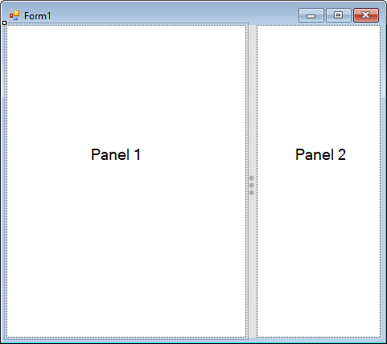
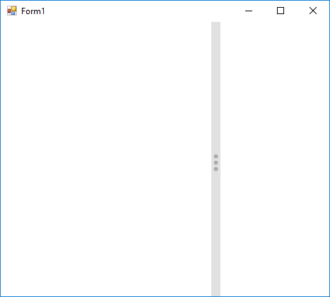

# Getting started

This section describes how to add [SplitContainerAdv](https://help.syncfusion.com/cr/cref_files/windowsforms/tools/Syncfusion.Tools.Windows~Syncfusion.Windows.Forms.Tools.SplitContainerAdv.html) control in a Windows Forms application.

## Assembly deployment

The following list of assemblies should be added as reference to use the [SplitContainerAdv](https://help.syncfusion.com/cr/cref_files/windowsforms/tools/Syncfusion.Tools.Windows~Syncfusion.Windows.Forms.Tools.SplitContainerAdv.html) in any application:

<table>
<tr>
<td>
{{'**Required assemblies**'| markdownify }}
</td>
<td>
{{'**Description**'| markdownify }}
</td>
</tr>
<tr>
<td>
Syncfusion.Grid.Base.dll
</td>
<td>
Syncfusion.Grid.Base contains classes that contains fundamentals and base classes of GridControl.
</td>
</tr>
<tr>
<td>
Syncfusion.Grid.Windows.dll
</td>
<td>
Syncfusion.Grid.Windows contains classes that handles all UI operations, fundamentals and base classes of GridControl which are used in the SplitContainerAdv control.
</td>
</tr>
<tr>
<td>
Syncfusion.Shared.Base.dll
</td>
<td>
Syncfusion.Shared.Base contains style related properties of SplitContainerAdv and various editor controls.
</td>
</tr>
<tr>
<td>
Syncfusion.Shared.Windows.dll
</td>
<td>
Syncfusion.Shared.Windows contains style related properties of SplitContainerAdv and various editor controls.
</td>
</tr>
<tr>
<td>
Syncfusion.Tools.Base.dll
</td>
<td>
Syncfusion.Tools.Base contains base class which used for SplitContainerAdv control.
</td>
</tr>
<tr>
<td>
Syncfusion.Tools.Windows.dll
</td>
<td>
Syncfusion.Tools.Windows contains the class that handles all UI operations and contains helper class of SplitContainerAdv control.
</td>
</tr>
</table>

## Installing NuGet Packages

To use [SplitContainerAdv](https://help.syncfusion.com/cr/cref_files/windowsforms/tools/Syncfusion.Tools.Windows~Syncfusion.Windows.Forms.Tools.SplitContainerAdv.html) control in Windows Forms application via nuget, the following packages should be installed.
 
<table>
<tr>
<td>{{'**S.No**'| markdownify }}
</td>
<td>{{'**Framework version**'| markdownify }}
</td>
<td>{{'**NuGet Packages**'| markdownify }}
</td>
</tr>
<tr>
<td> 1
</td>
<td> 2.0
</td>
<td> Syncfusion.Tools.Windows20
</td>
</tr>
<tr>
<td> 2
</td>
<td> 3.5
</td>
<td> Syncfusion.Tools.Windows35
</td>
</tr>
<tr>
<td> 3
</td>
<td> 4.0
</td>
<td> Syncfusion.Tools.Windows40
</td>
</tr>
<tr>
<td> 4
</td>
<td> 4.5
</td>
<td> Syncfusion.Tools.Windows45
</td>
</tr>
<tr>
<td> 5
</td>
<td> 4.5.1
</td>
<td>Syncfusion.Tools.Windows451
</td>
</tr>
<tr>
<td> 6
</td>
<td> 4.6
</td>
<td>Syncfusion.Tools.Windows46
</td>
</tr>
</table>
 
Please find more details regarding how to install the nuget packages in windows form application in the below link:
 
[How to install nuget packages](https://help.syncfusion.com/windowsforms/nuget-packages)

# Creating simple application with SplitContainerAdv

You can create the Windows Forms application with [SplitContainerAdv](https://help.syncfusion.com/cr/cref_files/windowsforms/tools/Syncfusion.Tools.Windows~Syncfusion.Windows.Forms.Tools.SplitContainerAdv.html) control as follows:

1. [Creating project](#creating-the-project)
2. [Adding control via Form Designer](#adding-control-via-Form-designer)
3. [Adding control manually using code](#adding-control-manually-using-code)

### Creating the project

Create a new Windows Forms project in the Visual Studio to display the [SplitContainerAdv](https://help.syncfusion.com/cr/cref_files/windowsforms/tools/Syncfusion.Tools.Windows~Syncfusion.Windows.Forms.Tools.SplitContainerAdv.html) with functionalities.

## Adding control via Form designer

The SplitContainerAdv control can be added to the application by dragging it from the toolbox and dropping it in a designer view. The following required assembly references will be added automatically:

* Syncfusion.Grid.Base.dll
* Syncfusion.Grid.Windows.dll
* Syncfusion.Shared.Base.dll
* Syncfusion.Shared.Windows.dll
* Syncfusion.Tools.Base.dll
* Syncfusion.Tools.Windows.dll

Child controls can be added to the SplitContainerAdv by dragging it from the toolbox and dropping it in desired panel. Here labels are added into SplitContainerAdv Panels.

## Adding control manually using code

To add control manually in C#, follow the given steps:

**Step 1** - Add the following required assembly references to the project:

* Syncfusion.Grid.Base.dll
* Syncfusion.Grid.Windows.dll
* Syncfusion.Shared.Base.dll
* Syncfusion.Shared.Windows.dll
* Syncfusion.Tools.Base.dll
* Syncfusion.Tools.Windows.dll

**Step 2** - Include the namespaces **Syncfusion.Tools.Windows**.





using Syncfusion.Tools.Windows;





Imports Syncfusion.Tools.Windows



 

**Step 3** - Create `SplitContainerAdv` control instance and add it to the form.





SplitContainerAdv splitContainerAdv1 = new SplitContainerAdv();

this.splitContainerAdv1.Style = Syncfusion.Windows.Forms.Tools.Enums.Style.Office2016Colorful;

this.splitContainerAdv1.Dock = System.Windows.Forms.DockStyle.Fill;

this.Controls.Add(splitContainerAdv1);





Dim splitContainerAdv1 As SplitContainerAdv = New SplitContainerAdv()

Me.splitContainerAdv1.Style = Syncfusion.Windows.Forms.Tools.Enums.Style.Office2016Colorful

Me.splitContainerAdv1.Dock = System.Windows.Forms.DockStyle.Fill

Me.Controls.Add(SplitContainerAdv1)





**Adding Controls to SplitContainerAdv**

Create instance of the required Controls and add it to panels such as [Panel1](https://help.syncfusion.com/cr/cref_files/windowsforms/tools/Syncfusion.Tools.Windows~Syncfusion.Windows.Forms.Tools.SplitContainerAdv~Panel1.html) or [Panel2](https://help.syncfusion.com/cr/cref_files/windowsforms/tools/Syncfusion.Tools.Windows~Syncfusion.Windows.Forms.Tools.SplitContainerAdv~Panel2.html) of the SplitContainerAdv.





// Create instance of the controls

Label label1 = new Label();
Label label2 = new Label();

this.label1.Text = "Panel 1";
this.label1.Font = new System.Drawing.Font("Microsoft Sans Serif", 14.25F, System.Drawing.FontStyle.Regular, System.Drawing.GraphicsUnit.Point, ((byte)(0)));
this.label2.Text = "Panel 2";
this.label2.Font = new System.Drawing.Font("Microsoft Sans Serif", 14.25F, System.Drawing.FontStyle.Regular, System.Drawing.GraphicsUnit.Point, ((byte)(0)));

// Add it to panels of SplitContainerAdv
this.splitContainerAdv1.Panel1.Controls.Add(this.label1);
this.splitContainerAdv1.Panel2.Controls.Add(this.label2);





' Create instance of the controls

Dim label1 As New Label()
Dim label2 As New Label()

Me.label1.Text = "Panel 1"
Me.label1.Font = New System.Drawing.Font("Microsoft Sans Serif", 14.25F, System.Drawing.FontStyle.Regular, System.Drawing.GraphicsUnit.Point, (CByte(0)))
Me.label2.Text = "Panel 2"
Me.label2.Font = New System.Drawing.Font("Microsoft Sans Serif", 14.25F, System.Drawing.FontStyle.Regular, System.Drawing.GraphicsUnit.Point, (CByte(0)))

' Add it to panels of SplitContainerAdv
Me.splitContainerAdv1.Panel1.Controls.Add(Me.label1)
Me.splitContainerAdv1.Panel2.Controls.Add(Me.label2)





